# Database Internals — Ruta de estudio

[[Obsidian/lecturas/00 Índice de lecturas|← Biblioteca de lecturas]]

Esta carpeta desarrolla la **Parte I: Storage Engines** y el comienzo de la **Parte II: Distributed Systems**, a partir de seis PDF disponibles. Recorre los capítulos 1–11: desde la representación de los datos en una máquina hasta la detección de fallas, la elección de líder y las garantías de replicación entre máquinas. La conclusión de la Parte I también está explicada; el alcance de cada escaneo se registra en las fuentes. Cada capítulo está dividido en notas pequeñas; una nota explica un mecanismo o un grupo estrechamente relacionado.

> [!tip] Empieza aquí
> Abre [[Obsidian/lecturas/database internals/00 Guía y fundamentos/01 Antes de empezar bytes páginas y costos|Bytes, páginas y costos]]. Luego sigue el enlace **Siguiente** al final de cada nota. Los índices de capítulo sirven para retomar el estudio sin perder el recorrido.

## Orden de lectura

| Paso | Abre este índice | Para qué sirve |
|---|---|---|
| 0 · Preparación | [[Obsidian/lecturas/database internals/00 Guía y fundamentos/00 Índice\|Guía y fundamentos]] | Aclarar bytes, páginas y offsets; interpretar relaciones gráficas; comparar sistemas y benchmarks con criterios justos |
| 1 · Capítulo 1 | [[Obsidian/lecturas/database internals/01 Introducción y panorama general/00 Índice\|Introducción y panorama general]] | Situar el storage engine dentro del DBMS y relacionar workload con layout |
| 2 · Capítulo 2 | [[Obsidian/lecturas/database internals/02 Fundamentos de B-Trees/00 Índice\|Fundamentos de B-Trees]] | Entender fanout, búsqueda, splits, redistribución y merges |
| 3 · Capítulo 3 | [[Obsidian/lecturas/database internals/03 Formatos de archivo/00 Índice\|Formatos de archivo]] | Convertir tipos, registros y nodos en bytes y páginas seguras |
| 4 · Capítulo 4 | [[Obsidian/lecturas/database internals/04 Implementación de B-Trees/00 Índice\|Implementación de B-Trees]] | Integrar headers, overflow, breadcrumbs, optimización y mantenimiento |
| 5 · Capítulo 5 | [[Obsidian/lecturas/database internals/05 Procesamiento de transacciones y recuperación/00 Índice\|Transacciones y recuperación]] | Conectar caché, WAL, ARIES, aislamiento, MVCC, bloqueos y concurrencia en B-Trees |
| 6 · Capítulo 6 | [[Obsidian/lecturas/database internals/06 Variantes de B-Trees/00 Índice\|Variantes de B-Trees]] | Entender copy-on-write, buffering, runs, deltas, CAS y localidad recursiva |
| 7 · Capítulo 7 | [[Obsidian/lecturas/database internals/07 Almacenamiento estructurado como log/00 Índice\|Almacenamiento estructurado como log]] | Entender LSM Trees, archivos inmutables, compaction, filtros y el equilibrio entre lecturas, escrituras y espacio |
| 8 · Parte II y capítulo 8 | [[Obsidian/lecturas/database internals/08 Introducción a sistemas distribuidos/00 Índice\|Introducción a sistemas distribuidos]] | Entender estado local, mensajes, fallos parciales, enlaces, modelos de tiempo y garantías |
| 9 · Capítulo 9 | [[Obsidian/lecturas/database internals/09 Detección de fallas/00 Índice\|Detección de fallas]] | Separar sospecha de certeza y entender pings, heartbeats, phi, gossip y propagación del silencio |
| 10 · Capítulo 10 | [[Obsidian/lecturas/database internals/10 Elección de líder/00 Índice\|Elección de líder]] | Comparar Bully, alternativas, candidatos, invitación y anillo, y distinguir elección de consenso |
| 11 · Capítulo 11 | [[Obsidian/lecturas/database internals/11 Replicación y consistencia/00 Índice\|Replicación y consistencia]] | Entender CAP, órdenes, modelos de consistencia, sesiones, quórums, testigos y CRDTs |
| 12 · Aplicación | [[Obsidian/lecturas/database internals/05 Práctica y repaso/00 Índice\|Práctica y repaso]] | Resolver un caso completo y comprobar comprensión |
| Consulta | [[Obsidian/lecturas/database internals/90 Fuentes y revisión/00 Índice\|Fuentes y revisión]] | Revisar alcance, procedencia de gráficos y material original |

Las carpetas `01`–`04`, «05 Procesamiento de transacciones y recuperación», «06 Variantes de B-Trees», «07 Almacenamiento estructurado como log», «08 Introducción a sistemas distribuidos», «09 Detección de fallas», «10 Elección de líder» y «11 Replicación y consistencia» corresponden a capítulos del libro. `00` y `90` son materiales de apoyo, al igual que la carpeta anterior «05 Práctica y repaso», cuyo nombre se conserva para mantener la navegación existente. Dentro de cada carpeta, `00 Índice` explica qué aprenderás en cada nota.

## El hilo que une los capítulos

```mermaid
flowchart LR
 A[Workload y arquitectura] -->|necesita acceso eficiente| B[B-Tree abstracto]
 B -->|debe persistirse| C[Bytes y páginas]
 C -->|debe cambiar sin corromperse| D[Implementación real]
 D -->|genera basura y deuda| E[Mantenimiento]
 D -->|requiere confirmar y recuperarse| F[Transacciones y recuperación]
 D -->|puede reducir costos de otras maneras| G[Variantes de B-Trees]
 G -->|conecta buffering e inmutabilidad| H[Logs y LSM Trees]
 H -->|aplaza fusiones y limpieza| E
 F -->|las garantías deben considerar la red| I[Sistemas distribuidos]
 I -->|el silencio solo permite sospechar| J[Detección de fallas]
 J -->|activa reemplazos| K[Elección de líder]
 K -->|debe acompañarse de reglas de acuerdo| L[Replicación y consistencia]
```

Los bloques no son productos alternativos, sino una cadena de decisiones. El workload determina qué trabajo importa; la estructura reduce la búsqueda; el formato la vuelve persistente; los protocolos de modificación conservan invariantes; y el mantenimiento paga el trabajo aplazado. Los LSM Trees acumulan cambios y generan archivos inmutables que luego se fusionan. Al distribuir el sistema, el nuevo problema consiste en coordinar estados locales mediante mensajes que pueden perderse o demorarse.

> [!tip] Una frase para situar el recorrido
> **Primero aprendemos a conservar y encontrar datos en una máquina; después, a razonar sobre varias máquinas que no comparten una vista inmediata de lo que ocurre.** Esta frase es una síntesis propia. Los nuevos capítulos incluyen los epígrafes atribuidos del libro y explican qué problema introduce cada uno.

En cada nota pregunta:

- ¿qué operación costosa se intenta evitar?
- ¿qué metadato permite tomar la decisión?
- ¿qué invariante debe seguir siendo cierta?
- ¿qué nuevo costo introduce la solución?
- ¿qué ocurriría si el proceso falla a la mitad?

## Consultas rápidas

- [[Obsidian/lecturas/database internals/00 Guía y fundamentos/02 Atlas visual explicado|Atlas visual explicado]]: ocho figuras técnicas y cómo interpretarlas.
- [[Obsidian/lecturas/database internals/05 Práctica y repaso/02 Glosario y tarjetas de memoria|Glosario y tarjetas]]: términos y repaso activo.
- [[Obsidian/lecturas/database internals/05 Procesamiento de transacciones y recuperación/00 Índice|Capítulo 5 · transacciones y recuperación]]: diez notas de estudio, diez gráficos y laboratorio reproducible.
- [[Obsidian/lecturas/database internals/06 Variantes de B-Trees/00 Índice|Capítulo 6 · variantes de B-Trees]]: diez notas de estudio, doce gráficos y laboratorio resuelto.
- [[Obsidian/lecturas/database internals/07 Almacenamiento estructurado como log/00 Índice|Capítulo 7 · almacenamiento basado en logs]]: notas temáticas, síntesis de la Parte I y repaso resuelto.
- [[Obsidian/lecturas/database internals/08 Introducción a sistemas distribuidos/00 Índice|Capítulo 8 · sistemas distribuidos]]: contexto de la Parte II, fundamentos y ejercicios explicados.
- [[Obsidian/lecturas/database internals/09 Detección de fallas/00 Índice|Capítulo 9 · detección de fallas]]: señales, sospechas y límites del detector.
- [[Obsidian/lecturas/database internals/10 Elección de líder/00 Índice|Capítulo 10 · elección de líder]]: algoritmos y supuestos para reemplazar coordinadores.
- [[Obsidian/lecturas/database internals/11 Replicación y consistencia/00 Índice|Capítulo 11 · replicación y consistencia]]: garantías que relacionan lo escrito con lo observado.
- [[Obsidian/lecturas/database internals/Mapa de lectura.canvas|Mapa de lectura]]: recorrido visual de capítulos 1–4. Para los capítulos 5–11, usa sus índices enlazados arriba.
- [[Obsidian/lecturas/database internals/90 Fuentes y revisión/01 Fuentes y cobertura|Fuentes y cobertura]]: páginas del PDF y límites del material.

Las figuras no cumplen una función decorativa. Cada una representa un flujo, layout, transición o costo y está explicada en la nota donde aparece.

> [!success] Señal de comprensión
> Puedes cambiar las claves, tamaños o nombres del ejemplo y seguir prediciendo qué páginas se leen, qué punteros cambian y qué trabajo queda pendiente.
