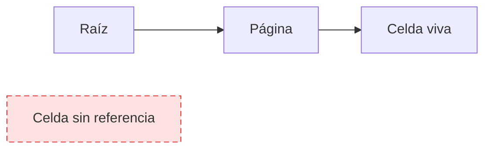

# Antes de empezar: bytes, páginas y costos

[[Obsidian/lecturas/database internals/00 Empieza aquí|Inicio del libro]] → [[Obsidian/lecturas/database internals/00 Guía y fundamentos/00 Índice|Guía y fundamentos]]

## Del valor lógico a su representación

La aplicación piensa en `cliente=42`, `precio=19.99` y `nombre="Ana"`. El dispositivo persiste bytes. Entre ambos hay contratos:

**Lo que demuestra la cadena:** cada nivel añade información y restricciones. Una cadena necesita longitud o terminador; una celda debe indicar dónde termina; una página requiere header y offsets; y un archivo necesita versión y una forma de localizar páginas. Perder un contrato en cualquier nivel impide reconstruir el valor original.

Los bytes no contienen su significado. `01 00 00 00` puede ser el entero 1 en little-endian, cuatro flags, parte de una cadena o un offset. El lector debe conocer el contrato antes de interpretar.

## Página lógica y bloque físico

Una **página** es la unidad que el motor usa para caché, checksums y navegación. Un **bloque o sector** pertenece al dispositivo o filesystem. Pueden tener tamaños distintos. Leer una celda de 40 bytes suele traer una página de varios KiB, y el dispositivo puede transferir bloques diferentes.

Esta diferencia explica la prioridad del B-Tree: si ya pagaste la lectura de una página, conviene aprovecharla para almacenar muchos separadores. Cientos de comparaciones de CPU pueden ser más baratas que otra lectura aleatoria.

## Offset, page ID y puntero

En memoria, un puntero puede ser una dirección virtual válida mientras vive el proceso. En disco se necesitan referencias reconstruibles:

- **offset:** distancia desde el inicio de una región conocida;
- **page ID:** identificador que otra capa traduce a ubicación;
- **slot ID:** posición lógica dentro del directorio de una página;
- **record ID:** combinación estable, a menudo page ID + slot.

Un offset directo es compacto, pero mover el objeto invalida la referencia. Una indirección añade un salto, pero permite que el objeto cambie de lugar mientras su identificador lógico permanece estable.

## Qué significa “costo”

No existe una sola métrica:

| Costo | Ejemplo |
|---|---|
| latencia | tiempo de una búsqueda individual |
| throughput | operaciones sostenidas por segundo |
| I/O | páginas o bloques leídos y escritos |
| CPU | comparaciones, compresión, checksums |
| memoria | caché, buffers y estructuras auxiliares |
| espacio | índices, versiones antiguas y huecos |
| coordinación | locks, latches y mensajes |

Una mejora desplaza trabajo. Comprimir reduce I/O y gasta CPU. Mantener sibling links acelera rangos y aumenta escrituras durante splits. Aplazar limpieza reduce latencia inmediata y crea deuda de vacuum.

## Tres amplificaciones

**Lectura:** trabajo físico dividido por datos lógicos devueltos. Recuperar 100 bytes puede leer varias páginas.

**Escritura:** bytes persistidos divididos por el cambio lógico. Un update pequeño puede escribir WAL, página y metadatos.

**Espacio:** bytes ocupados divididos por datos vivos. Índices, versiones, reservas y fragmentación aumentan la proporción.

Declara siempre qué capa se midió. La amplificación del storage engine y la recolección interna de un SSD son fenómenos distintos que pueden acumularse.

## Alcanzabilidad: la vida lógica de un dato

Una celda está viva cuando existe una ruta válida desde una raíz o estructura de metadatos. Borrar un offset puede volverla inaccesible sin sobrescribir sus bytes. Vacuum transforma espacio lógicamente muerto en espacio físicamente reutilizable.

**Lo que demuestra la relación:** la posición dentro del archivo no decide la vida; la existencia de una ruta desde la raíz decide la alcanzabilidad. MVCC añade otra condición: una versión puede no ser actual y seguir viva para un snapshot antiguo.

> [!question]- ¿Por qué no conviene medir un B-Tree solo por comparaciones?
> Porque el costo dominante suele ser cuántas páginas se cargan o modifican; las comparaciones dentro de una página pueden ser relativamente baratas.

> [!question]- ¿Qué gana una referencia indirecta?
> Estabilidad: el objeto puede moverse y solo se actualiza la tabla o entrada que resuelve el identificador lógico.

---

**Índice:** [[Obsidian/lecturas/database internals/00 Guía y fundamentos/00 Índice|Guía y fundamentos]] · **Siguiente:** [[Obsidian/lecturas/database internals/00 Guía y fundamentos/02 Atlas visual explicado|Atlas visual explicado]]
