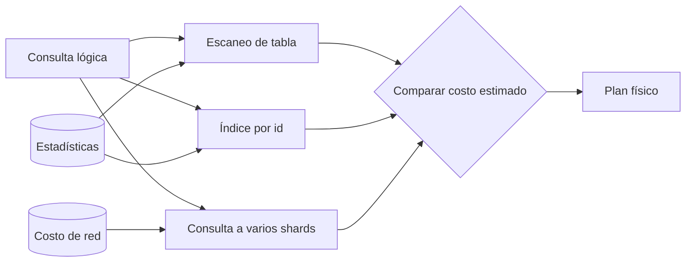

# Arquitectura de un DBMS: de una intención a bytes

[[Obsidian/lecturas/database internals/00 Empieza aquí|Inicio del libro]] → [[Obsidian/lecturas/database internals/01 Introducción y panorama general/00 Índice|Introducción y panorama general]]

> [!abstract] Idea que organiza la nota
> Un DBMS no es una caja que «ejecuta SQL». Es una cadena de traducciones: entiende una intención, escoge una estrategia física y coordina acceso, concurrencia y recuperación para que el resultado sea correcto incluso si varias operaciones coinciden o la máquina falla.

## El recorrido completo

Imagina `UPDATE pedidos SET estado='enviado' WHERE id=731`. Para la aplicación es una sola orden. Para el motor implica identificar objetos, encontrar la fila, controlar quién puede modificarla, registrar información de recuperación, mantener índices y decidir cuándo puede afirmar que el cambio terminó.

![[Obsidian/lecturas/database internals/Recursos visuales/01-arquitectura-dbms.svg|1000]]

**Lo que demuestra la arquitectura:** la ruta vertical transforma una solicitud del cliente en operaciones sobre páginas. Transporte recibe; parser y optimizador convierten intención en plan; el ejecutor pide operaciones a los métodos de acceso; y el buffer manager mueve las páginas entre almacenamiento y RAM. Las conexiones laterales son restricciones transversales: transacciones y locks controlan visibilidad y compatibilidad, mientras WAL y recovery hacen reconstruible el estado. Por eso no pueden añadirse como un paso opcional al final.

## Comprender antes de ejecutar

La capa de **transporte** mantiene la sesión, recibe mensajes y serializa respuestas. En un clúster también comunica nodos. Su frontera importa porque una operación que parece local puede requerir enviar fragmentos, reunir resultados o tratar un timeout sin duplicar efectos.

El **parser** comprueba sintaxis y construye una representación interna. Luego se resuelven nombres y tipos: `pedidos` debe existir, `estado` debe aceptar el valor y `id` debe poder compararse con `731`. Solo después es posible verificar permisos con precisión, porque ya se sabe qué objetos intenta tocar la petición.

El **optimizador** recibe una operación lógica y compara planes físicos equivalentes. Para buscar el pedido 731 podría recorrer toda la tabla o usar un índice por `id`. Elige mediante estimaciones: cardinalidad, selectividad, costo de I/O, memoria y, si hay distribución, transferencia de red. No «conoce» el futuro; estadísticas viejas o correlaciones ocultas pueden hacerlo elegir mal.

**Lo que demuestra la bifurcación:** las tres ramas prometen el mismo resultado lógico, pero realizan trabajos físicos distintos. Estadísticas y costo de red no contienen datos del pedido; alimentan estimaciones. El rombo elige con evidencia incompleta, por lo que «plan elegido» no significa «plan óptimo demostrado».

## Ejecutar significa coordinar

El **motor de ejecución** recorre operadores como búsqueda, filtro, join, agregación y ordenamiento. Puede producir resultados en flujo para no materializar cada intermedio. Cuando solicita la siguiente fila, activa capas inferiores; por eso el dibujo arquitectónico no debe imaginarse como una cascada que cada componente visita una sola vez.

En almacenamiento cooperan responsabilidades distintas:

- El **gestor de transacciones** delimita commit y abort y decide qué cambios forman una unidad lógica.
- El **control de concurrencia** impide combinaciones incompatibles mediante locks, versiones, validación optimista o una mezcla.
- Los **métodos de acceso** localizan y modifican registros mediante heaps, hashes, B-Trees o LSM Trees.
- El **buffer manager** conserva páginas calientes en RAM y decide carga, desalojo y escritura.
- El **recovery manager** usa un log para rehacer o deshacer lo necesario tras un fallo.

La integridad lógica y la física no son idénticas. En una transferencia bancaria, débito y crédito deben confirmarse juntos: garantía lógica. A la vez, dos hilos no deben dejar bytes mezclados en una página: integridad física. Un motor correcto necesita ambas.

## Sigue la actualización del pedido

El parser identifica tabla y columnas. El optimizador elige el índice primario. La transacción obtiene la versión apropiada; el método de acceso recorre el índice; el buffer manager trae la página si falta; recovery registra el cambio en WAL antes de que una página de datos dependa de él; se modifica la fila y el índice secundario de `estado`. El commit puede confirmarse cuando el log cumple la garantía de durabilidad, aunque la página definitiva se escriba después.

> [!important] La respuesta no marca el final de todo el trabajo
> Checkpoints, propagación de páginas, compactación o limpieza de versiones pueden continuar en segundo plano. «Commit exitoso» expresa una garantía concreta, no que todos los bytes alcanzaron ya su destino final.

## Recupera la idea sin mirar

> [!question]- ¿Por qué autorización suele ocurrir después de interpretar la consulta?
> Porque antes de resolver nombres y semántica el motor aún no sabe con precisión qué tablas, columnas u operaciones reales debe autorizar.

> [!question]- ¿Por qué el optimizador puede equivocarse sin tener un bug?
> Porque compara costos estimados a partir de estadísticas y un modelo simplificado. Si la distribución real cambió o dos columnas están correlacionadas, el plan estimado como barato puede resultar caro.

> [!question]- ¿Qué diferencia existe entre método de acceso y buffer manager?
> El método de acceso decide cómo localizar registros dentro de una estructura. El buffer manager media el movimiento y permanencia de sus páginas entre almacenamiento y RAM.

**Fuente:** [[Obsidian/lecturas/database internals/Materiales/Database Internals - Parte I (fuente).pdf#page=7|PDF, capítulo 1, desde p. 7]].

---

**Anterior:** [[Obsidian/lecturas/database internals/01 Introducción y panorama general/00 Índice|Índice del capítulo]] · **Índice:** [[Obsidian/lecturas/database internals/01 Introducción y panorama general/00 Índice|Ver este bloque]] · **Siguiente:** [[Obsidian/lecturas/database internals/01 Introducción y panorama general/02 Memoria disco y durabilidad|Memoria, disco y durabilidad]]
