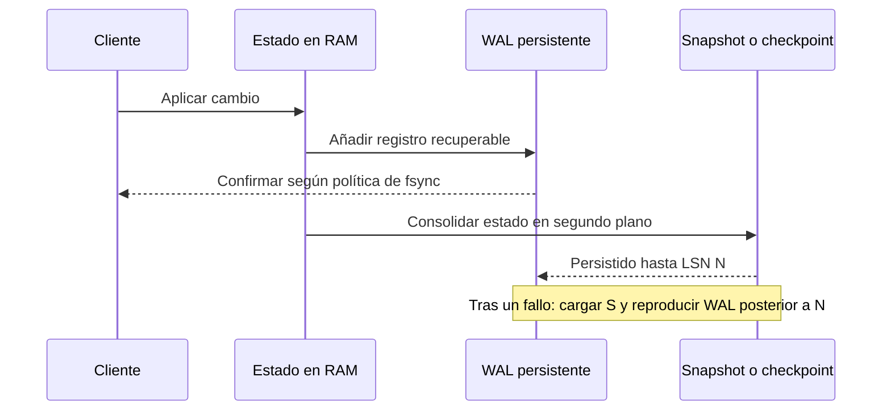

# Memoria, disco y durabilidad

[[Obsidian/lecturas/database internals/00 Empieza aquí|Inicio del libro]] → [[Obsidian/lecturas/database internals/01 Introducción y panorama general/00 Índice|Introducción y panorama general]]

> [!abstract] Idea que organiza la nota
> Todos los motores usan memoria y almacenamiento persistente. La distinción útil es cuál constituye el hogar principal del dato y qué costos físicos guiaron las estructuras. Durabilidad no aparece por guardar «en memoria» o «en disco»: se construye con un protocolo verificable.

## El medio cambia la forma del motor

RAM permite direccionar posiciones pequeñas y seguir punteros con latencia baja. SSD y disco transfieren bloques; una lectura aleatoria cuesta mucho más que acceder a un byte ya residente. Por eso un árbol diseñado para almacenamiento intenta ser ancho y bajo: cada página contiene muchos separadores y cada I/O descarta gran parte del espacio de búsqueda. En memoria pueden tolerarse más saltos entre nodos pequeños.

Una base **principalmente en disco** considera persistente el archivo de páginas y utiliza RAM como buffer. Una base **principalmente en memoria** mantiene allí el estado activo y usa almacenamiento para log, snapshots y backups. Que un dataset de disco esté completamente cacheado no lo convierte automáticamente en una base nativa de memoria: conserva serialización, páginas, offsets y protocolos pensados para persistencia.

| Pregunta | Motor orientado a memoria | Motor orientado a disco |
|---|---|---|
| ¿Dónde vive la copia activa? | RAM | Páginas persistentes |
| ¿Qué optimiza el layout? | Acceso fino y punteros | Pocos I/O y transferencias por bloque |
| ¿Para qué sirve el disco? | Log, snapshot, backup | Fuente persistente y recuperación |
| ¿Qué limita capacidad? | Costo y tamaño de RAM | Capacidad e I/O del medio |

## Durabilidad: prometer solo lo que puede recuperarse

Cambiar una estructura en RAM es rápido, pero un corte de energía borra ese estado. Para poder responder «commit exitoso» sin escribir inmediatamente toda la base, el motor combina un **log secuencial** y un **checkpoint**.

**Lo que demuestra la secuencia:** el camino del cliente termina cuando el registro persistente satisface la política acordada, no necesariamente cuando el estado completo queda consolidado. El snapshot posterior agrupa muchos cambios. Tras un fallo, snapshot y sufijo del log se complementan: el primero evita reconstruir toda la historia y el segundo conserva lo ocurrido después.

El orden es crucial. Si el motor permite que una página de datos modificada dependa de un cambio antes de registrar información suficiente en WAL, una caída puede dejar una página imposible de explicar. **Write-ahead** significa que el registro necesario se hace durable antes que la página cuya recuperación depende de él.

## Tres estados que no deben confundirse

Una escritura puede haber cambiado una variable del proceso, haber sido entregada al sistema operativo o haber alcanzado el medio persistente según la garantía de sincronización. Son estados distintos. Confirmar pronto mejora latencia, pero cambia cuánto puede perderse. Agrupar varios commits en una sincronización reduce el costo promedio —group commit— a cambio de que algunos esperen al lote.

**Lo que demuestra la jerarquía:** cada nivel continuo acumula una garantía más fuerte. Las líneas punteadas separan hechos que suelen confundirse: llamar a `write` o llegar al page cache no equivale necesariamente a persistencia estable. El límite exacto depende de hardware, sistema operativo y configuración; la aplicación debe conocer la promesa real.

## Presupuestar memoria de forma realista

Que el archivo CSV mida 40 GB no demuestra que la base quepa cómodamente en 64 GB. Hay que sumar índices, versiones, encabezados, alineación, fragmentación, buffers, estructuras temporales y margen para picos. Réplicas y recuperación también importan: cargar un snapshot enorme y reproducir un log largo puede hacer que el reinicio tarde más de lo aceptable.

La memoria no volátil reduce la brecha tradicional, pero no elimina la consistencia. Persistir bytes parcialmente o en un orden inesperado todavía exige barreras, checksums y protocolos de publicación. Menor latencia física no convierte una actualización de múltiples campos en atómica por sí sola.

> [!example] Elegir con la garantía en mente
> Un caché de sesiones puede tolerar perder segundos y reconstruirse desde otro sistema; puede confirmar con una política relajada. Un libro mayor financiero necesita saber exactamente cuándo el cambio sobrevivirá al reinicio. La misma estructura rápida no responde ambas necesidades sin cambiar el protocolo.

## Recupera la idea sin mirar

> [!question]- ¿Por qué un motor en memoria todavía necesita disco?
> Si promete durabilidad, necesita una representación persistente desde la que reconstruir: normalmente log más snapshots, además de backups.

> [!question]- ¿Qué problema resuelve el checkpoint que no resuelve el WAL por sí solo?
> Acorta la recuperación. Sin checkpoints, habría que reproducir el log desde el inicio o conservarlo indefinidamente.

> [!question]- ¿Por qué árboles anchos ayudan en disco?
> Porque una sola página trae muchos separadores. Cada lectura reduce mucho el rango restante y evita más accesos aleatorios.

**Fuente:** [[Obsidian/lecturas/database internals/Materiales/Database Internals - Parte I (fuente).pdf#page=11|PDF, capítulo 1, desde p. 11]].

---

**Anterior:** [[Obsidian/lecturas/database internals/01 Introducción y panorama general/01 Arquitectura de un DBMS|Arquitectura de un DBMS]] · **Índice:** [[Obsidian/lecturas/database internals/01 Introducción y panorama general/00 Índice|Ver este bloque]] · **Siguiente:** [[Obsidian/lecturas/database internals/01 Introducción y panorama general/03 Filas columnas y wide-column|Filas, columnas y wide-column]]
