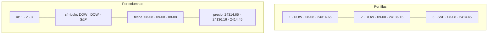
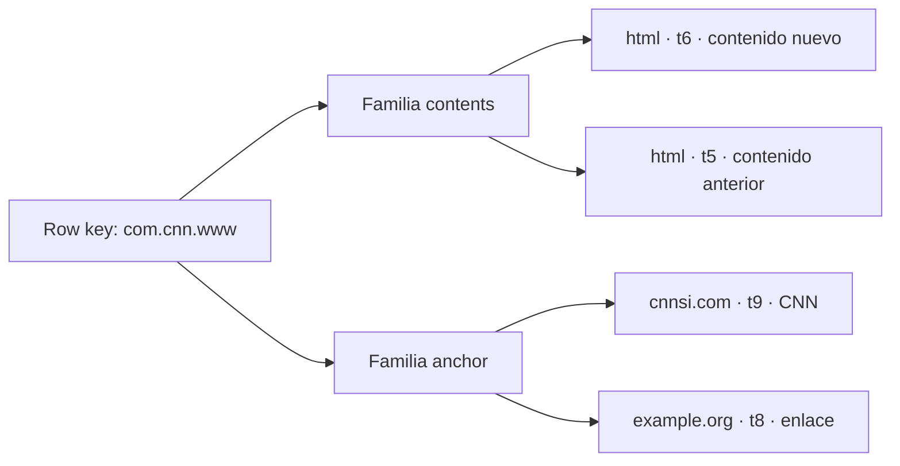

# Filas, columnas y wide-column

[[Obsidian/lecturas/database internals/00 Empieza aquí|Inicio del libro]] → [[Obsidian/lecturas/database internals/01 Introducción y panorama general/00 Índice|Introducción y panorama general]]

> [!abstract] Idea que organiza la nota
> Una tabla lógica no fija cómo se acomodan sus bytes. Agrupar por fila favorece recuperar entidades; agrupar por columna favorece recorrer atributos. Una wide-column store es otra cosa: un modelo de mapa ordenado por row key, familias y versiones.

## Una tabla, dos disposiciones

![[Obsidian/lecturas/database internals/Recursos visuales/05-filas-columnas.svg|1000]]

**Lo que demuestra la figura:** el amarillo marca los bytes útiles para una suma de `precio`. En layout por filas, esos valores viajan dentro de registros completos; en layout por columnas están contiguos y las demás columnas pueden omitirse. La ventaja depende del acceso: si la operación necesitara cada entidad completa, la localidad de filas cambiaría el costo.

Supón tres cotizaciones:

| id | símbolo | fecha | precio |
|---:|---|---|---:|
| 1 | DOW | 08-08 | 24314.65 |
| 2 | DOW | 09-08 | 24136.16 |
| 3 | S&P | 08-08 | 2414.45 |

**Lo que demuestra la disposición:** ambos recuadros contienen la misma información. En filas, cada bloque contiguo reconstruye una entidad completa; en columnas, cada bloque reúne un atributo de muchas entidades. Las líneas expresan proximidad física conceptual, no relaciones semánticas entre valores.

## Filas: localidad para entidades

En un layout por filas, los campos del pedido 731 quedan próximos. `SELECT * FROM pedidos WHERE id=731` localiza una fila y aprovecha los bytes que ya trajo la página. Inserts y updates que afectan una entidad completa encajan con esta unidad.

El costo aparece cuando una consulta necesita solo `importe` de cien millones de pedidos. Leer cada fila también mueve identificadores, textos y fechas que terminarán descartados. El problema no es el cálculo de la suma, sino los bytes inútiles transferidos entre almacenamiento, memoria y CPU.

## Columnas: localidad para atributos

En un layout columnar, todos los importes próximos forman una secuencia homogénea. `AVG(importe)` puede ignorar las demás columnas. Esto ofrece tres beneficios conectados:

- Menos I/O porque solo se leen los atributos requeridos.
- Mejor compresión porque valores del mismo tipo y distribución repiten patrones; funcionan bien diccionarios, deltas, RLE y bit-packing.
- Ejecución vectorizada porque la CPU procesa lotes de valores con menos saltos y puede usar SIMD.

Pero una fila no desaparece conceptualmente. Si la posición 10 de `importe` corresponde al mismo registro que la posición 10 de `fecha`, updates y deletes deben preservar esa alineación mediante grupos de filas, bitmaps, identificadores o reescrituras. Recuperar muchas columnas de pocas filas puede obligar a saltar entre varios segmentos.

| Patrón dominante | Suele favorecer |
|---|---|
| Pocas filas, casi todas sus columnas | Filas |
| Inserts y updates de entidades completas | Filas |
| Muchas filas, dos o tres columnas | Columnas |
| Agregaciones y compresión intensa | Columnas |

No es una elección absoluta. Un sistema puede conservar datos recientes por filas y convertir históricos a columnas, o mantener una representación columnar derivada para análisis.

## Wide-column no significa columnar analítico

Una **wide-column store** modela datos como un mapa multidimensional ordenado. La ruta conceptual es:

`row key → familia → qualifier → timestamp → valor`

**Lo que demuestra la jerarquía:** una row key conduce a familias que contienen qualifiers y versiones temporales. Las ramas no son columnas analíticas contiguas, sino componentes de un mapa asociados a la misma fila. Esa identidad por fila permite datos dispersos: no es necesario materializar todos los qualifiers posibles.

Las **familias de columnas** agrupan datos que suelen consultarse y configurarse juntos. Pueden almacenarse por separado, pero dentro de una familia el orden principal continúa girando alrededor de la row key. Invertir un dominio (`com.cnn.www`) hace que claves de dominios relacionados queden próximas en orden lexicográfico; eso sirve para rangos por prefijo.

La confusión nace del nombre. «Columnar» describe layout físico para escanear un atributo de muchas filas. «Wide-column» describe un modelo y una organización por clave/familia que admite columnas dispersas y versiones. Preguntar qué consulta se vuelve contigua en almacenamiento despeja la diferencia.

> [!example] Dos consultas que revelan el layout
> `SELECT * FROM usuario WHERE id=17` quiere una entidad: por filas evita reconstruirla. `SELECT AVG(edad) FROM usuarios` quiere un atributo masivo: por columnas evita leer campos inútiles. En una wide-column store, buscar una row key y una familia recupera celdas asociadas a esa fila; no equivale al segundo caso.

## Recupera la idea sin mirar

> [!question]- ¿Por qué los datos columnares suelen comprimirse mejor?
> Porque valores vecinos comparten tipo y patrones: repeticiones, rangos pequeños o deltas. Las codificaciones explotan esa homogeneidad.

> [!question]- ¿Cuál es el precio de reconstruir filas desde columnas?
> Hay que mantener correspondencia entre posiciones o identificadores y visitar varias regiones cuando la consulta necesita muchos atributos.

> [!question]- ¿Qué prueba que wide-column y columnar no son sinónimos?
> En wide-column el acceso se organiza por row key, familia, qualifier y versión; en columnar analítico se agrupan valores del mismo atributo a través de muchas filas.

**Fuente:** [[Obsidian/lecturas/database internals/Materiales/Database Internals - Parte I (fuente).pdf#page=14|PDF, capítulo 1, desde p. 14]].

---

**Anterior:** [[Obsidian/lecturas/database internals/01 Introducción y panorama general/02 Memoria disco y durabilidad|Memoria, disco y durabilidad]] · **Índice:** [[Obsidian/lecturas/database internals/01 Introducción y panorama general/00 Índice|Ver este bloque]] · **Siguiente:** [[Obsidian/lecturas/database internals/01 Introducción y panorama general/04 Archivos de datos y organización|Archivos de datos y organización]]
