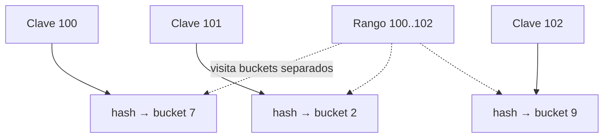

# Archivos de datos y organización

[[Obsidian/lecturas/database internals/00 Empieza aquí|Inicio del libro]] → [[Obsidian/lecturas/database internals/01 Introducción y panorama general/00 Índice|Introducción y panorama general]]

> [!abstract] Idea que organiza la nota
> Un archivo solo ofrece una secuencia de bytes. El DBMS añade páginas y reglas para ubicar registros. Heap, hash e index-organized table eligen qué operación será barata y dónde quedará el costo restante.

## Por qué no basta con archivos del sistema operativo

Una base persigue simultáneamente poco espacio desperdiciado, pocos accesos para encontrar un registro y modificaciones baratas. Esas metas compiten. Comprimir todo al máximo dificulta modificar; insertar siempre al final facilita escribir, pero no encontrar; mantener orden facilita rangos, pero obliga a conservarlo.

La unidad práctica es la **página**, un bloque de tamaño fijo o acotado que el motor transfiere, cachea, verifica y recupera. Aunque cambie un campo de ocho bytes, primero debe localizarse la página que lo contiene. Dentro, una tabla de slots puede separar identidad y posición: `(page_id, slot_id)` sigue nombrando un registro aunque sus bytes se muevan dentro de esa página.

**Lo que demuestra la doble referencia:** la clave no necesita apuntar a un byte absoluto. El `page_id` reduce la búsqueda a una página y el slot resuelve la posición interna. Esta indirección permite reorganizar celdas dentro de la página sin reescribir todos los localizadores externos.

## Heap file: insertar sin mantener orden

Un **heap file** guarda registros sin orden obligatorio por clave. El motor usa páginas con espacio libre o añade otras. Insertar suele ser barato porque no necesita encontrar una posición ordenada. La consecuencia es clara: buscar `id=731` sin índice exige recorrer registros. Con un índice, la lectura hace dos etapas: índice y luego heap.

«Heap» aquí no significa la estructura de prioridad heap ni la memoria dinámica del proceso. Significa archivo de registros no ordenado por su clave lógica.

El heap conviene cuando hay varios caminos de acceso secundarios y mover la fila independientemente del orden de esos índices resulta útil. Requiere, sin embargo, administrar espacio libre, registros variables y localizadores estables.

## Hash-organized: igualdad antes que rangos

Una función hash transforma la clave en un bucket. Para `clave = x`, permite saltar a una región pequeña. Pero 100 y 101 pueden caer en buckets distantes, de modo que `clave BETWEEN 100 AND 200` no se vuelve una lectura contigua. Colisiones y crecimiento también necesitan estrategia: encadenamiento, buckets de desborde o redistribución.

**Lo que demuestra la dispersión:** claves vecinas llegan al hash con orden, pero sus destinos dejan de ser vecinos. La igualdad aprovecha el salto directo; un rango pierde la localidad original y debe consultar múltiples regiones.

## Index-organized table: la fila vive en el índice

En una **index-organized table (IOT)**, las hojas del índice primario contienen el registro completo. Al recorrer el árbol no hace falta un segundo salto a un heap. Además, filas próximas por la clave quedan próximas físicamente, lo que beneficia rangos.

El precio es que las filas ocupan espacio dentro de las hojas. Menos entradas caben en cada página, disminuye el fan-out y las divisiones pueden mover más bytes. Una fila grande también hace costoso mantener el orden. Por eso «evitar un lookup» no significa ganar siempre.

| Organización | Igualdad | Rango | Inserción | Dónde vive la fila |
|---|---|---|---|---|
| Heap sin índice | Escaneo | Escaneo | Simple | Archivo sin orden |
| Heap + índice | Índice + salto | Depende del índice; filas dispersas | Mantiene índice | Heap separado |
| Hash-organized | Fuerte | Débil | Maneja buckets | Bucket hash |
| IOT | Fuerte | Fuerte por clave principal | Mantiene orden y divide páginas | Hoja del índice |

## Qué ocurre al crecer una fila

Si un campo variable ya no cabe, el motor puede mover el registro, dejar un forward pointer o separar el valor grande. Cada opción cambia lecturas y mantenimiento. Un localizador estable mediante slot reduce referencias rotas dentro de la página, pero no resuelve por sí solo un traslado a otra página. Esta tensión reaparecerá al estudiar índices secundarios.

> [!tip] Pregunta de diseño
> No preguntes «¿qué organización es más rápida?». Pregunta «¿qué accesos son igualdad o rango, cuántas escrituras habrá y qué costo acepto cuando un registro se mueve?».

## Recupera la idea sin mirar

> [!question]- ¿Por qué una página es más que una agrupación arbitraria?
> Porque actúa como unidad de I/O, caché, verificación, concurrencia y recuperación. Varias capas coordinan usando su identidad.

> [!question]- ¿Qué compra una IOT al guardar la fila en la hoja?
> Elimina el salto del índice al archivo de datos y conserva localidad por la clave. Paga con hojas más grandes y movimientos más costosos.

> [!question]- ¿Por qué hash no sirve naturalmente para rangos?
> Porque la función destruye el orden: claves cercanas no quedan en ubicaciones cercanas.

**Fuente:** [[Obsidian/lecturas/database internals/Materiales/Database Internals - Parte I (fuente).pdf#page=18|PDF, capítulo 1, desde p. 18]].

---

**Anterior:** [[Obsidian/lecturas/database internals/01 Introducción y panorama general/03 Filas columnas y wide-column|Filas, columnas y wide-column]] · **Índice:** [[Obsidian/lecturas/database internals/01 Introducción y panorama general/00 Índice|Ver este bloque]] · **Siguiente:** [[Obsidian/lecturas/database internals/01 Introducción y panorama general/05 Índices primarios secundarios y clustering|Índices primarios, secundarios y clustering]]
