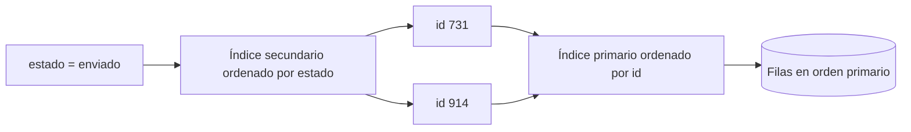
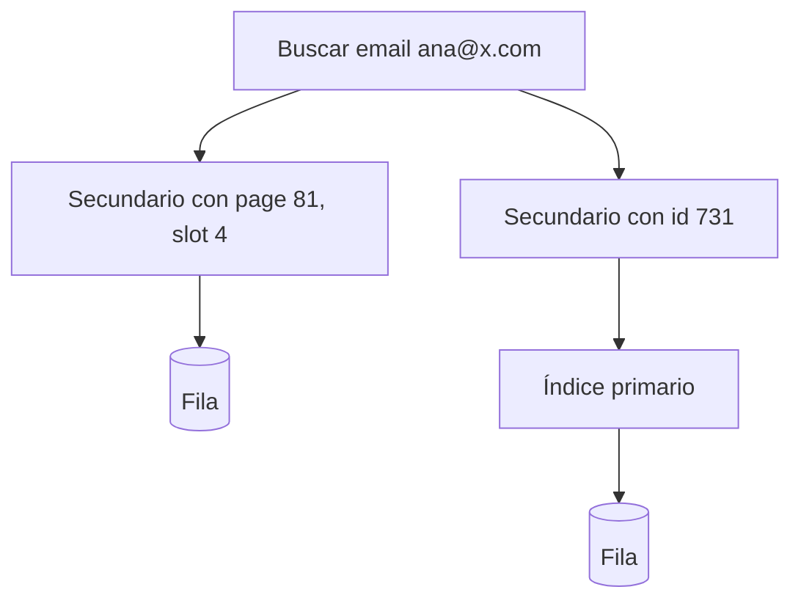

# Índices primarios, secundarios y clustering

[[Obsidian/lecturas/database internals/00 Empieza aquí|Inicio del libro]] → [[Obsidian/lecturas/database internals/01 Introducción y panorama general/00 Índice|Introducción y panorama general]]

> [!abstract] Idea que organiza la nota
> Un índice es información derivada que traduce una clave de búsqueda en un camino hacia datos. «Primario», «secundario» y «clustered» responden preguntas distintas: qué acceso representa, sobre qué atributo busca y si su orden coincide con el orden físico de las filas.

## Qué contiene un índice

Para consultar `email='ana@x.com'`, el motor necesita convertir ese valor en una ubicación o identidad. Una entrada puede guardar `(email, page_id, slot_id)`, `(email, primary_key)` o incluso columnas suficientes para responder sin visitar la tabla. El índice no es gratis: cada insert, update o delete que afecte su clave debe mantenerlo, registrar ese trabajo y recuperarlo consistentemente.

El **índice primario** es el camino principal, normalmente sobre la primary key. Un **índice secundario** añade otro orden de búsqueda, como email, fecha o estado. Una clave secundaria puede repetirse: miles de pedidos pueden tener `estado='pendiente'`, por lo que una entrada debe conducir a varios registros.

## Clustered describe proximidad física

Un índice es **clustered** cuando las filas se disponen siguiendo el orden de su clave. `id BETWEEN 100 AND 200` puede recorrer páginas contiguas. Solo hay un orden físico dominante por copia: las mismas filas no pueden estar simultáneamente ordenadas de forma independiente por `id`, `fecha` y `cliente`.

Un índice **nonclustered** mantiene su propio orden, pero sus hojas contienen localizadores o primary keys que conducen a filas cuyo orden físico es otro. «Primario» y «clustered» suelen coincidir, pero no son sinónimos: primario describe el papel de acceso; clustered, la relación con el layout.

**Lo que demuestra el recorrido:** el secundario agrupa entradas por estado, pero las filas siguen organizadas por la clave primaria. Cada coincidencia entrega una identidad primaria y provoca otro recorrido. Por eso encontrar claves puede ser barato mientras recuperar sus filas produce I/O disperso.

## Dos formas de apuntar desde un secundario

### Localizador físico directo

La hoja guarda `(page_id, slot_id)`. Tras encontrar el término secundario, hay un salto directo a la fila. Funciona bien mientras la ubicación permanezca estable. Si una división, compactación o crecimiento mueve la fila a otra página, todos los secundarios con ese localizador deben actualizarse o usar un mecanismo de redirección.

### Indirección mediante primary key

La hoja guarda la primary key. La lectura recorre primero el secundario y después el primario. Añade trabajo, pero la identidad estable no cambia cuando la fila se relocaliza. Esto desacopla la organización secundaria de la física.

**Lo que demuestra la comparación:** la rama directa hace un solo salto después del secundario, pero termina en una ubicación mutable. La indirecta recorre además el índice primario, aunque la referencia intermedia `id 731` permanece estable. El diseño intercambia latencia de lectura por costo de reparar referencias cuando una fila se mueve.

| Hoja secundaria guarda | Lectura | Si la fila se mueve | Espacio |
|---|---|---|---|
| Localizador físico | Un salto | Puede exigir reparar secundarios | Suele ser compacto |
| Primary key | Dos recorridos | El secundario permanece válido | Depende del tamaño de la PK |
| Ambos | Prueba directa y valida/fallback | Reparación diferida posible | Más grande y complejo |

## Por qué importa el tamaño de la clave primaria

Si cada índice secundario repite la primary key, una clave larga se multiplica por número de filas e índices. Con cinco secundarios, cien millones de filas y una clave de 32 bytes, solo esas copias representan 16 GB antes de encabezados, árboles y fragmentación. También caben menos entradas por página, baja el fan-out y crece el I/O.

## Índices de cobertura

Un índice puede incorporar columnas adicionales para responder una consulta sin visitar la fila. Por ejemplo, `(cliente_id, fecha) INCLUDE (importe)` puede cubrir un informe que solo necesita esas columnas. Reduce saltos, pero duplica datos y hace más costosa cada actualización de las columnas incluidas. «Cubrir» es relativo a una consulta concreta, no una propiedad universal.

> [!warning] Un índice acelera una ruta y grava las escrituras
> Crear uno para cada filtro posible aumenta páginas sucias, WAL, memoria, recuperación y contención. La decisión debe basarse en consultas reales, selectividad y costo de mantenimiento.

## Recupera la idea sin mirar

> [!question]- ¿Por qué solo hay un orden clustered principal por copia?
> Porque una secuencia física no puede estar ordenada simultáneamente por claves independientes. Otros órdenes requieren índices o copias adicionales.

> [!question]- ¿Cuándo conviene guardar la primary key en el secundario?
> Cuando se valora que la referencia sobreviva a movimientos de la fila y se acepta un segundo recorrido para obtenerla.

> [!question]- ¿Un índice de baja selectividad nunca sirve?
> No. Puede servir si cubre la consulta, si se combina con otras condiciones o si evita un escaneo costoso; pero encontrar gran parte de la tabla y luego saltar a sus filas puede ser peor que escanear.

**Fuente:** [[Obsidian/lecturas/database internals/Materiales/Database Internals - Parte I (fuente).pdf#page=21|PDF, capítulo 1, desde p. 21]].

---

**Anterior:** [[Obsidian/lecturas/database internals/01 Introducción y panorama general/04 Archivos de datos y organización|Archivos de datos y organización]] · **Índice:** [[Obsidian/lecturas/database internals/01 Introducción y panorama general/00 Índice|Ver este bloque]] · **Siguiente:** [[Obsidian/lecturas/database internals/01 Introducción y panorama general/06 Mutabilidad orden y buffering|Mutabilidad, orden y buffering]]
