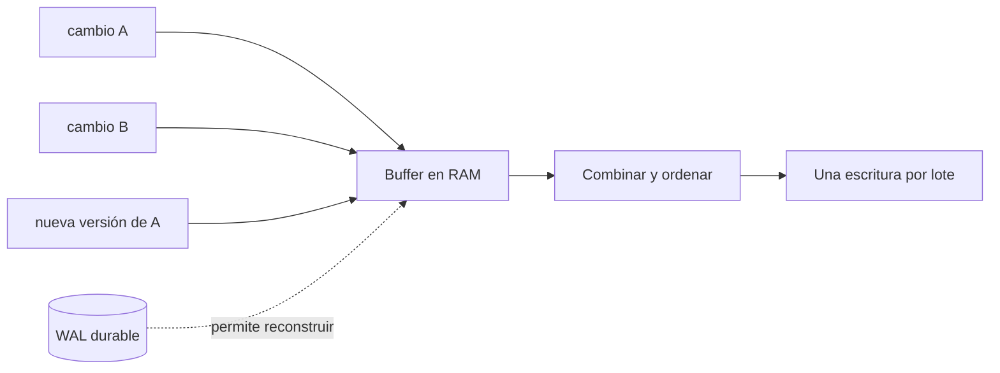
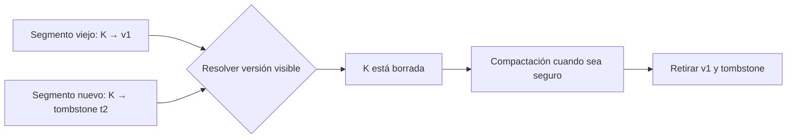
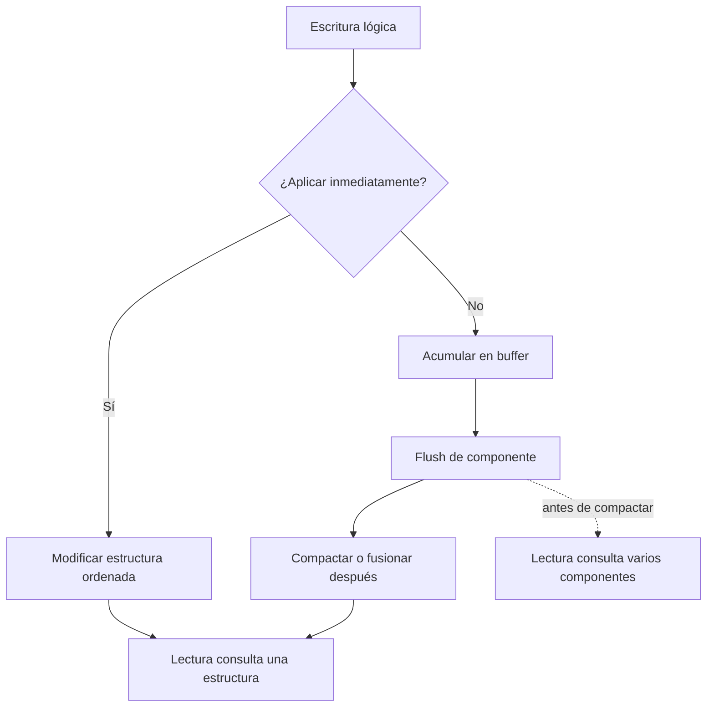

# Mutabilidad, orden y buffering

[[Obsidian/lecturas/database internals/00 Empieza aquí|Inicio del libro]] → [[Obsidian/lecturas/database internals/01 Introducción y panorama general/00 Índice|Introducción y panorama general]]

> [!abstract] Idea que organiza la nota
> Buffering, mutabilidad y orden son tres decisiones independientes que explican gran parte de un motor. Ninguna elimina trabajo: decide si pagarlo en la escritura inmediata, en una lectura futura o en mantenimiento de fondo.

## Buffering: juntar cambios para amortizar

El almacenamiento mueve bloques. Escribir cien cambios de 100 bytes como cien operaciones separadas puede tocar repetidamente páginas de 8 KiB. Un buffer acumula, combina y descarga cambios por lotes. Una operación física costosa sirve entonces a muchas operaciones lógicas: ese costo se **amortiza**.

El beneficio principal es throughput, no magia. Aparecen estado pendiente, presión de memoria y una pregunta de fallo: ¿qué ocurre si se pierde el buffer antes del flush? Un WAL durable puede conservar suficiente información para reconstruirlo.

**Lo que demuestra el flujo:** tres cambios convergen en memoria y el lote puede reconocer que la versión nueva de A reemplaza a la anterior. Así se descarga menos trabajo redundante. El WAL no vacía el buffer: conserva evidencia durable para reconstruirlo tras un fallo.

## Mutabilidad: sobrescribir o publicar otra versión

Una estructura **mutable** modifica una página en su ubicación lógica. Evita conservar muchas versiones y suele ofrecer una ruta directa de lectura, pero debe protegerse contra torn writes, concurrencia y fallos a mitad de actualización. WAL, latches y protocolos de recuperación hacen segura la aparente simplicidad de «cambiar en el sitio».

Una estructura **inmutable** no altera lo publicado. Añade una versión, escribe un segmento nuevo o usa copy-on-write para producir páginas y una nueva raíz. Esto facilita snapshots y publicación atómica: lectores antiguos conservan la raíz anterior y lectores nuevos adoptan la nueva. El precio son versiones obsoletas, múltiples lugares por consultar y garbage collection.

Un **tombstone** representa un borrado en diseños que conservan versiones. Simplemente omitir una clave en el segmento nuevo no basta: una copia antigua podría resucitar. La marca debe dominar versiones previas hasta que compactación pueda eliminar ambas con seguridad.

**Lo que demuestra la resolución:** el rombo compara versiones, no concatena valores. El tombstone domina a `v1` por ser posterior, pero debe permanecer como evidencia del borrado. La compactación solo puede retirar ambos cuando ningún lector, snapshot o réplica los necesita.

## Orden: mantenerlo ahora o reconstruirlo después

Datos ordenados por clave vuelven eficientes rangos y recorridos secuenciales. Pero insertar en el lugar correcto puede dividir páginas o mover bytes. Guardar en orden de llegada abarata el append, aunque consultar por clave necesitará un índice o fusionar componentes; consultar rangos necesitará clasificación o segmentos ya ordenados.

El orden no desaparece como costo: cambia de momento. Un B-Tree tradicional mantiene orden durante actualizaciones por página. Un LSM Tree ordena una memtable y descarga componentes inmutables, pero después reconcilia solapamientos mediante compactación. Un heap evita orden en los datos y depende de índices para caminos eficientes.

| Diseño conceptual | Buffering | Mutabilidad | Orden |
|---|---|---|---|
| B-Tree tradicional | Buffer pool | Actualiza páginas con recuperación | Global por clave |
| LSM Tree | Memtable y lotes | Segmentos en disco inmutables | Cada segmento; merge posterior |
| Heap file | Buffer de páginas | Suele actualizar registros | Sin orden de clave |
| Copy-on-write tree | Puede agrupar cambios | Publica páginas nuevas | Global por clave |

## Las tres decisiones forman una ruta de costos

**Lo que demuestra la bifurcación:** la rama izquierda paga el orden durante la escritura para conservar una estructura única. La derecha abarata la ruta inmediata mediante buffer y flush, pero crea trabajo de fondo y lecturas temporales sobre varios componentes. Son rutas de costo, no identidades universales: existen B-Trees con otras políticas y LSM Trees con compactaciones diferentes.

## Amplificación: medir el trabajo indirecto

Una escritura lógica de 100 bytes puede registrar WAL, ensuciar una página de 8 KiB, mantener tres índices y reescribir más tarde segmentos durante compactación: **amplificación de escritura**. Una consulta puede revisar varios componentes y descartar resultados: **amplificación de lectura**. Versiones obsoletas ocupan espacio: **amplificación de espacio**.

Optimizar una suele desplazar costo a otra. Más buffering reduce operaciones pequeñas, pero aumenta memoria y trabajo pendiente. Más compactación mejora lecturas y espacio, pero consume I/O. El diseño debe considerar p95/p99 y mantenimiento, no solo el tiempo ideal de una operación aislada.

> [!example] La misma clave cambia cien veces
> Aplicar cada cambio a una página ordenada mantiene una sola versión visible, pero toca repetidamente la estructura y el WAL. Acumularlos puede conservar solo el último valor al descargar, aunque exige que el log permita recuperar el estado pendiente y que las lecturas consulten memoria además de disco.

## Recupera la idea sin mirar

> [!question]- ¿Qué significa amortizar una escritura?
> Repartir el costo de una operación física entre muchos cambios lógicos, normalmente agrupándolos y eliminando trabajo redundante.

> [!question]- ¿Por qué append-only no significa «nunca borrar»?
> La ruta inmediata añade versiones o tombstones; compactación o garbage collection recupera después el espacio de lo obsoleto.

> [!question]- ¿Cuál es la pregunta correcta al comparar B-Tree y LSM?
> Dónde paga cada uno el orden, qué amplificación produce bajo la carga real y cuánto mantenimiento de fondo puede absorber el sistema.

**Fuente:** [[Obsidian/lecturas/database internals/Materiales/Database Internals - Parte I (fuente).pdf#page=21|PDF, capítulo 1, páginas 21–22]].

---

**Anterior:** [[Obsidian/lecturas/database internals/01 Introducción y panorama general/05 Índices primarios secundarios y clustering|Índices primarios, secundarios y clustering]] · **Índice:** [[Obsidian/lecturas/database internals/01 Introducción y panorama general/00 Índice|Ver este bloque]] · **Siguiente:** [[Obsidian/lecturas/database internals/02 Fundamentos de B-Trees/00 Índice|Fundamentos de B-Trees]]
