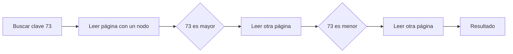
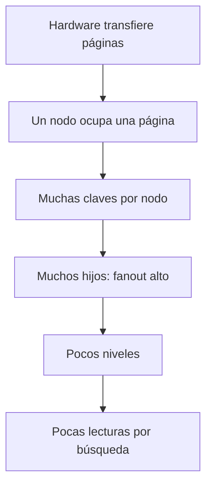

# Hardware, páginas y árboles de búsqueda

[[Obsidian/lecturas/database internals/00 Empieza aquí|Inicio del libro]] → [[Obsidian/lecturas/database internals/02 Fundamentos de B-Trees/00 Índice|Fundamentos de B-Trees]]

## El problema no es comparar, sino mover datos

Un árbol binario de búsqueda mantiene una regla elegante: cada nodo separa claves menores y mayores. Si está equilibrado, localizar una clave entre `N` elementos exige alrededor de `log₂ N` decisiones. Esa descripción es suficiente mientras nodos y punteros viven en RAM. Allí, seguir un puntero suele costar mucho menos que solicitar una página que no está en memoria.

En almacenamiento persistente la unidad práctica no es el nodo diminuto, sino un **bloque o página completa**. Aunque solo falten unos bytes, el sistema mueve varios KiB. Si cada nodo binario ocupa una ubicación distinta, una búsqueda paga una transferencia por decisión y desperdicia casi todos los bytes de cada página. Un millón de claves requieren cerca de veinte niveles en un árbol binario perfectamente equilibrado: veinte comparaciones parecen pocas; hasta veinte lecturas aleatorias pueden ser demasiadas.

**Lo que demuestra la ruta:** cada comparación binaria es correcta, pero puede conducir a otra transferencia de página. Las cajas «Leer» separan el trabajo de CPU del movimiento de datos y muestran por qué la forma del árbol debe reducir transferencias, no solo comparaciones.

## Por qué “empaquetar nodos” no resuelve todo

Podríamos colocar varios nodos binarios en una misma página. Algunas decisiones serían internas y baratas, pero seguirían existiendo muchos punteros, huecos y relaciones padre-hijo que mantener. Las rotaciones de un AVL o de un árbol rojo-negro, sencillas como cambios de punteros en memoria, pueden convertir una modificación en varias escrituras persistentes. Además, el orden de inserción puede degenerar un BST no balanceado en una lista: insertar `10, 20, 30, 40` deja cada elemento como hijo derecho del anterior.

El B-Tree cambia la granularidad del diseño: **una página entera es un nodo**. Dentro de ella guarda muchas claves ordenadas; esas claves dividen el dominio en muchos intervalos y cada intervalo tiene un puntero a otra página. Se acepta hacer más comparaciones con datos ya cargados para evitar accesos adicionales. Esa es la razón del “B” práctico: no es un árbol binario ancho por estética, sino una estructura adaptada a transferencias por bloques.

**Lo que demuestra la cadena causal:** transferir por páginas favorece nodos que concentran muchas claves; más claves producen mayor fanout; y mayor fanout reduce niveles y lecturas. Claves más grandes o espacio desperdiciado invierten la cadena: caben menos entradas, baja el fanout, crece la altura y aumenta la latencia potencial.

## HDD y SSD cambian el peso, no la idea

En un HDD, una lectura aleatoria necesita mover el cabezal y esperar la rotación; una vez posicionado, leer bytes contiguos es relativamente barato. Agrupar muchas claves por página evita movimientos mecánicos repetidos. En un SSD ya no existe cabezal, pero persisten granularidades físicas: se leen y programan páginas, mientras que el borrado ocurre en bloques mayores. El controlador mantiene una tabla de traducción lógica-física y puede copiar páginas vivas antes de reutilizar un bloque. Por eso escrituras pequeñas y dispersas pueden amplificarse.

La página del motor, la página del sistema operativo y la página flash no tienen por qué medir lo mismo. Sin embargo, en todas las capas resulta útil agrupar trabajo y aprovechar localidad. Un B-Tree continúa siendo valioso en SSD porque reduce la cantidad de páginas que se consultan y conserva claves relacionadas en regiones ordenadas. Lo que cambia es la importancia relativa: en HDD domina la localización mecánica; en SSD pesan más caché, paralelismo, traducción y amplificación de escritura.

## Referencias persistentes

Un puntero de RAM es una dirección que el proceso puede seguir. En un archivo suele ser un identificador de página o un desplazamiento. Antes de acceder al hijo, el motor traduce esa referencia, consulta su caché y, si falta, pide la página al almacenamiento. Una estructura con menos referencias externas tiene menos oportunidades de provocar fallos de caché y menos relaciones persistentes que actualizar.

> [!important] La intuición que debes conservar
> `O(log N)` no determina por sí solo el rendimiento. Pregunta siempre cuál es la base del logaritmo, cuántas decisiones ocurren dentro de una página ya cargada y cuántas obligan a traer otra.

## Comprueba que lo entendiste

> [!question]- ¿Por qué un árbol binario equilibrado puede ser peor que un B-Tree aunque ambos tengan altura logarítmica?
> Porque la base del logaritmo y la unidad de costo son distintas. El binario decide entre dos ramas y puede necesitar una página por nodo; el B-Tree resuelve cientos de intervalos dentro de una página ya cargada y reduce los saltos externos.

> [!question]- ¿Qué cambia al pasar de HDD a SSD y qué no cambia?
> Desaparece la búsqueda mecánica y cambian latencias, paralelismo y costos de escritura. No desaparecen la transferencia por bloques, los fallos de caché ni la conveniencia de reducir páginas visitadas.

> [!question]- ¿Por qué no se persisten punteros de memoria dentro del árbol?
> Porque una dirección virtual solo tiene sentido durante la vida y el mapeo de un proceso. En disco se guardan page IDs u offsets que el motor puede resolver de nuevo al abrir el archivo.

**Fuente:** [[Obsidian/lecturas/database internals/Materiales/Database Internals - Parte I (fuente).pdf#page=23|PDF, p. 23]], [[Obsidian/lecturas/database internals/Materiales/Database Internals - Parte I (fuente).pdf#page=28|PDF, pp. 28–31]]. Ejemplos numéricos propios.

---

**Anterior:** [[Obsidian/lecturas/database internals/02 Fundamentos de B-Trees/00 Índice|Índice]] · **Índice:** [[Obsidian/lecturas/database internals/02 Fundamentos de B-Trees/00 Índice|Ver capítulo]] · **Siguiente:** [[Obsidian/lecturas/database internals/02 Fundamentos de B-Trees/02 Anatomía fanout altura y ocupación|Anatomía, fanout, altura y ocupación]]
