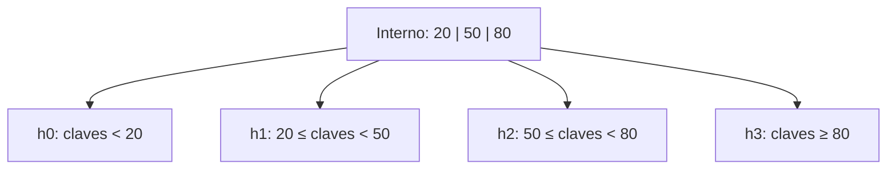
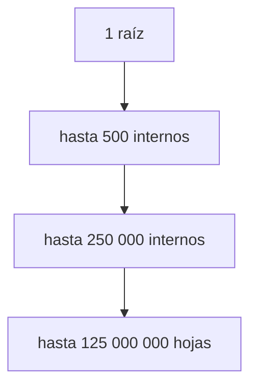

# Anatomía, fanout, altura y ocupación

[[Obsidian/lecturas/database internals/00 Empieza aquí|Inicio del libro]] → [[Obsidian/lecturas/database internals/02 Fundamentos de B-Trees/00 Índice|Fundamentos de B-Trees]]

> [!info] Recuerda antes
> - Un nodo del B-Tree se diseña para ocupar una **página**, la unidad que el motor mueve entre almacenamiento y memoria.
> - Una comparación dentro de una página residente es mucho más barata que traer otra página.
> Con esa base, la anatomía del nodo explica cómo el árbol cambia comparaciones locales por menos I/O.

## Una página interna es un mapa de intervalos

Un B-Tree es ordenado, balanceado y multivía. Una página interna contiene claves **separadoras** y punteros a hijos. Si muestra los separadores `20 | 50 | 80`, no afirma que solo existan esos tres valores: divide todo el dominio en cuatro intervalos. Cada hijo se hace responsable de uno. La convención exacta varía; en estas notas, un separador representa la primera clave del hijo situado a su derecha.

**Lo que demuestra la partición:** comparar `67` con los separadores descarta `<50` y `≥80`, de modo que solo `h2` conserva la clave como candidata. Tres separadores crean cuatro subrangos; en general, `n` separadores necesitan `n + 1` hijos para cubrir el dominio sin huecos.

La raíz no tiene padre y puede ser también hoja cuando el árbol es pequeño. Los nodos internos solo refinan rangos. Las hojas contienen claves y valores, o claves y referencias a registros. En la variante usual de bases de datos, parecida al B+Tree, los valores se guardan únicamente en las hojas; así las páginas internas dedican más bytes a separadores y punteros y logran más fanout. Todas las hojas permanecen a la misma profundidad: eso es estar balanceado. No significa que todas estén igualmente llenas.

## Fanout: cuántas alternativas resuelve una página

![[Obsidian/lecturas/database internals/Recursos visuales/06-fanout-altura.svg|1000]]

**Lo que demuestra la ruta naranja:** el árbol estrecho necesita cuatro páginas para alcanzar el objetivo; el nodo ancho descarta más rangos por página y necesita tres. La diferencia relevante no es cuántas cajas aparecen, sino cuántos saltos realiza la búsqueda. El fanout cambia comparaciones baratas dentro de una página por menos I/O entre páginas.

El **fanout** es la cantidad de hijos direccionables desde una página interna. Se aproxima con:

`fanout ≈ bytes útiles de página / bytes por entrada interna`

Supón una página de 16 KiB, 128 bytes de cabecera y entradas internas de 24 bytes entre clave, puntero y metadatos. Quedan `16 384 - 128 = 16 256` bytes; caben aproximadamente `⌊16 256 / 24⌋ = 677` entradas. La cifra real será menor por ranuras, alineación, claves variables y espacio de seguridad, pero muestra el orden de magnitud.

La clave completa no siempre debe repetirse en niveles internos. Basta un separador que distinga inequívocamente los rangos. Acortar separadores aumenta el fanout; guardar valores grandes dentro de internos lo reduce. Esta relación explica por qué el formato de una clave —no solo el número de filas— puede cambiar la altura.

## Altura: multiplicar alcance por nivel

Con fanout efectivo `F` y altura `h`, el número de hojas direccionables crece aproximadamente como `F^h`. Si `F = 500`, una raíz puede distinguir 500 hijos; un nivel adicional alcanza unas 250 000 páginas; otro, 125 millones. Incluso si cada hoja guardara solo cien entradas, tres saltos internos abarcarían miles de millones de claves.

**Lo que demuestra la progresión:** las etiquetas representan multiplicadores de capacidad, no la cantidad literal de cajas. Cada nivel multiplica el alcance por un factor cercano al fanout. Caché y ocupación reducen la capacidad efectiva, pero no la conclusión: un árbol ancho cubre muchas claves con pocos niveles.

Dentro de cada página, localizar el separador puede hacerse con búsqueda binaria. Con 512 entradas bastan unas nueve comparaciones. Pagar nueve comparaciones de CPU sobre una página residente suele ser preferible a pagar una transferencia extra. La altura mide páginas atravesadas; no debe confundirse con las comparaciones internas.

## Ocupación: espacio usado y margen futuro

La **ocupación** es la fracción de capacidad actualmente utilizada. Una hoja con espacio para ocho entradas y cinco presentes tiene ocupación de `5/8 = 62,5 %`. Mantener todo al 100 % aprovecharía cada byte en ese instante, pero la siguiente inserción obligaría a dividir. Reservar margen absorbe modificaciones locales y reduce la frecuencia de cambios estructurales.

Una ocupación baja tiene el costo contrario: se necesitan más páginas para los mismos datos, la caché cubre una fracción menor del conjunto y los recorridos por rango tocan más hojas. El motor busca un equilibrio mediante políticas de llenado, redistribución y división. El mínimo permitido depende de la variante; la raíz suele tener reglas especiales porque puede contener menos entradas sin romper la búsqueda.

| Cambio | Beneficio | Costo posible |
|---|---|---|
| Página mayor | más entradas y fanout | más bytes por fallo de caché y por modificación |
| Clave interna menor | más fanout | lógica adicional para abreviar correctamente |
| Más espacio libre | menos `split` inmediato | más páginas y presión de caché |
| Valores solo en hojas | internos compactos | siempre se desciende hasta hoja |

> [!warning] No mezcles definiciones de “orden”
> Algunos textos cuentan el máximo de hijos; otros, el máximo de claves. Antes de usar una fórmula verifica qué representa cada símbolo. La relación estable es: con `n` separadores internos normalmente existen `n + 1` intervalos.

## Comprueba que lo entendiste

> [!question]- Si una página interna admite 500 hijos, ¿qué explica mejor la baja altura: tener claves ordenadas o multiplicar el alcance por 500 en cada nivel?
> Multiplicar el alcance. El orden permite escoger el hijo correcto; el fanout alto es lo que hace que pocos niveles cubran un conjunto enorme.

> [!question]- ¿Por qué llenar todas las páginas al 100 % puede empeorar una carga con muchas inserciones?
> Porque la siguiente entrada no tiene margen local y fuerza redistribución o `split`. Se ahorra espacio inmediato a cambio de más cambios estructurales y escrituras.

> [!question]- ¿Qué dos cantidades no debes confundir al hablar de altura?
> Páginas atravesadas entre raíz y hoja, frente a comparaciones realizadas dentro de cada página. La segunda suele ejecutarse sobre bytes ya residentes.

**Fuente:** [[Obsidian/lecturas/database internals/Materiales/Database Internals - Parte I (fuente).pdf#page=31|PDF, pp. 31–35]]. Cálculos didácticos propios.

---

**Anterior:** [[Obsidian/lecturas/database internals/02 Fundamentos de B-Trees/01 Hardware páginas y árboles de búsqueda|Hardware, páginas y árboles]] · **Índice:** [[Obsidian/lecturas/database internals/02 Fundamentos de B-Trees/00 Índice|Ver capítulo]] · **Siguiente:** [[Obsidian/lecturas/database internals/02 Fundamentos de B-Trees/03 Búsqueda puntual y rangos|Búsqueda puntual y rangos]]
