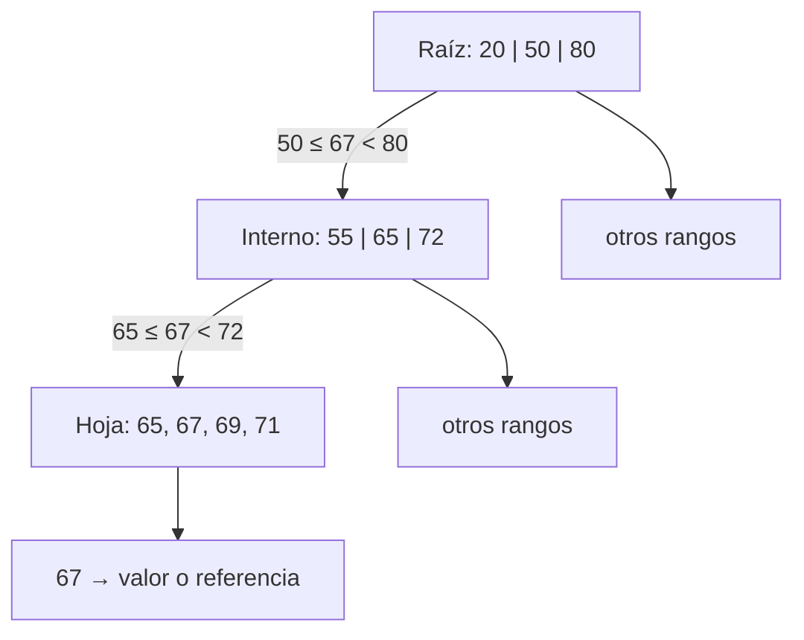

# Búsqueda puntual y rangos

[[Obsidian/lecturas/database internals/00 Empieza aquí|Inicio del libro]] → [[Obsidian/lecturas/database internals/02 Fundamentos de B-Trees/00 Índice|Fundamentos de B-Trees]]

> [!info] Recuerda antes
> - Las claves internas son **separadores**: `n` separadores delimitan `n + 1` hijos.
> - Todas las hojas están a la misma profundidad y las hojas vecinas pueden enlazarse en orden de clave.
> La búsqueda usa los separadores para reducir un intervalo; el rango reutiliza ese descenso y después aprovecha el orden de las hojas.

## Una búsqueda puntual reduce el intervalo

Buscar `clave = 67` empieza en la raíz. Dentro de cada página se localiza el primer separador mayor que la clave objetivo; el puntero situado antes de ese separador conduce al rango apropiado. Si no existe separador mayor, se toma el hijo del extremo derecho. Esta regla corresponde a nuestra convención —cada separador es la menor clave del hijo derecho—; otras implementaciones pueden usar límites distintos, pero comparación y formato deben coincidir.

Considera esta ruta:

**Lo que demuestra el descenso:** cada comparación elimina todos los subrangos salvo uno. `67` queda primero entre 50 y 80, luego entre 65 y 72, y solo en la hoja se comprueba la igualdad. Los separadores reducen el dominio; no sustituyen necesariamente a la entrada de datos de la hoja.

La búsqueda termina de dos maneras. Si la hoja contiene `67`, devuelve su valor o la referencia al registro. Si al buscar dentro de la hoja se encuentra el punto donde debería estar y no aparece, la clave no existe. No se examinan hojas vecinas para una clave única salvo que la implementación permita duplicados repartidos o use una convención especial.

## Costos que conviene mantener separados

Con `M` entradas y fanout efectivo `F`, las transferencias de página siguen aproximadamente `log_F M`. Dentro de una página con `E` separadores, la búsqueda binaria cuesta alrededor de `log₂ E` comparaciones. La caché altera el costo físico: raíz y niveles altos suelen permanecer calientes, por lo que una consulta puede atravesar cuatro niveles lógicos y necesitar solo una o dos lecturas reales.

También importa qué devuelve la hoja. Si contiene el registro completo, la búsqueda termina allí. Si contiene una dirección de fila almacenada en otra estructura, aparece una lectura adicional. Por eso “usar el índice” no garantiza el mismo costo para todas las proyecciones: un índice de cobertura puede responder con sus propios bytes; uno no cubriente necesita visitar el dato base.

## Rango: buscar una vez, avanzar en orden

Para `35 ≤ clave ≤ 78`, el árbol localiza primero `35` como si fuera una búsqueda puntual. Desde esa posición recorre entradas crecientes. Las implementaciones suelen enlazar hojas hermanas para pasar a la siguiente sin regresar al padre. El recorrido se detiene al superar `78`.

**Lo que demuestra el recorrido:** el descenso inicial paga el costo logarítmico una sola vez. Después, los punteros laterales mueven la lectura entre hojas y el trabajo crece con la salida: se omite 30 antes del límite inferior y 84 al alcanzar el superior. Repetir una búsqueda desde la raíz por cada clave desperdiciaría el orden ya encontrado.

El costo conceptual es `O(log_F M + K/B)`: la primera parte encuentra el inicio; `K` es la cantidad de resultados y `B` aproxima cuántas entradas útiles caben por hoja. Si el rango devuelve casi toda la tabla, ningún índice puede evitar leer muchos datos; la ventaja es que lo hace en orden y con acceso predecible.

Los enlaces laterales son lógicos, no una promesa de contigüidad física. Dos hojas vecinas por clave pueden estar lejos en el archivo después de muchas divisiones. El motor puede intentar asignarlas cerca o usar lectura anticipada, pero el puntero por sí solo solo garantiza cuál es la siguiente, no dónde está en el dispositivo.

## Límites, duplicados y errores sutiles

La diferencia entre “primer separador mayor que” y “mayor o igual que” es decisiva cuando la clave coincide con un separador. Si `50` es la primera clave del hijo derecho, una comparación incorrecta podría enviar `50` al hijo izquierdo. Los duplicados complican aún más la frontera: pueden codificarse junto a un identificador único, guardarse como lista de valores o extenderse por varias hojas. La operación de rango debe definir si los extremos son inclusivos y cómo continúa entre páginas.

Ejemplo paso a paso para `clave ≥ 65 AND clave < 72`:

1. La raíz elige el intervalo que contiene 65.
2. El interno conduce a la hoja cuyo rango comienza en 65.
3. La búsqueda binaria encuentra la primera posición no menor que 65.
4. Se emiten 65, 67, 69 y 71.
5. Al observar 72, se detiene porque el límite superior es exclusivo.

> [!important] Dos capacidades, una estructura
> La igualdad usa el árbol para descartar rangos hasta una entrada. El rango usa el mismo descenso solo para posicionarse y después explota el orden de las hojas. El enlace lateral evita repetir el trabajo de navegación.

## Comprueba que lo entendiste

> [!question]- Para devolver `K` claves consecutivas, ¿por qué no se hacen `K` descensos desde la raíz?
> Se desciende una vez hasta el límite inferior y después se recorre la hoja y sus hermanos. Repetir el descenso desperdiciaría el orden y los enlaces laterales.

> [!question]- ¿Qué error aparece si la convención del separador usa `>` durante la inserción pero `>=` durante la búsqueda?
> Una clave igual al separador puede enviarse a un hijo distinto de aquel donde se almacenó. La estructura seguiría dibujándose ordenada, pero algunas búsquedas producirían falsos negativos.

> [!question]- ¿Los sibling links garantizan lecturas físicamente secuenciales?
> No. Garantizan continuidad lógica por clave. Las hojas vecinas pueden estar alejadas en el archivo; la asignación, el caché y el prefetch determinan la localidad física.

**Fuente:** [[Obsidian/lecturas/database internals/Materiales/Database Internals - Parte I (fuente).pdf#page=33|PDF, pp. 33–36]]. Consultas y claves de ejemplo propias.

---

**Anterior:** [[Obsidian/lecturas/database internals/02 Fundamentos de B-Trees/02 Anatomía fanout altura y ocupación|Anatomía, fanout, altura y ocupación]] · **Índice:** [[Obsidian/lecturas/database internals/02 Fundamentos de B-Trees/00 Índice|Ver capítulo]] · **Siguiente:** [[Obsidian/lecturas/database internals/02 Fundamentos de B-Trees/04 Inserción overflow y split|Inserción, overflow y split]]
