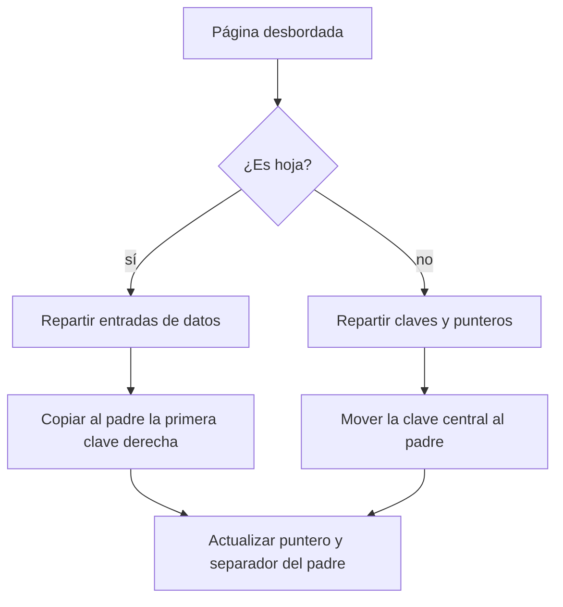
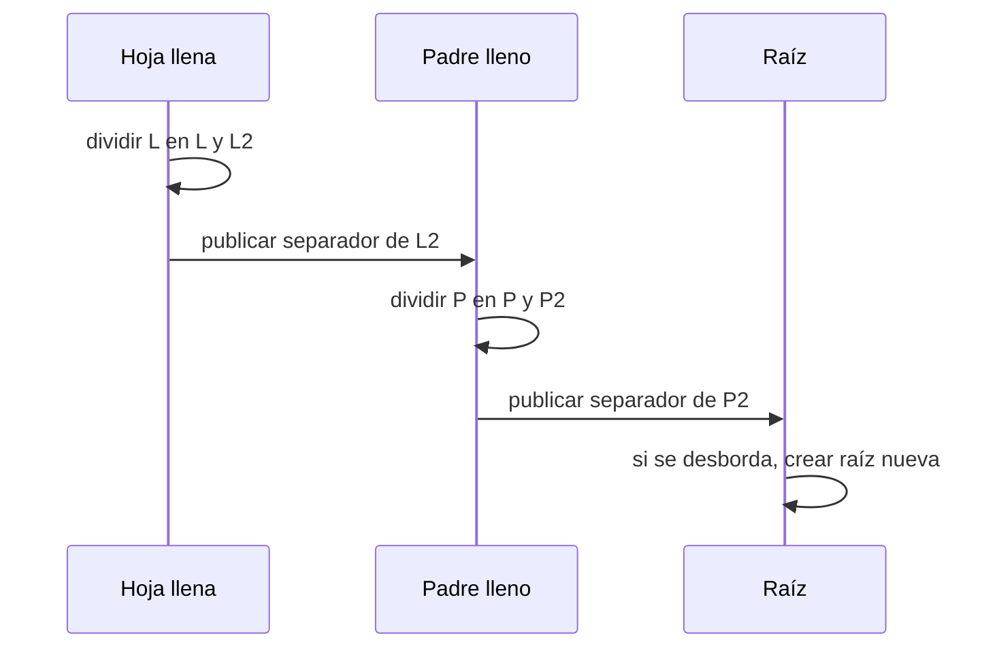

# Inserción, overflow y split

[[Obsidian/lecturas/database internals/00 Empieza aquí|Inicio del libro]] → [[Obsidian/lecturas/database internals/02 Fundamentos de B-Trees/00 Índice|Fundamentos de B-Trees]]

> [!info] Recuerda antes
> - Buscar una clave termina en la hoja responsable de su intervalo.
> - La **ocupación** mide cuánto espacio de una página está usado; el margen libre absorbe cambios locales.
> Insertar repite primero la búsqueda. El nuevo problema aparece solo cuando la entrada pertenece a una hoja que ya no tiene espacio utilizable.

## El caso común es local

Insertar empieza igual que buscar: se desciende desde la raíz hasta la hoja responsable del rango. Allí se encuentra la posición ordenada. Si hay espacio, se añade la entrada, se desplazan o reorganizan las posteriores y se actualizan metadatos como cantidad de celdas y espacio libre. No cambia la altura ni se toca otra rama.

Ejemplo con capacidad cuatro: la hoja `[10, 20, 40]` recibe `35`. El punto de inserción está entre 20 y 40 y el resultado es `[10, 20, 35, 40]`. El orden queda conservado y la operación termina. El margen vacío evita que cada escritura se convierta en una modificación estructural.

## Overflow: cuando la entrada correcta no cabe

Si la misma hoja ya contiene `[10, 20, 30, 40]`, insertar `35` produce cinco entradas para cuatro posiciones. El **overflow** no puede resolverse enviando arbitrariamente la clave a otra hoja: cada página representa un intervalo y el padre debe saber cómo alcanzarlo. La solución normal es el `split`:

1. reservar una página nueva;
2. considerar el conjunto ordenado con la entrada nueva;
3. repartir aproximadamente la mitad entre página izquierda y derecha;
4. publicar en el padre un separador y el puntero del nuevo hermano.

![[Obsidian/lecturas/database internals/Recursos visuales/02-split-btree.svg|1000]]

**Lo que demuestra el cambio de estado:** `35` pertenece entre 30 y 40 y hace desbordar la hoja. Tras el `split`, la original conserva `[10, 20]` y la nueva recibe `[30, 35, 40]`. El `30` violeta se **copia** al padre como frontera sin desaparecer de la hoja: las claves `<30` bajan a la izquierda y las `≥30`, a la derecha. El movimiento conserva orden, cobertura de rangos, profundidad uniforme y alcanzabilidad de la entrada nueva.

![[Obsidian/lecturas/database internals/Recursos visuales/09-split-btree-archivo.png|1000]]

**La analogía del archivo muestra el mismo mecanismo:** el cajón lleno de la izquierda representa una página antes del overflow. Los cajones azul y verde representan las dos páginas resultantes, con sus entradas repartidas pero aún ordenadas. La clave `67` queda en el cajón derecho porque `67 > 60`; la tarjeta `60` del estante superior representa el separador publicado en el padre para escoger entre ambos rangos. Así, el `split` no solo mueve entradas: también debe crear una ruta correcta desde el nivel superior.

> [!warning] Límite de la analogía
> La tarjeta `60` puede representar la primera clave de la página derecha o una frontera equivalente, según la convención del B-Tree. El motor mueve o copia bytes, actualiza page IDs y modifica punteros; no copia literalmente archivadores ni estantes.

La distribución exacta puede variar. Con claves de tamaño variable, “la mitad” por cantidad no siempre equivale a la mitad por bytes. Algunas políticas dejan más espacio en el lado donde se esperan futuras inserciones. Lo obligatorio es que ambas páginas respeten los límites de ocupación y que el separador del padre dirija correctamente.

## Hojas e internos no promocionan de la misma forma

En una organización con datos solo en hojas, el primer elemento del hermano derecho permanece allí y se copia como separador al padre. Si se eliminara de la hoja, la entrada de usuario desaparecería. En un nodo interno, en cambio, la clave central puede moverse al padre porque su función es separar subárboles, no representar por sí sola un registro de usuario. Los punteros restantes se reparten conservando los intervalos.

**Lo que demuestra la bifurcación:** una hoja conserva la clave separadora como dato y por eso la copia al padre. En un interno, la clave central solo organiza la navegación y puede moverse hacia arriba. Ambas ramas producen el mismo efecto estructural: una frontera y un hijo adicionales en el padre.

## Propagación: el padre también puede llenarse

Añadir el separador al padre requiere espacio. Si el padre está lleno, se divide de la misma manera conceptual y produce otro separador para su propio padre. La cascada asciende, pero solo por el camino que condujo a la hoja original; las demás ramas permanecen intactas.

**Lo que demuestra la secuencia:** cada división genera un separador que debe publicarse un nivel arriba. Si también se llena el padre, la propagación continúa por la ruta guardada. Una raíz dividida no tiene padre donde publicar, por lo que se crea otra con dos punteros; ese es el único caso que aumenta la altura y mantiene todas las hojas a la misma profundidad.

Un `split` toca más de una página: reserva el hermano, copia entradas, modifica la original y actualiza el padre; con hojas enlazadas también ajusta vecinos. En un motor real, un fallo entre pasos podría dejar una página inaccesible o un separador apuntando al rango equivocado. La implementación necesita registro de recuperación, orden de publicación o copy-on-write. El algoritmo lógico explica el resultado; no basta para garantizar atomicidad ante fallos o concurrencia.

> [!tip] Prueba mental del `split`
> Después de dividir, elige tres claves: una menor que el separador, una igual y una mayor. Simula el descenso desde el padre. Si alguna llega al hermano incorrecto, la convención del separador o el reparto están mal.

## Comprueba que lo entendiste

> [!question]- ¿Por qué un `split` de hoja normalmente copia el separador al padre, mientras que uno interno puede moverlo?
> En una hoja B+ la clave separadora también es un dato que debe seguir disponible abajo. En un nodo interno es metadato de navegación y puede pasar a representar la frontera desde el padre.

> [!question]- ¿Cuándo aumenta la altura del árbol?
> Solo cuando se divide la raíz y se crea una raíz nueva. Los demás `splits` añaden un hermano dentro de la altura existente, aunque puedan propagarse hacia arriba.

> [!question]- ¿Qué evidencia debe quedar recuperable si el proceso falla tras crear el hermano pero antes de actualizar el padre?
> Debe existir suficiente WAL o un protocolo de publicación/copy-on-write para completar o revertir la operación sin perder la nueva página ni dejar un rango inaccesible.

**Fuente:** [[Obsidian/lecturas/database internals/Materiales/Database Internals - Parte I (fuente).pdf#page=36|PDF, pp. 36–39]]. La imagen técnica y los ejemplos se elaboraron para estas notas a partir del mecanismo del capítulo.

---

**Anterior:** [[Obsidian/lecturas/database internals/02 Fundamentos de B-Trees/03 Búsqueda puntual y rangos|Búsqueda puntual y rangos]] · **Índice:** [[Obsidian/lecturas/database internals/02 Fundamentos de B-Trees/00 Índice|Ver capítulo]] · **Siguiente:** [[Obsidian/lecturas/database internals/02 Fundamentos de B-Trees/05 Borrado redistribución y merge|Borrado, redistribución y merge]]
