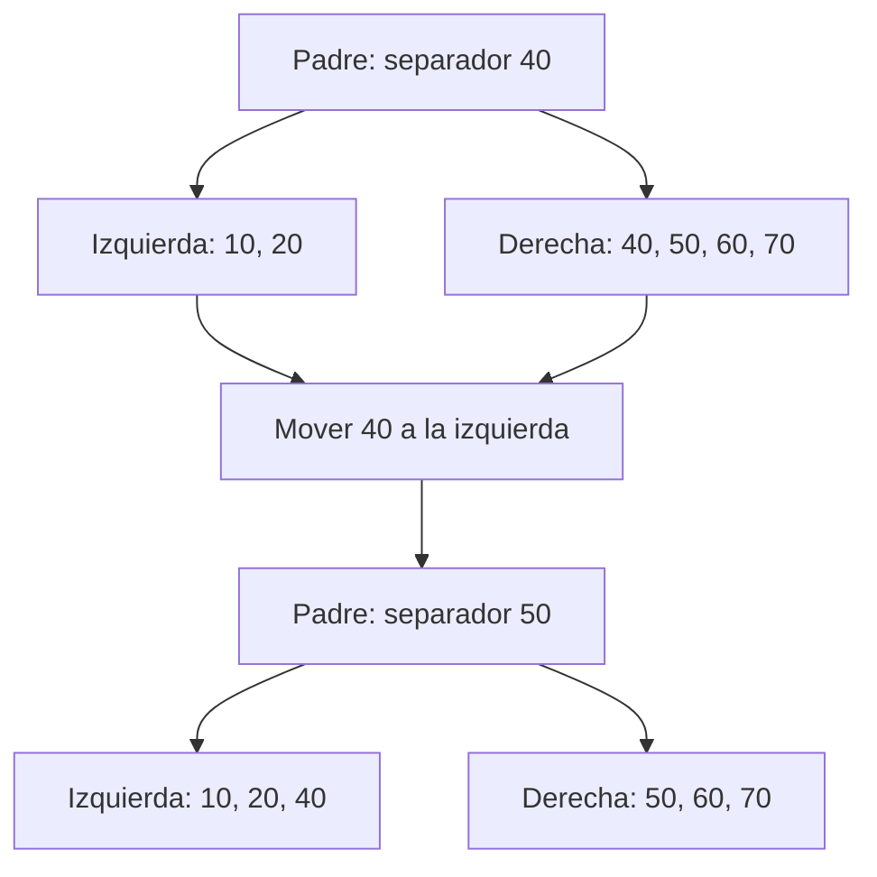
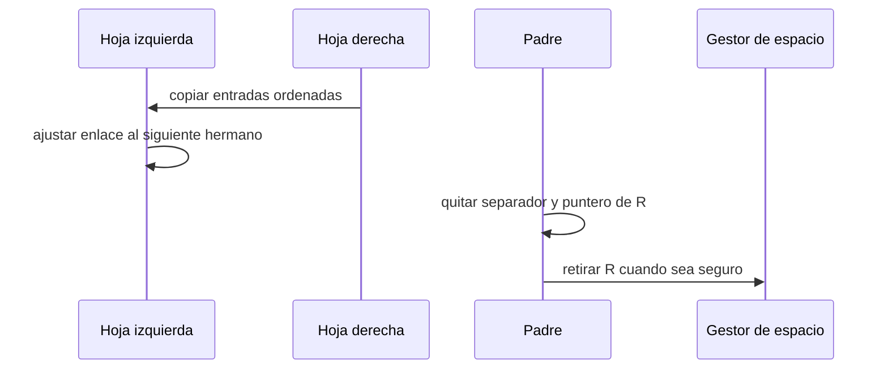

# Borrado, redistribución y merge

[[Obsidian/lecturas/database internals/00 Empieza aquí|Inicio del libro]] → [[Obsidian/lecturas/database internals/02 Fundamentos de B-Trees/00 Índice|Fundamentos de B-Trees]]

> [!info] Recuerda antes
> - Un `split` repara el exceso de ocupación creando un hermano y publicando una nueva frontera en el padre.
> - Los separadores del padre deben seguir describiendo exactamente los rangos de sus hijos.
> El borrado enfrenta el problema inverso: una página puede quedar demasiado vacía y obligar a mover o retirar fronteras sin perder alcanzabilidad.

## Borrar primero, reparar solo si hace falta

El borrado localiza la hoja, encuentra la entrada y la elimina. Si la ocupación sigue por encima del mínimo, la operación termina. Esta ruta es importante: un B-Tree no se reorganiza por cada eliminación. El trabajo estructural aparece únicamente cuando una página no-raíz queda por debajo del mínimo permitido, situación llamada **underflow**.

Supón hojas con capacidad seis y mínimo tres. Borrar `30` de `[10, 20, 30, 40]` produce `[10, 20, 40]`; todavía hay tres entradas, así que no ocurre nada más. Si se elimina también `40`, la hoja queda en `[10, 20]` y debe recuperarse ocupación o desaparecer mediante una fusión.

## Redistribuir: tomar una entrada de un hermano

Si un hermano con el mismo padre tiene más que el mínimo, puede ceder una entrada. No basta moverla: el separador del padre debe ajustarse porque cambió la frontera entre ambos rangos.

**Lo que demuestra la redistribución:** `40` deja de ser la primera clave de la hoja derecha y pasa a la izquierda. Como el separador representa la primera clave derecha, el padre debe cambiar `40` por `50`. Mover bytes sin reparar esa frontera enviaría una búsqueda de `40` al hijo equivocado.

Redistribuir mantiene el número de páginas, evita liberar espacio y normalmente no propaga el cambio hacia arriba. Puede hacerse desde el hermano izquierdo o derecho; la elección depende de quién tenga excedente, del costo de mover bytes y de la política del motor. Solo se redistribuye entre hermanos compatibles, habitualmente bajo el mismo padre, porque la operación debe mantener intervalos continuos y referencias coherentes.

## Merge: convertir dos páginas en una

Si los hermanos están cerca del mínimo y sus contenidos juntos caben en una página, pedir prestado no resuelve el déficit de manera válida. Entonces se fusionan. Con izquierda `[10, 20]` y derecha `[30]`, el resultado puede ser `[10, 20, 30]`. El padre elimina el separador `30` y el puntero al hermano derecho. La página derecha deja de formar parte lógica del árbol.

**Lo que demuestra la secuencia:** el contenido se vuelve accesible desde la hoja superviviente antes de retirar del padre la ruta antigua. La página fusionada solo puede liberarse cuando ningún lector concurrente o snapshot conserve una referencia. Alcanzabilidad en el árbol nuevo y seguridad de reutilización física son condiciones distintas.

En nodos internos, el `merge` incluye la clave separadora del padre entre los contenidos de ambos hermanos, porque esa clave es necesaria para conservar la división de los subrangos internos. Después se elimina del padre. Esta diferencia es el espejo de la inserción: en hojas, el separador suele ser una copia de una clave que ya está en la hoja; en internos, forma parte de la estructura y debe bajar al combinarse.

## Propagación y contracción de la raíz

Al perder un separador y un puntero, el padre puede quedar por debajo de su mínimo. Entonces la redistribución o fusión se repite un nivel arriba. La cascada asciende por un único camino, igual que un `split`, pero con efecto contrario. Si la raíz termina con un solo hijo, ese hijo se convierte en la nueva raíz y la altura disminuye. La raíz vacía de un árbol sin registros puede volver a ser una hoja.

Ejemplo completo:

1. Una hoja queda por debajo del mínimo tras borrar `30`.
2. Ningún hermano tiene excedente suficiente.
3. Se fusiona con el hermano derecho.
4. El padre pierde un separador y un puntero.
5. El padre ahora también queda por debajo del mínimo.
6. Se fusiona con su hermano interno y se actualiza el abuelo.
7. Si el abuelo era raíz y queda con un solo hijo, ese hijo ocupa su lugar.

## Por qué algunos motores difieren el merge

Fusionar reduce páginas y mejora ocupación, pero escribe varias páginas, cambia enlaces y puede competir con lectores. Una carga que alterna inserciones y borrados cerca del umbral puede provocar `split`, luego `merge`, luego `split` otra vez. Algunas implementaciones toleran páginas temporalmente poco ocupadas o realizan mantenimiento posterior para evitar esa oscilación. La propiedad esencial no es “fusionar inmediatamente”, sino mantener búsquedas correctas bajo las reglas específicas de la variante.

> [!warning] Borrar no equivale a devolver espacio al sistema operativo
> Una página retirada puede entrar en una lista libre del archivo y reutilizarse en futuras inserciones sin que el archivo se haga más pequeño. Eliminación lógica, reutilización interna y reducción física del archivo son estados distintos.

## Comprueba que lo entendiste

> [!question]- ¿Por qué se intenta redistribuir antes de hacer `merge`?
> Porque mover algunas entradas entre hermanos puede restaurar la ocupación sin retirar una página ni eliminar un puntero del padre. El cambio estructural queda más localizado.

> [!question]- ¿Qué debe bajar desde el padre cuando se fusionan nodos internos?
> La clave separadora que dividía ambos subrangos. Sin ella, los punteros combinados perderían una frontera necesaria para navegar correctamente.

> [!question]- ¿Por qué diferir un `merge` no implica necesariamente que el árbol sea incorrecto?
> Algunas variantes permiten ocupación temporalmente baja y conservan rutas de búsqueda válidas. El mantenimiento posterior recupera espacio y evita oscilaciones repetidas entre `split` y `merge`.

**Fuente:** [[Obsidian/lecturas/database internals/Materiales/Database Internals - Parte I (fuente).pdf#page=39|PDF, pp. 39–41]]. Claves y umbrales del ejemplo son didácticos.

---

**Anterior:** [[Obsidian/lecturas/database internals/02 Fundamentos de B-Trees/04 Inserción overflow y split|Inserción, overflow y split]] · **Índice:** [[Obsidian/lecturas/database internals/02 Fundamentos de B-Trees/00 Índice|Ver capítulo]] · **Siguiente:** [[Obsidian/lecturas/database internals/02 Fundamentos de B-Trees/06 Invariantes costos y razonamiento|Invariantes, costos y razonamiento]]
