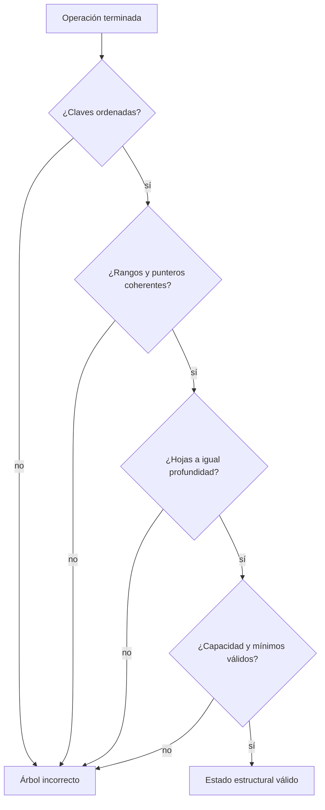
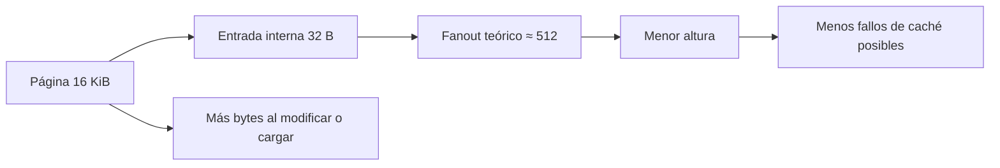

# Invariantes, costos y razonamiento

[[Obsidian/lecturas/database internals/00 Empieza aquí|Inicio del libro]] → [[Obsidian/lecturas/database internals/02 Fundamentos de B-Trees/00 Índice|Fundamentos de B-Trees]]

> [!info] Recuerda antes
> - Búsqueda, `split`, redistribución y `merge` son procedimientos distintos, pero todos modifican la misma jerarquía de intervalos.
> - Que una operación termine no demuestra que el árbol siga siendo correcto.
> Esta nota cambia el foco: de memorizar pasos a verificar las propiedades que cualquier secuencia de pasos debe conservar.

## Los invariantes convierten pasos en una estructura correcta

Un algoritmo de B-Tree no se valida porque “parece balanceado”, sino porque después de cada operación siguen cumpliéndose propiedades comprobables:

1. las claves de cada página están ordenadas;
2. cada separador y sus punteros describen intervalos no ambiguos;
3. todos los hijos son alcanzables desde la raíz;
4. todas las hojas tienen la misma profundidad;
5. ninguna página termina por encima de su capacidad;
6. ninguna página no-raíz queda bajo el mínimo exigido por la variante;
7. los enlaces entre hojas conservan el mismo orden global;
8. la raíz cumple sus reglas especiales de ocupación.

**Lo que demuestra la cadena de invariantes:** cada comprobación es necesaria y un solo «no» invalida el estado aunque las demás propiedades se cumplan. La cadena evalúa la estructura lógica resultante; recuperación y concurrencia agregan condiciones adicionales que no aparecen aquí.

Balanceado significa igual profundidad de hojas, no igual ocupación. Una hoja al 55 % y otra al 90 % pueden coexistir. Tampoco basta conservar el orden local: si el padre mantiene un separador obsoleto tras una redistribución, las hojas siguen ordenadas pero algunas claves se vuelven inalcanzables mediante la búsqueda normal.

## Modelo de costo: páginas antes que notación

Para estimar una búsqueda, comienza con el tamaño útil de página y la entrada interna. Si una página admite `F = 400` hijos y hay `M = 64 000 000` hojas potenciales, tres niveles de ramificación alcanzan `400³ = 64 000 000`. Una ruta podría ser raíz → interno → interno → hoja. Si raíz y primer interno están en caché, solo los dos niveles inferiores requieren E/S.

Las comparaciones dentro de una página son otra dimensión. Con 400 separadores, una búsqueda binaria necesita cerca de nueve comparaciones. Decir simplemente `O(log M)` oculta que el árbol paga pocas transferencias gracias a una base grande y realiza comparaciones baratas dentro de cada transferencia.

**Lo que demuestra el modelo:** páginas grandes y entradas compactas aumentan el fanout y reducen altura, pero el promedio oculta headers, slots, fragmentación y reserva de espacio. El valor `512` es una cota pedagógica; la utilidad del cálculo está en mostrar qué variable mueve cada costo.

Para un rango, agrega las hojas recorridas y los bytes devueltos. Para una inserción, distingue el caso ordinario —una hoja modificada— del caso raro pero caro de cascada de `split`. Para un borrado, distingue la eliminación local de redistribuciones o fusiones. Las operaciones estructurales son costosas, pero su costo se amortiza entre muchas operaciones que caben en páginas existentes.

## Cómo analizar un B-Tree concreto

Usa esta secuencia:

1. **Unidad física:** tamaño de página, granularidad del dispositivo y caché disponible.
2. **Formato:** bytes de cabecera, clave, puntero, valor y ranura.
3. **Fanout y capacidad de hoja:** cuántas alternativas o registros caben realmente.
4. **Ocupación:** promedio, mínimo y espacio reservado para crecimiento.
5. **Altura:** páginas en una ruta y cuáles suelen estar calientes.
6. **Patrón de claves:** crecientes, aleatorias, largas, con prefijos comunes o duplicadas.
7. **Carga:** proporción de búsquedas puntuales, rangos, inserciones, actualizaciones y borrados.
8. **Mantenimiento:** frecuencia de `split`, redistribución y `merge`, más bytes escritos por ellos.
9. **Seguridad:** coordinación de páginas durante concurrencia y recuperación tras fallos.

Claves crecientes concentran inserciones en la hoja derecha. Esto aporta localidad, pero puede crear un punto caliente y divisiones repetidas en el extremo. Claves aleatorias reparten escrituras, aunque ensucian más páginas y reducen localidad. Claves largas reducen fanout; abreviarlas en internos puede ayudar siempre que preserve el orden de comparación.

## Tres errores de razonamiento

**“Más fanout siempre es mejor.”** Reduce altura, pero una página enorme consume más caché y puede aumentar bytes leídos o reescritos. La respuesta depende de la carga y el dispositivo.

**“Una actualización toca solo la fila.”** Puede modificar hoja, padre, hermanos, enlaces y registro de recuperación. El caso común y el peor caso deben medirse por separado.

**“Una página retirada ya está libre para todos.”** Un lector concurrente, una instantánea o la recuperación pueden necesitar la versión antigua. El estado lógico y la reclamación física requieren coordinación.

> [!question]- ¿Cómo compruebo un separador después de un `split`?
> Recorre una clave menor, una igual y una mayor desde el padre. Cada una debe llegar a la hoja cuyo intervalo la contiene. Después verifica que la clave de frontera sigue presente donde corresponda según sea hoja o interno.

> [!question]- ¿Por qué dos árboles con la misma cantidad de registros pueden tener alturas distintas?
> Porque el tamaño de claves, punteros y valores cambia cuántas entradas caben; la ocupación real y las políticas de división también cambian el fanout efectivo.

> [!tip] Resumen operativo
> Buscar reduce rangos. Insertar aprovecha espacio y divide ante overflow. Borrar elimina localmente y repara underflow. Los invariantes permiten demostrar que cada cambio conserva orden, alcance y altura uniforme.

**Fuente:** [[Obsidian/lecturas/database internals/Materiales/Database Internals - Parte I (fuente).pdf#page=23|PDF, pp. 23–41]]. Las estimaciones y preguntas de comprobación son elaboración didáctica propia.

---

**Anterior:** [[Obsidian/lecturas/database internals/02 Fundamentos de B-Trees/05 Borrado redistribución y merge|Borrado, redistribución y merge]] · **Índice:** [[Obsidian/lecturas/database internals/02 Fundamentos de B-Trees/00 Índice|Ver capítulo]] · **Siguiente:** [[Obsidian/lecturas/database internals/03 Formatos de archivo/00 Índice|Capítulo 3 · Formatos de archivo]]
