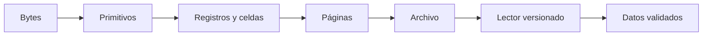

# Capítulo 3 · Formatos de archivo

[[Obsidian/lecturas/database internals/00 Empieza aquí|← Inicio del libro]]

**Pregunta central:** ¿cómo convierte un motor una secuencia de bytes en registros y páginas que puede encontrar, modificar y verificar con seguridad?

Las notas 01 a 06 recorren una capa del formato por vez, desde el significado de un entero hasta la validación de una página completa. Cada diagrama demuestra una operación, una relación de offsets o una decisión del lector.

| Nota | Lo que podrás explicar |
|---|---|
| [[Obsidian/lecturas/database internals/03 Formatos de archivo/01 Codificación binaria y endianness\|01 · Codificación binaria y endianness]] | Por qué los bytes no tienen significado por sí solos; cómo ancho, signo y orden de bytes reconstruyen un número |
| [[Obsidian/lecturas/database internals/03 Formatos de archivo/02 Strings arrays flags y registros\|02 · Strings, arrays, flags y registros]] | Cómo delimitar valores variables, empaquetar opciones y diseñar un registro con acceso seguro a sus campos |
| [[Obsidian/lecturas/database internals/03 Formatos de archivo/03 Anatomía de archivos páginas y celdas\|03 · Anatomía de archivos, páginas y celdas]] | Cómo se compone un archivo navegable y por qué una página de B-Tree necesita layouts distintos para hojas e internos |
| [[Obsidian/lecturas/database internals/03 Formatos de archivo/04 Slotted pages e indirección\|04 · Slotted pages e indirección]] | Cómo separar identidad, orden lógico y ubicación física permite mover registros sin romper referencias |
| [[Obsidian/lecturas/database internals/03 Formatos de archivo/05 Fragmentación y gestión del espacio\|05 · Fragmentación y gestión del espacio]] | Por qué tener bytes libres no significa poder insertar; cuándo reutilizar huecos, compactar o usar overflow |
| [[Obsidian/lecturas/database internals/03 Formatos de archivo/06 Versionado checksums y lectura segura\|06 · Versionado, checksums y lectura segura]] | Cómo escoger un decodificador, detectar corrupción y validar offsets antes de confiar en una página |

## Ruta mental del capítulo

**Lo que demuestra la cadena de contratos:** escribir transforma valores en campos, celdas, páginas y finalmente bytes; leer debe invertir exactamente esas decisiones. Si falta endianness, longitud, layout o versión, los mismos bytes admiten interpretaciones distintas y ya no puede reconstruirse de forma inequívoca el nivel anterior.

**Al terminar:** continúa con [[Obsidian/lecturas/database internals/04 Implementación de B-Trees/00 Índice|Implementación de B-Trees]].

**Fuente del bloque:** [[Obsidian/lecturas/database internals/Materiales/Database Internals - Parte I (fuente).pdf#page=42|PDF, pp. 42–57]].
