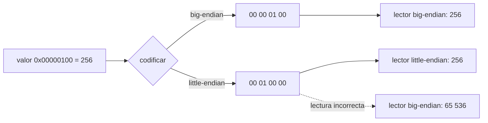
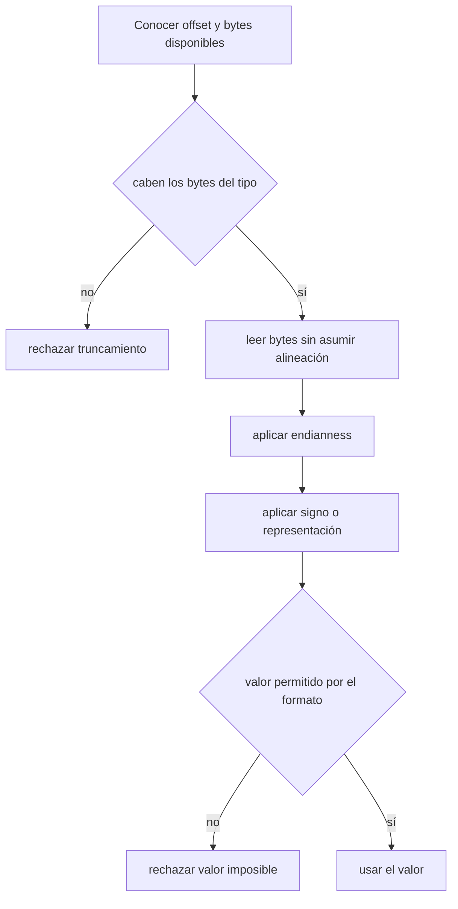

# Codificación binaria y endianness

[[Obsidian/lecturas/database internals/00 Empieza aquí|Inicio del libro]] → [[Obsidian/lecturas/database internals/03 Formatos de archivo/00 Índice|Formatos de archivo]]

## Un byte no sabe qué significa

En memoria, el lenguaje presenta variables: un `u32`, un `float` o un objeto. En el archivo solo existen bytes numerados por su posición. La secuencia `01 00 00 00` puede representar el entero 1, el entero 16 777 216, cuatro flags, parte de una imagen o simplemente datos opacos. El **formato** le da significado al fijar cuatro cosas: tipo, ancho, signo y orden de bytes.

Serializar transforma un valor lógico en bytes según ese contrato. Deserializar aplica el contrato inverso. Ambos extremos deben coincidir; que una lectura produzca *algún* número no demuestra que sea el correcto.

| Decisión | Ejemplo | Por qué importa |
|---|---|---|
| ancho | `u16` frente a `u64` | determina cuántos bytes consumir y el rango posible |
| signo | `i8` frente a `u8` | `FF` puede ser -1 o 255 |
| endianness | little frente a big | decide qué byte tiene mayor peso |
| representación | entero, IEEE 754, decimal | decide cómo interpretar los bits |

## El mismo entero en dos órdenes

![[Obsidian/lecturas/database internals/Recursos visuales/07-endianness.svg|1000]]

**Lo que demuestra la figura:** ambos lados representan `0x12345678`, pero asignan pesos distintos al byte del offset menor. Big-endian coloca primero el más significativo (`12`) y little-endian el menos significativo (`78`). Los bytes no transportan esa convención; escritor y lector deben compartirla.

Considera `0xAABBCCDD`. `AA` es el byte más significativo y `DD`, el menos significativo.

```text
dirección             +0   +1   +2   +3
big-endian          [ AA ][ BB ][ CC ][ DD ]
little-endian       [ DD ][ CC ][ BB ][ AA ]
```

Big-endian coloca primero el byte de mayor peso, de forma parecida a como escribimos un número decimal. Little-endian coloca primero el de menor peso. Ninguno es intrínsecamente mejor: el problema aparece cuando escritor y lector presuponen convenciones distintas.



**Lo que demuestra la bifurcación:** las ramas coherentes preservan el valor porque cada lector aplica la convención de su escritor. La rama punteada conserva todos los bytes, pero cambia su peso posicional y reconstruye otro número. Declarar el endianness vuelve portable el archivo; heredarlo del procesador lo hace accidentalmente local.

La reconstrucción de un `u32` little-endian hace explícito ese peso:

$$valor=b_0+(b_1\ll 8)+(b_2\ll 16)+(b_3\ll 24)$$

No basta con copiar cuatro bytes dentro de una estructura de C. El compilador puede introducir *padding* por alineación, y la ABI puede cambiar entre plataformas. Un formato persistente escribe y lee cada campo de manera definida.

## Leer un encabezado hexadecimal

Supón este contrato de página:

| Offset | Bytes | Campo | Regla |
|---:|---:|---|---|
| `0x00` | 4 | magic | ASCII literal `DBPG` |
| `0x04` | 2 | versión | `u16` little-endian |
| `0x06` | 2 | tamaño de página | `u16` little-endian |
| `0x08` | 1 | flags | mapa de bits |

```text
offset  00 01 02 03 04 05 06 07 08
0000    44 42 50 47 03 00 00 10 05
        D  B  P  G  └─3─┘ └4096┘ └ flags
```

La lectura ocurre por etapas. Primero se reconocen los cuatro bytes literales. `03 00` significa 3 porque el byte menos significativo aparece primero. `00 10` significa `0x1000`, es decir, 4096. El `05` final es `0000 0101₂`: están activos los bits 0 y 2. Sin la tabla, el dump es solo evidencia; con la tabla, puede verificarse campo por campo.

## Ancho fijo: simplicidad a cambio de espacio

Los enteros de 8, 16, 32 y 64 bits hacen predecible el siguiente offset. Si un header empieza con tres `u32`, el cuarto campo comienza en el byte 12. Esa aritmética directa facilita la lectura aleatoria y la validación.

El costo es reservar siempre el ancho completo. Un contador que casi nunca supera 100 ocupa 8 bytes si se define como `u64`. Un *varint* puede usar un byte para valores pequeños y más para grandes; ahorra espacio, pero ya no se puede localizar el campo siguiente sin decodificar el anterior. La elección depende de cuánto importa la densidad frente al acceso directo.

### El caso especial de los flotantes

IEEE 754 codifica signo, exponente y fracción. Su ancho es fijo, pero su valor suele ser una aproximación binaria. `0.1` no tiene una representación binaria finita, igual que `1/3` no tiene una decimal finita. Para dinero, un entero escalado —por ejemplo, centavos— evita que la semántica financiera dependa del redondeo flotante. Esta decisión debe estar en el contrato porque cambiarla después exige migrar bytes existentes.

## Un procedimiento de lectura disciplinado



**Lo que demuestra la secuencia:** comprobar que quedan cuatro bytes solo autoriza a construir un `u32`; todavía no demuestra que ese número sea una versión o un tamaño permitido. La lectura segura combina límites físicos antes de consumir con invariantes semánticos después de interpretar.

> [!tip] Para recordar
> Los bytes son la ortografía; el layout es la gramática. Endianness no cambia los bytes presentes, sino el peso que el lector asigna a su posición.

> [!question]- ¿Por qué `sizeof(struct)` no define un formato durable?
> Porque incorpora decisiones del compilador y la plataforma, como padding, alineación y endianness. Un formato durable especifica offsets y codificaciones de manera independiente.

> [!question]- `04 03 02 01` representa `0x01020304`. ¿Qué orden se usó?
> Little-endian: el byte menos significativo, `04`, aparece en la dirección más baja.

**Fuente:** [[Obsidian/lecturas/database internals/Materiales/Database Internals - Parte I (fuente).pdf#page=44|PDF, pp. 44–45]]. Hex dump y procedimiento de validación elaborados para estas notas.

---

**Anterior:** [[Obsidian/lecturas/database internals/03 Formatos de archivo/00 Índice|Inicio del capítulo]] · **Índice:** [[Obsidian/lecturas/database internals/03 Formatos de archivo/00 Índice|Ver este bloque]] · **Siguiente:** [[Obsidian/lecturas/database internals/03 Formatos de archivo/02 Strings arrays flags y registros|Strings arrays flags y registros]]
