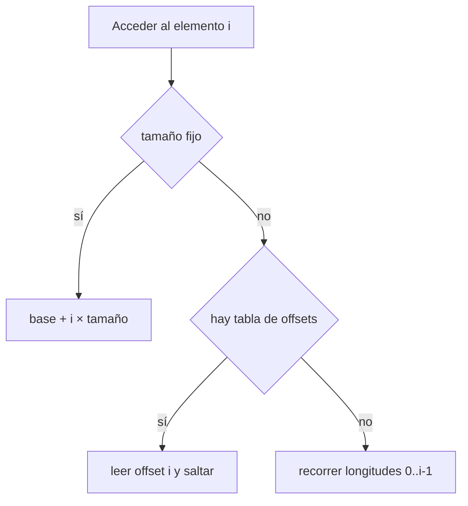
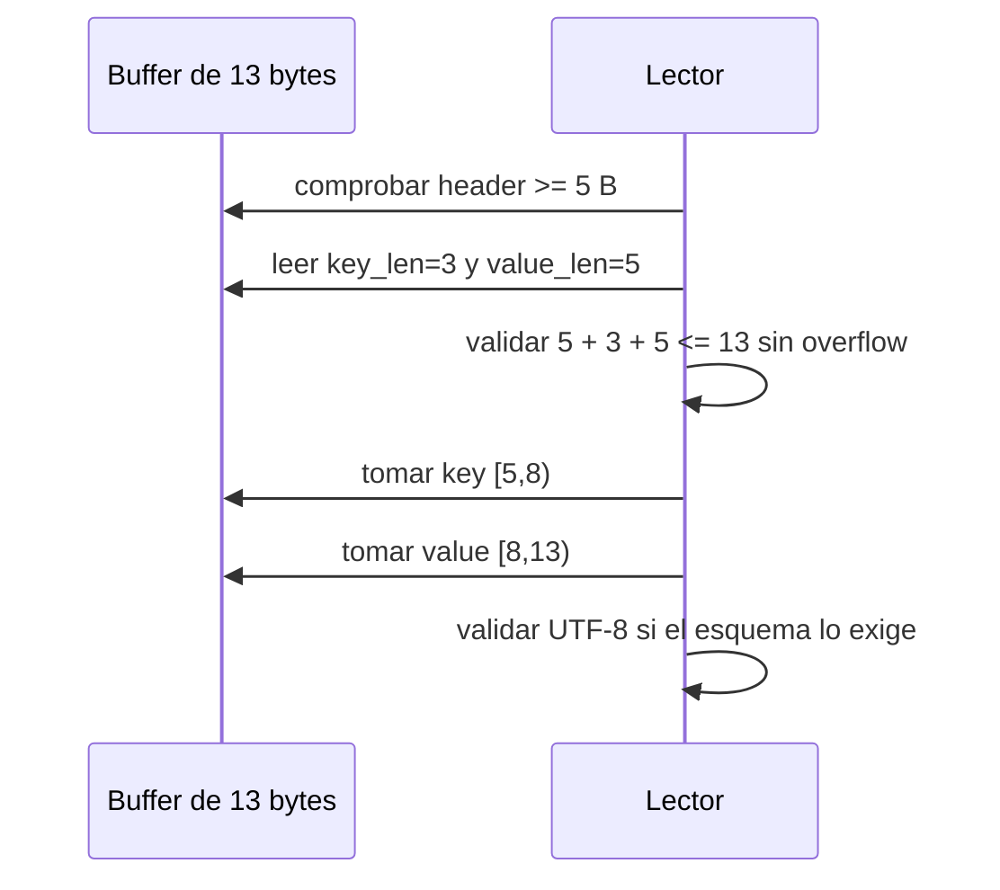

# Strings, arrays, flags y registros

[[Obsidian/lecturas/database internals/00 Empieza aquí|Inicio del libro]] → [[Obsidian/lecturas/database internals/03 Formatos de archivo/00 Índice|Formatos de archivo]]

## El problema es saber dónde termina un valor

Un `u32` siempre consume cuatro bytes; una cadena no. Si el lector no conoce su final, tampoco conoce el inicio del campo siguiente. Por eso un tipo variable necesita **delimitación**. Dos estrategias clásicas son prefijar la longitud o reservar un terminador.

```text
longitud prefijada:  05 00 | 68 6F 6C 61 21
                     u16      h  o  l  a  !

terminada en cero:   68 6F 6C 61 21 00
                      h  o  l  a  ! fin
```

La longitud prefijada permite conocer el final en O(1) y admite cualquier byte en el contenido. La cadena terminada en cero obliga a buscar el terminador y necesita una regla especial si `00` puede formar parte del valor. Un prefijo `u16` también impone un límite: como máximo 65 535 bytes, salvo que el formato defina una extensión.

> [!warning] Caracteres no son bytes
> En UTF-8, `a` ocupa un byte, pero muchos caracteres ocupan dos, tres o cuatro. Si la longitud delimita bytes, el escritor debe contar bytes codificados; contar caracteres desplaza todos los campos posteriores.

## Arrays: conteo no siempre significa acceso directo

Para elementos fijos, el conteo basta:

```text
[count:u16][elemento 0:u32][elemento 1:u32]...[elemento n-1:u32]
```

El elemento `i` empieza en `base + i × 4`. Para elementos variables, conocer `count` solo dice cuántos hay; no indica dónde empieza el elemento 17. Se puede recorrer los 16 anteriores o guardar una tabla de offsets.



**Lo que demuestra la bifurcación:** la aritmética directa ofrece acceso barato solo con elementos uniformes; la tabla de offsets compra acceso aleatorio a cambio de metadatos; y el recorrido secuencial ahorra la tabla pero vuelve lineal el acceso al elemento `i`. Las slotted pages reutilizan este mismo intercambio a escala de página.

## Enums, booleanos y flags

Un **enum** elige una alternativa excluyente: `0 = ROOT`, `1 = INTERNAL`, `2 = LEAF`. Los **flags** describen propiedades que pueden coexistir. Como cada flag ocupa un bit, sus máscaras son potencias de dos.

```text
IS_LEAF       = 0000 0001 = 0x01
VARIABLE_SIZE = 0000 0010 = 0x02
HAS_OVERFLOW  = 0000 0100 = 0x04

flags = 0x05  = 0000 0101
```

El valor `0x05` activa `IS_LEAF` y `HAS_OVERFLOW`, no `VARIABLE_SIZE`. Para consultar overflow se evalúa `(flags & 0x04) != 0`; para activarlo, `flags | 0x04`; para desactivarlo, `flags & ~0x04`.

| Construcción | Pregunta que responde | Error frecuente |
|---|---|---|
| booleano | ¿sí o no? | dedicar un byte a cada opción sin necesidad |
| enum | ¿cuál de estas alternativas? | reutilizar un número antiguo con otro significado |
| flags | ¿qué propiedades simultáneas están activas? | usar valores que no son potencias de dos |

Los bits reservados necesitan una política. Un lector puede ignorarlos si solo agregan información, o rechazar la entrada si alteran el layout. Ignorar por optimismo un bit que significa “contenido comprimido” haría interpretar bytes comprimidos como registros.

## Diseñar un registro mixto

Supón un empleado con `id:u64`, `fecha:u32`, `activo:flag`, `nombre` y `apellido` en UTF-8. Los campos fijos pueden ir al principio y los variables al final. Para cada cadena se almacena `offset + length`.

```text
┌──────────────── header fijo ────────────────┐
│ id:u64 │ fecha:u32 │ flags:u8              │
│ nombre_off:u16 │ nombre_len:u16              │
│ apellido_off:u16 │ apellido_len:u16          │
├──────────────── datos variables ───────────────┤
│ bytes de nombre │ bytes de apellido              │
└──────────────────────────────────────────────────┘
```

Guardar solo longitudes reduciría el header, pero para llegar al apellido habría que calcular dónde termina el nombre. Con offset y longitud, cada campo se alcanza de forma independiente y se valida contra los límites del registro. Esta separación también evita que el compilador decida el padding.

### Ejemplo de celda clave-valor

Contrato:

```text
flags:u8 | key_len:u16 LE | value_len:u16 LE | key | value
```

Dump para clave `ana` y valor `Quito`:

```text
offset  00 01 02 03 04 05 06 07 08 09 0A 0B 0C
0000    01 03 00 05 00 61 6E 61 51 75 69 74 6F
        │  └─3─┘ └─5─┘  a  n  a  Q  u  i  t  o
        └ flags
```

El lector no debería crear las vistas de `key` y `value` inmediatamente. Primero confirma que existen cinco bytes de header, lee las longitudes sin salirse, comprueba la suma y solo entonces corta rangos.



**Lo que demuestra la secuencia:** cada acceso al buffer depende de una comprobación previa que demuestra que el rango existe. Solo después de delimitar los bytes se valida UTF-8, porque permanecer dentro del buffer y formar texto válido son condiciones independientes.

## Desbordamiento aritmético: el fallo menos visible

No conviene validar solo `header + key_len + value_len <= buffer_len`: si la suma se hace en un entero estrecho, puede desbordarse y volver a un valor pequeño. Una forma segura es comprobar por restas: `key_len <= restantes` y, después de consumir la clave, `value_len <= restantes`. El archivo debe tratarse como entrada no confiable aunque lo haya escrito el mismo motor, porque puede estar truncado o corrupto.

> [!tip] Para recordar
> Longitud delimita; offset permite saltar; flag describe una propiedad. Cada metadato existe para evitar una búsqueda o una ambigüedad concreta.

> [!question]- ¿Por qué un conteo no basta para saltar al elemento 20 de un array variable?
> Porque no informa cuántos bytes ocupan los 20 elementos anteriores. Hace falta recorrer sus longitudes o consultar una tabla de offsets.

> [!question]- ¿Qué compra guardar `offset + length` por campo?
> Acceso independiente y validación local de cada rango; el costo es un header mayor.

**Fuente:** [[Obsidian/lecturas/database internals/Materiales/Database Internals - Parte I (fuente).pdf#page=46|PDF, pp. 46–48]]. Registro y hex dump ampliados con validaciones didácticas.

---

**Anterior:** [[Obsidian/lecturas/database internals/03 Formatos de archivo/01 Codificación binaria y endianness|Codificación binaria y endianness]] · **Índice:** [[Obsidian/lecturas/database internals/03 Formatos de archivo/00 Índice|Ver este bloque]] · **Siguiente:** [[Obsidian/lecturas/database internals/03 Formatos de archivo/03 Anatomía de archivos páginas y celdas|Anatomía de archivos páginas y celdas]]
