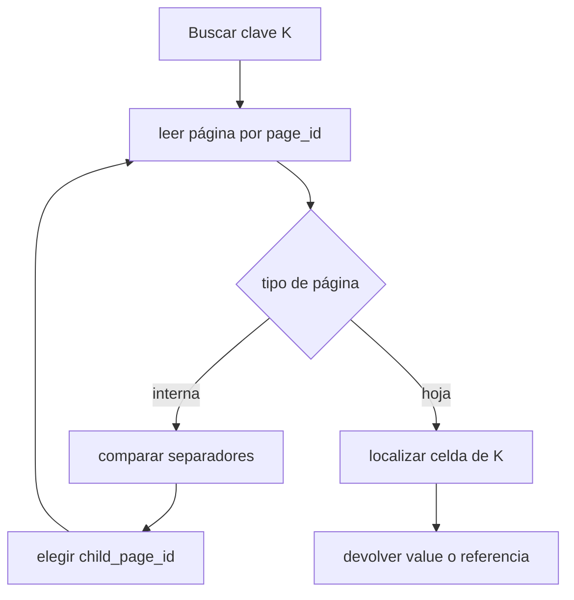

# Anatomía de archivos, páginas y celdas

[[Obsidian/lecturas/database internals/00 Empieza aquí|Inicio del libro]] → [[Obsidian/lecturas/database internals/03 Formatos de archivo/00 Índice|Formatos de archivo]]

> [!info] Recuerda antes
> - Los bytes no se describen solos: el lector necesita tipo, ancho, endianness y reglas para longitudes variables.
> - Un registro combina varios campos codificados, pero todavía falta decidir dónde vive y cómo se localiza.
> El archivo añade esa escala superior: agrupa registros en celdas, celdas en páginas y páginas bajo un contrato global.

## Del archivo a una dirección calculable

Un archivo es una secuencia de bytes, pero un motor necesita unidades con significado. Una organización frecuente coloca un header global, una secuencia de páginas y, a veces, un tráiler. El header contiene lo mínimo necesario para interpretar el cuerpo: *magic*, versión, tamaño de página o ubicación de metadatos.


**Lo que demuestra el layout:** las flechas conectan regiones consecutivas del archivo, no punteros de memoria. Un prefijo estable permite interpretar el header y el tamaño de página vuelve calculable el inicio de cada unidad. El tráiler es opcional porque algunos formatos mantienen sus índices dentro de las propias páginas.

Si el header mide `H` bytes y todas las páginas miden `P`, el comienzo de la página `i` es:

$$offset(i)=H+i\cdot P$$

Ejemplo: con `H = 4096`, `P = 8192` e `i = 7`, el offset es `61 440`. Un `page_id` es una identidad lógica; esta fórmula es una posible traducción. Si hay compresión o tamaños variables, puede hacer falta una tabla de páginas. La ventaja del ID sigue siendo la misma: las referencias no dependen de una dirección virtual de proceso.

## Por qué el motor trabaja con páginas

Las páginas suelen medir varios KiB y agrupan registros para leerlos, cachearlos, bloquearlos y verificar su integridad. En un B-Tree, una página suele contener un nodo. Esto alinea la estructura lógica con una unidad de E/S manejable.

| Página mayor | Página menor |
|---|---|
| más claves y mayor fanout | menor costo al leer o ensuciar una unidad |
| menos niveles potenciales | más metadatos y posiblemente más niveles |
| buena eficiencia secuencial | granularidad fina para caché y recuperación |
| mayor amplificación para cambios pequeños | menos bytes útiles por cabecera |

No existe un tamaño universal. El adecuado depende del dispositivo, tamaño de claves, patrón de lectura y política de caché. “La página coincide con un bloque físico” es una simplificación: filesystem, dispositivo y motor pueden usar granularidades distintas.

## Una página también necesita un contrato

Supón una página de 4096 bytes:

| Offset | Tamaño | Campo |
|---:|---:|---|
| `0x00` | 4 | magic `BTPG` |
| `0x04` | 1 | versión |
| `0x05` | 1 | flags/tipo de página |
| `0x06` | 2 | número de celdas |
| `0x08` | 2 | fin del directorio |
| `0x0A` | 2 | inicio de celdas |
| `0x0C` | 4 | checksum |

```text
00: 42 54 50 47 02 01 03 00 16 00 D0 0F 7A 31 9C 04
    B  T  P  G  v  fl └─3─┘ └─22┘ └4048┘ └ checksum ─┘
10: E8 0F DC 0F D0 0F ...
    └─4072 └─4060 └─4048   offsets little-endian
```

El header dice que hay tres entradas. El directorio ocupa desde `0x10` hasta `0x16`; las celdas comienzan en `0x0FD0`. Por tanto, el espacio contiguo está en `[0x0016, 0x0FD0)`. Los offsets `0x0FE8`, `0x0FDC` y `0x0FD0` apuntan a celdas ubicadas cerca del final.

El lector puede comprobar relaciones antes de tocar una celda: `fin_directorio <= inicio_celdas <= 4096`, y `16 + 2 × cell_count = fin_directorio`. Estas ecuaciones convierten los metadatos en invariantes verificables.

## Celdas internas y celdas hoja

Una página interna de B-Tree dirige la navegación; una hoja contiene datos o referencias a ellos. Por eso sus celdas no tienen el mismo layout.

```text
celda interna:
┌─ key_size:u32 ─┬─ child_page_id:u32 ─┬─ key:byte[key_size] ─┐
└───────────────└─────────────────────└──────────────────────┘

celda hoja:
┌─ flags:u8 ─┬─ key_size:u32 ─┬─ value_size:u32 ─┬─ key ─┬─ value ─┐
└───────────└─────────────────└───────────────────└────────└─────────┘
```

Si el tipo vive en el header de página, no hace falta repetirlo en cada celda. Esa economía funciona porque todas las celdas de la página comparten interpretación. Si una sola página mezclara varios tipos, cada entrada necesitaría etiqueta o una tabla adicional.



**Lo que demuestra el ciclo:** una página interna entrega el ID de la siguiente página y repite el descenso. Al llegar a una hoja cambia el layout esperado y aparece el valor. El flag del header controla esa bifurcación y determina qué campos deben existir en cada celda.

## Por qué una concatenación simple deja de servir

Con registros fijos, una página puede ser un array y el registro `i` está en `base + i × size`. Al introducir claves y valores variables surgen tres problemas:

1. insertar en medio obliga a desplazar payloads;
2. borrar deja un hueco o vuelve a desplazar;
3. si una referencia externa guarda el offset, mover el registro la rompe.

Dividir la página en bloques fijos evita algunos desplazamientos, pero crea fragmentación interna. Un registro de 65 bytes dentro de bloques de 64 necesita dos bloques y desperdicia 63 bytes. La siguiente nota introduce un directorio de slots para desacoplar el orden del registro de su ubicación.

> [!tip] Para recordar
> Archivo contiene páginas; página contiene celdas; el tipo de página determina la interpretación de cada celda. Un `page_id` nombra; el layout localiza.

> [!question]- ¿Por qué una página interna no necesita `value_size`?
> Porque su función es dirigir la búsqueda: relaciona separadores con IDs de páginas hijas. La hoja es la que almacena el valor o su referencia.

> [!question]- ¿Qué demuestra `fin_directorio <= inicio_celdas`?
> Que el directorio y la región de celdas no se solapan; si falla, el header describe una página estructuralmente imposible.

**Fuente:** [[Obsidian/lecturas/database internals/Materiales/Database Internals - Parte I (fuente).pdf#page=48|PDF, pp. 48–52]]. Header y dump integrados como ejemplo didáctico.

---

**Anterior:** [[Obsidian/lecturas/database internals/03 Formatos de archivo/02 Strings arrays flags y registros|Strings arrays flags y registros]] · **Índice:** [[Obsidian/lecturas/database internals/03 Formatos de archivo/00 Índice|Ver este bloque]] · **Siguiente:** [[Obsidian/lecturas/database internals/03 Formatos de archivo/04 Slotted pages e indirección|Slotted pages e indirección]]
