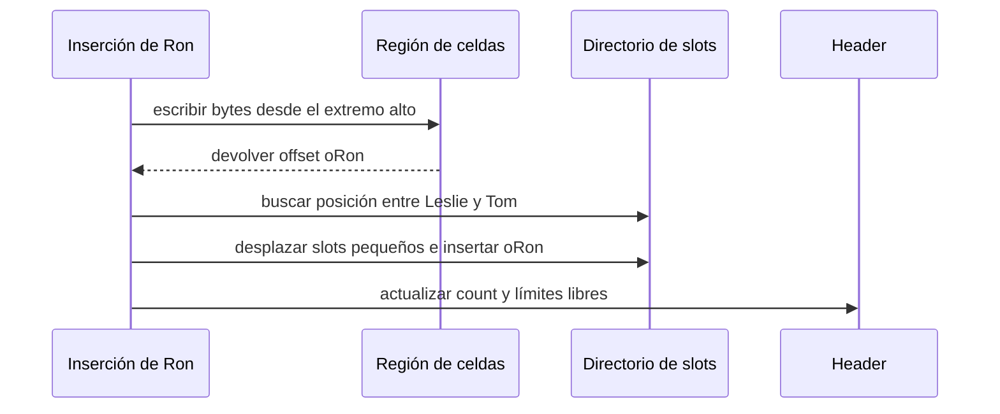

# Slotted pages e indirección

[[Obsidian/lecturas/database internals/00 Empieza aquí|Inicio del libro]] → [[Obsidian/lecturas/database internals/03 Formatos de archivo/00 Índice|Formatos de archivo]]

> [!info] Recuerda antes
> - Una página contiene celdas de tamaño variable y un header que permite interpretarlas.
> - Si una referencia externa guarda el offset físico de una celda, moverla invalida esa referencia.
> La slotted page introduce una capa pequeña de indirección para poder ordenar, mover y compactar payloads sin cambiar su identidad lógica.

## Tres cosas que no deben ser la misma

Una página mutable con registros variables necesita distinguir:

- **identidad:** cómo se refiere otro componente al registro;
- **orden lógico:** en qué posición participa en una búsqueda ordenada;
- **ubicación física:** en qué bytes se encuentra ahora.

Si la identidad fuera el offset físico, compactar la página rompería todas las referencias. Una *slotted page* introduce indirección: desde fuera se usa `(page_id, slot_id)`; dentro, el slot contiene el offset actual de la celda.

![[Obsidian/lecturas/database internals/Recursos visuales/03-slotted-page.svg|1000]]

**Lo que demuestra la figura:** el directorio celeste conserva el orden lógico `10, 30, 50`, mientras sus offsets apuntan a celdas físicas de distinto ancho y en otro orden. Slots y payloads crecen desde extremos opuestos, de modo que sus fronteras delimitan directamente el tramo verde contiguo. Ordenar o compactar puede cambiar offsets sin cambiar los IDs de slot.

## Layout desde ambos extremos

```text
offset bajo                                                     offset alto
0x0000                                                               0x1000
┌── HEADER ──┬─ SLOT DIRECTORY ─→┬─── FREE SPACE ───┬←─ CELLS ───┐
│ count=3    │ s0 │ s1 │ s2       │                  │ c2 │ c1 │ c0 │
└────────────└────────────────────└───────────────────└──────────────┘

s0 ─────────────────────────────────────────────────────► c0
s1 ──────────────────────────────────────────────► c1
s2 ──────────────────────────────────────► c2
```

Un slot puede ocupar dos o cuatro bytes si solo guarda un offset local. La celda ocupa exactamente su tamaño variable. Al insertar, el motor necesita espacio para **ambos**: la entrada de slot y la celda.

## Insertar sin mantener los payloads ordenados

Supón que llegan `Tom`, `Leslie` y `Ron`. Los bytes pueden anexarse en orden de llegada, desde el final de la página:

```text
orden físico:   [Tom][Leslie][Ron]
orden de slots: [Leslie*][Ron*][Tom*]
                    │       │     │
                    └─ offsets hacia las celdas ─┘
```

La búsqueda binaria opera sobre el directorio ordenado. Insertar `Ron` entre `Leslie` y `Tom` desplaza offsets pequeños, no los nombres completos ni sus valores asociados.



**Lo que demuestra la secuencia:** el payload se escribe una sola vez y el orden se expresa insertando su offset en el directorio. La inserción aún puede desplazar O(n) slots, pero cada elemento movido es un offset pequeño y no un registro variable potencialmente grande.

## Buscar y resolver una referencia

Una referencia externa `(page_id=27, slot_id=4)` no conoce el offset. El buffer manager carga la página 27; el lector valida que exista el slot 4; ese slot, por ejemplo, contiene `0x0F20`; recién entonces se decodifica la celda.


**Lo que demuestra la indirección:** tras compactar, el slot cambia su offset a `0x0ED0`, pero los consumidores externos siguen usando `(27,4)`. La identidad estable sobrevive al movimiento físico porque solo el directorio necesita actualizarse.

## Qué problemas resuelve y cuáles no

| Necesidad | Mecanismo de la slotted page |
|---|---|
| registros variables con poco desperdicio | cada celda usa sus bytes reales; solo se añade un slot |
| orden de búsqueda | el directorio puede ordenarse sin ordenar payloads |
| reubicación | se actualiza el offset del slot |
| recuperar huecos | se compactan celdas vivas y se corrigen slots |

La slotted page no elimina el costo de la compactación ni garantiza referencias eternas. Si se borra el slot 4 y se reutiliza para otro registro, una referencia antigua podría apuntar a una entidad distinta. Algunos diseños retrasan la reutilización, añaden una generación o garantizan que las referencias no sobrevivan a cierta transacción.

Tampoco significa que cada slot deba contener una clave. La figura muestra claves para hacer visible el orden; una implementación puede almacenar solo offsets y comparar las claves dentro de las celdas. Guardar prefijos o metadatos en el slot acelera comparaciones, pero aumenta el directorio.

## La idea general de la indirección

La capa extra parece trabajo innecesario hasta que algo debe moverse. Sin indirección, cada movimiento obliga a descubrir y reescribir todas las referencias. Con indirección, se mantiene estable el nombre y se actualiza una traducción local. El mismo patrón aparece en tablas de páginas virtuales, handles de objetos y tablas de inodos.

> [!tip] Para recordar
> El slot no es la celda. El slot conserva la identidad y resuelve la ubicación actual de la celda.

> [!question]- ¿Por qué ordenar slots suele ser más barato que ordenar celdas?
> Porque los slots tienen tamaño pequeño y uniforme. Mover varios offsets cuesta menos que mover claves y valores variables.

> [!question]- ¿Puede compactarse una página sin cambiar `(page_id, slot_id)`?
> Sí. Se mueven los bytes de la celda y se actualiza el offset almacenado en ese slot; la identidad externa permanece estable.

**Fuente:** [[Obsidian/lecturas/database internals/Materiales/Database Internals - Parte I (fuente).pdf#page=50|PDF, pp. 50–53]]. El SVG es una visualización técnica del layout explicado en esas páginas.

---

**Anterior:** [[Obsidian/lecturas/database internals/03 Formatos de archivo/03 Anatomía de archivos páginas y celdas|Anatomía de archivos páginas y celdas]] · **Índice:** [[Obsidian/lecturas/database internals/03 Formatos de archivo/00 Índice|Ver este bloque]] · **Siguiente:** [[Obsidian/lecturas/database internals/03 Formatos de archivo/05 Fragmentación y gestión del espacio|Fragmentación y gestión del espacio]]
