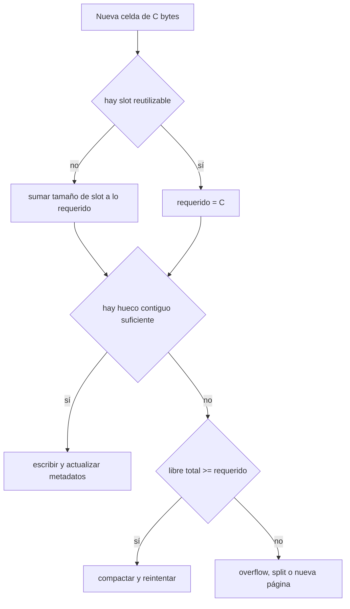
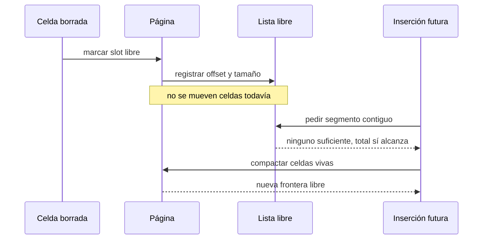

# Fragmentación y gestión del espacio

[[Obsidian/lecturas/database internals/00 Empieza aquí|Inicio del libro]] → [[Obsidian/lecturas/database internals/03 Formatos de archivo/00 Índice|Formatos de archivo]]

> [!info] Recuerda antes
> - En una slotted page, borrar o mover una celda puede conservar el slot y dejar un hueco entre payloads.
> - Los slots y las celdas crecen desde extremos opuestos; una inserción necesita un tramo contiguo, no una suma abstracta de bytes libres.
> Separar identidad de ubicación hizo baratos los movimientos; ahora hay que administrar los huecos que esos movimientos y borrados producen.

## Libre no siempre significa utilizable

Al borrar una celda de una slotted page, el motor puede dejar el hueco y marcar su slot como libre. El borrado es rápido porque no mueve todas las celdas, pero el espacio deja de formar una sola región. La diferencia esencial es:

- **espacio libre total:** suma de todos los huecos;
- **espacio libre contiguo:** mayor región donde puede escribirse una celda completa;
- **espacio requerido:** bytes de la celda **más** una entrada de slot, si no puede reutilizarse una.

Ejemplo: una página tiene huecos de 20, 20, 24 y 36 bytes. Hay 100 bytes libres, pero no cabe una celda de 60 bytes sin compactar. Una suma agregada no responde la pregunta de inserción.

```text
antes del borrado:
[header][slots][..... libre .....][A:40][B:20][C:24][D:36]

después de borrar B y D:
[header][slots][..... libre .....][A:40][hueco:20][C:24][hueco:36]
```

La fragmentación **externa** son huecos separados entre asignaciones vivas. La fragmentación **interna** es desperdicio dentro de una unidad asignada: por ejemplo, reservar dos bloques de 64 bytes para una celda de 65 desperdicia 63.

## Llevar inventario de huecos

Una lista de disponibilidad registra pares `(offset, tamaño)`. Puede vivir en el header, en slots libres o dentro de los propios huecos. Al insertar una celda, el motor busca un segmento suficiente.

| Estrategia | Regla | Ventaja | Riesgo |
|---|---|---|---|
| first fit | usar el primer hueco suficiente | búsqueda corta | deja restos pequeños en zonas tempranas |
| best fit | usar el hueco con menor sobrante | ajusta bien esa inserción | examina más huecos y puede crear residuos diminutos |
| append | usar solo la frontera contigua | camino simple y localidad | ignora huecos hasta compactar |

Supón huecos de `[24, 80, 40]` y una celda de 35. First fit elige 80 y deja 45; best fit elige 40 y deja 5. Esa decisión local no prueba que best fit sea globalmente mejor: un hueco de 5 puede no servir para futuras celdas, mientras el de 45 sí.



**Lo que demuestra la decisión:** el costo real incluye payload y, si hace falta, un slot. Tener bytes suficientes en total no autoriza la escritura: deben formar un tramo contiguo. La compactación solo sirve cuando la suma alcanza pero está dispersa; mover bytes no crea capacidad que no existe.

## Compactar: convertir huecos en una frontera

Compactar copia las celdas vivas hacia un extremo, actualiza sus slots y deja una región libre contigua.

```text
antes:
[header][slots][hueco][A][hueco][B][C]

después:
[header][slots][........ libre ........][A][B][C]
```

La identidad `(page_id, slot_id)` permite este movimiento. Si las referencias externas fueran offsets directos, compactar exigiría buscar y corregir punteros fuera de la página.

Compactar tiene costos: lee y copia bytes vivos, actualiza offsets, consume CPU, ensucia buena parte de la página y puede aumentar la escritura persistente. Por eso hacerlo en cada borrado produce latencia innecesaria. Posponerlo hace barato el borrado, pero transfiere el trabajo a una futura inserción o a mantenimiento en segundo plano.



**Lo que demuestra la línea temporal:** el borrado lógico libera la entrada antes de pagar el movimiento de bytes. Ese aplazamiento abarata el camino inmediato, pero traslada compactación a una inserción futura y puede elevar la cola de latencia aunque el promedio parezca estable.

## Si compactar no basta

Cuando los bytes vivos más la nueva celda superan la capacidad, hay varias salidas:

**Dividir una página de B-Tree.** Se reparten celdas entre dos páginas y se actualiza el padre. Mantiene los valores cerca de las claves, pero cambia la estructura del árbol y puede propagar otra división.

**Página de overflow.** La celda principal guarda una referencia y los bytes grandes viven en una o más páginas adicionales. Evita que un valor enorme expulse muchas claves, a cambio de más E/S y gestión de vida útil.

**Nueva página append-only.** En estructuras orientadas a append puede publicarse otra unidad y mantener un índice que la alcance. La recuperación del espacio queda para compactaciones de nivel superior.

**Límite de registro.** Un formato puede rechazar valores que no caben. Es sencillo, pero traslada la restricción a la aplicación.

## Localidad: claves juntas o celdas completas

Una hoja compara claves durante la búsqueda, pero no siempre necesita leer los valores. Mantener las claves juntas puede colocar más comparaciones en una línea de caché y ayudar a búsquedas fallidas. Después de hallar la clave, otro offset lleva al valor.

| Layout | Favorece | Sacrifica |
|---|---|---|
| clave y valor juntos | acceso simple cuando siempre se devuelve el valor | valores grandes separan claves |
| claves y valores separados | búsqueda densa y buena localidad de claves | segunda indirección y más metadatos |

No es una elección puramente de espacio. Depende de si predominan búsquedas fallidas, rangos, valores grandes o lecturas que proyectan solo la clave.

## Caso numérico completo

En una página quedan 120 bytes contiguos y dos huecos de 40 y 50. Una celda necesita 150 bytes y un slot nuevo de 4.

1. Requerido: `150 + 4 = 154`.
2. Mayor tramo actual: 120; no cabe.
3. Libre total: `120 + 40 + 50 = 210`; sí alcanza.
4. Compactar deja 210 bytes contiguos.
5. Insertar consume 154 y deja 56.

Si el total hubiese sido 150, ni siquiera compactando cabría, porque el slot también forma parte de la inserción.

> [!tip] Para recordar
> Fragmentación es capacidad existente pero mal situada. Compactar cambia su forma, no la cantidad total de espacio.

> [!question]- ¿Por qué no compactar en cada borrado?
> Porque convierte una operación local en copias y escrituras de muchas celdas vivas. Puede ser mejor registrar el hueco y compactar solo cuando una inserción lo necesita.

> [!question]- ¿Cuándo un overflow puede ser preferible a insertar el valor en la hoja?
> Cuando el valor es tan grande que reduciría mucho la densidad de claves. El costo es seguir referencias y gestionar páginas adicionales.

**Fuente:** [[Obsidian/lecturas/database internals/Materiales/Database Internals - Parte I (fuente).pdf#page=54|PDF, pp. 54–55]]. Ejemplos numéricos propios para mostrar continuidad y costo de slots.

---

**Anterior:** [[Obsidian/lecturas/database internals/03 Formatos de archivo/04 Slotted pages e indirección|Slotted pages e indirección]] · **Índice:** [[Obsidian/lecturas/database internals/03 Formatos de archivo/00 Índice|Ver este bloque]] · **Siguiente:** [[Obsidian/lecturas/database internals/03 Formatos de archivo/06 Versionado checksums y lectura segura|Versionado checksums y lectura segura]]
