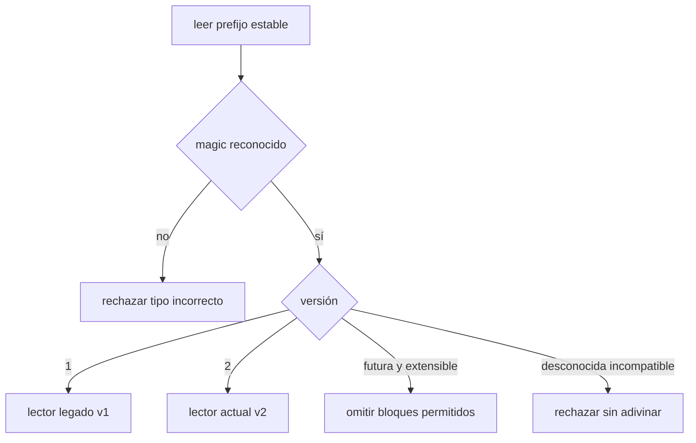
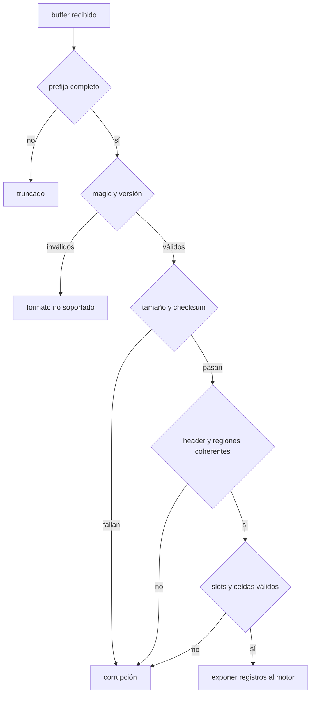

# Versionado, checksums y lectura segura

[[Obsidian/lecturas/database internals/00 Empieza aquí|Inicio del libro]] → [[Obsidian/lecturas/database internals/03 Formatos de archivo/00 Índice|Formatos de archivo]]

> [!info] Recuerda antes
> - Headers, slots y celdas forman un contrato de offsets, longitudes y tipos.
> - Validar que un rango cabe en la página evita leer fuera del buffer, pero no prueba que los bytes no hayan cambiado.
> Persistir un layout crea dos problemas nuevos: reconocer qué versión lo escribió y detectar corrupción antes de confiar en sus metadatos.

## Un archivo dura más que el programa que lo escribió

Una versión futura del motor puede agregar compresión, cambiar el header o corregir una codificación. Los bytes antiguos no se actualizan solos. Antes de interpretar offsets y longitudes, el lector debe identificar qué contrato los produjo.

La identificación suele comenzar con un **magic number**, un patrón fijo que responde “¿es este el tipo de archivo que espero?”, seguido por una versión legible con un prefijo estable. Si para hallar la versión hiciera falta conocer ya el layout versionado, habría una dependencia circular.

```text
offset  00 01 02 03 04 05 06 07
0000    44 42 50 47 02 00 10 00
        D  B  P  G  └v2─┘ └ header_len=16 ─┘
```

El magic `DBPG` no prueba integridad, pero evita tratar por accidente un JPEG o un archivo arbitrario como página de base de datos. La versión 2 selecciona el decodificador; `header_len` puede permitir saltar campos adicionales desconocidos si el formato lo autoriza.

## Cuatro estrategias de evolución

| Estrategia | Ventaja | Costo |
|---|---|---|
| lector por versión | conserva archivos y normaliza al modelo actual | mantiene varias rutas de código |
| migración al abrir | el resto del motor ve un solo formato | reescritura larga y sensible a fallos |
| migración gradual | distribuye el costo | conviven páginas de varias versiones |
| bloques etiquetados con longitud | extensiones ignorables | más metadatos y reglas |

Compatibilidad **hacia atrás** significa que el software nuevo lee archivos antiguos. Compatibilidad **hacia delante** significa que el software antiguo tolera archivos nuevos; es más difícil porque el lector no puede comprender semántica aún no inventada. Solo puede ignorar campos si sus longitudes están delimitadas y si ignorarlos no cambia el significado de los conocidos.



**Lo que demuestra la decisión:** el magic filtra antes de que bytes arbitrarios puedan interpretarse como longitudes. Cada versión conocida selecciona reglas explícitas. Una versión futura solo puede aceptarse si el contrato definió extensiones ignorables; no existe compatibilidad por suposición.

## Checksum: detectar que los bytes cambiaron

Un checksum reduce una región de bytes a una huella pequeña. Al escribir se calcula y almacena; al leer se recalcula y compara. Un checksum por página permite verificar solamente la unidad que se usa y aislar un fallo local.

| Mecanismo | Sirve principalmente para | No ofrece por sí solo |
|---|---|---|
| suma, XOR o paridad | algunos errores simples | buena detección de cambios combinados |
| CRC | corrupción accidental y ráfagas de bits | autenticidad ante un atacante |
| hash no criptográfico | huella rápida y distribución | resistencia a manipulación |
| MAC criptográfico | integridad y autenticidad con clave | recuperación del contenido perdido |

Si el campo checksum está dentro de la página, la cobertura debe evitar circularidad: se trata ese campo como cero al calcular o se excluye su rango. También debe especificarse si cubre padding y si opera antes o después de comprimir o cifrar. Bytes de padding sin inicializar vuelven la huella no determinista y pueden filtrar memoria.

```mermaid
sequenceDiagram
    participant W as Escritor
    participant D as Disco
    participant R as Lector
    W->>W: checksum = CRC(bytes con campo en cero)
    W->>D: guardar bytes + checksum
    D-->>R: devolver página
    R->>R: recalcular con la misma cobertura
    alt coincide
        R->>R: validar estructura y decodificar
    else no coincide
        R->>R: marcar corrupción; no propagar datos
    end
```

**Lo que demuestra la bifurcación:** un checksum correcto solo afirma que los bytes coinciden con la huella calculada; todavía deben validarse offsets y reglas estructurales. Una aplicación puede escribir un layout imposible y calcular un CRC perfecto. Un checksum incorrecto detecta corrupción, pero la recuperación requiere réplica, WAL, backup u otra redundancia.

## Orden de lectura segura de una página

Supón este header de 16 bytes:

```text
00: 42 54 50 47 02 01 03 00 16 00 D0 0F 7A 31 9C 04
10: E8 0F DC 0F D0 0F ...
```

Una lectura robusta no salta directamente al offset `0x0FE8`. Sigue una escalera de confianza:

1. comprobar que existen los bytes del prefijo estable;
2. validar magic y seleccionar la versión;
3. comprobar que la página completa tiene el tamaño esperado;
4. verificar checksum con la cobertura definida;
5. leer `slot_count`, `free_start` y `free_end` sin desbordamientos;
6. demostrar `header_end <= free_start <= free_end <= page_size`;
7. demostrar que el directorio completo cabe antes de las celdas;
8. verificar que cada offset cae en la región permitida;
9. validar longitudes de celda y que las celdas vivas no se solapen;
10. comprobar invariantes semánticos, como claves ordenadas.



**Lo que demuestra la secuencia de validación:** cada rombo amplía la confianza y depende de los anteriores. El CRC evita procesar una página alterada; la validación posterior de offsets evita aceptar una página coherente a nivel de bytes pero imposible a nivel estructural. Omitir una etapa deja una clase distinta de fallo sin detectar.

## Evitar overflow al validar rangos

Una comprobación como `offset + length <= page_size` puede fallar si la suma desborda el entero y vuelve a un valor pequeño. Una forma más segura es:

```text
offset <= page_size
length <= page_size - offset
```

La resta solo se ejecuta después de demostrar que `offset` está dentro. La misma técnica aplica a `header + key_len + value_len`: se consumen rangos uno por uno y se compara cada longitud con los bytes restantes.

## Qué hacer al detectar un problema

El lector debe fallar de manera explícita y conservar contexto: archivo, page ID, versión esperada, checksum leído y tipo de invariante roto. Continuar con valores parciales puede propagar corrupción hacia índices, réplicas o backups. Sin embargo, el mensaje no debe imprimir datos sensibles completos; offsets y huellas suelen bastar para diagnosticar.

> [!tip] Para recordar
> Versión decide cómo interpretar. Checksum dice si los bytes cambiaron. Validación estructural demuestra si esos bytes forman una página posible. Son tres preguntas distintas.

> [!question]- ¿Un CRC correcto demuestra que la página es lógicamente válida?
> No. Solo demuestra, con su garantía probabilística, que los bytes coinciden con la huella almacenada. El escritor pudo haber creado una página inválida y calcular correctamente su CRC.

> [!question]- ¿Por qué no interpretar una versión desconocida como la actual?
> Porque un campo nuevo podría ocupar la posición que el lector antiguo trata como longitud u offset, generando corrupción silenciosa en vez de un error claro.

**Fuente:** [[Obsidian/lecturas/database internals/Materiales/Database Internals - Parte I (fuente).pdf#page=56|PDF, pp. 56–57]]. Secuencia de lectura segura y ejemplos de validación ampliados a partir de los principios del capítulo.

---

**Anterior:** [[Obsidian/lecturas/database internals/03 Formatos de archivo/05 Fragmentación y gestión del espacio|Fragmentación y gestión del espacio]] · **Índice:** [[Obsidian/lecturas/database internals/03 Formatos de archivo/00 Índice|Ver este bloque]] · **Siguiente:** [[Obsidian/lecturas/database internals/04 Implementación de B-Trees/00 Índice|Implementación de B-Trees]]
