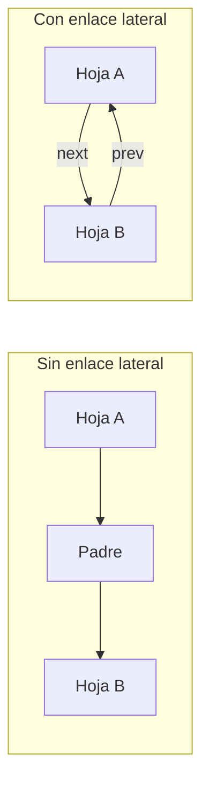
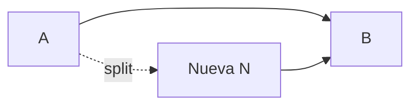

# Headers, magic numbers y enlaces laterales

[[Obsidian/lecturas/database internals/00 Empieza aquí|Inicio del libro]] → [[Obsidian/lecturas/database internals/04 Implementación de B-Trees/00 Índice|Implementación de B-Trees]]

> [!info] Recuerda antes
> - El B-Tree abstracto habla de nodos, claves y punteros; el formato persistente habla de páginas, offsets y bytes.
> - Un lector seguro identifica versión y tipo antes de interpretar celdas.
> Implementar el árbol consiste en hacer explícita esa traducción y guardar también las relaciones que aceleran la navegación entre páginas.

## Un bloque de bytes necesita explicar qué es

Cuando el buffer manager carga 4 u 8 KiB desde disco, recibe bytes. Para interpretarlos necesita saber si representan una hoja, un nodo interno, una página overflow o una página libre. El **page header** contiene ese contrato local.

Campos habituales:

| Campo | Para qué sirve |
|---|---|
| tipo y flags | escoger el decodificador y las operaciones válidas |
| versión de layout | distinguir formatos antiguos y nuevos |
| número de celdas | saber cuántas entradas leer sin escanear basura |
| límites del espacio libre | decidir si cabe una inserción |
| nivel del árbol | diferenciar hojas e internos y validar la altura |
| enlaces auxiliares | llegar a hermanos, overflow o freelist |
| checksum o LSN | detectar corrupción o relacionar la página con recovery |

El header no es decoración ni “administración extra”. Si el número de celdas dice 20 cuando solo existen 12 offsets válidos, el lector puede interpretar payload como punteros. Un dato incorrecto en pocos bytes puede volver inusable toda la página.

## Magic numbers: reconocer antes de confiar

Un **magic number** es una secuencia constante en una posición conocida. `50 41 47 45` corresponde a `PAGE` en ASCII:

```text
offset  00 01 02 03 04 05 06 07
bytes   50 41 47 45 02 01 00 17
        └─ "PAGE" ─┘  │  │  └─ 23 celdas
                      │  └──── tipo: hoja
                      └─────── versión 2
```

Encontrar la constante esperada es una señal de que el offset y el formato probablemente son correctos. No demuestra que el resto de la página esté intacto: una escritura parcial puede conservar los primeros cuatro bytes y dañar todo lo demás. Por eso un magic number identifica; un checksum valida el contenido con mucha mayor cobertura.

## Hermanos enlazados o regreso por el padre

Para recorrer un rango, después de terminar una hoja hay que localizar la siguiente. Sin enlace lateral, el algoritmo puede subir al padre, encontrar el siguiente hijo y bajar otra vez. Si la hoja era la última hija de ese padre, quizá deba subir varios niveles.



**Lo que demuestra la comparación:** el primer trayecto regresa por la jerarquía para localizar la siguiente hoja; el segundo usa un enlace local y evita ese rodeo. El padre no desaparece: continúa guiando el descenso inicial y manteniendo las fronteras de los rangos.

Los sibling links ayudan en escaneos, rebalanceos y ciertas técnicas concurrentes. El costo aparece en un split. Si `A` se divide y crea `N` antes de `B`, hay que establecer `A.next=N`, `N.prev=A`, `N.next=B` y `B.prev=N`. La última asignación toca una página que no era la que se dividía.



Esto puede requerir otro latch, otra entrada de log y un orden de locks que evite deadlocks. La optimización de lectura aumenta el **radio de escritura**.

> [!tip] Regla para decidir
> Un enlace adicional es útil cuando evita navegación frecuente y el motor puede mantenerlo de manera atómica. Cada puntero persistente crea también una nueva invariante que recovery debe poder reconstruir.

> [!question]- ¿Por qué no basta el magic number para detectar corrupción?
> Porque solo comprueba una constante en una región pequeña. La página podría conservarla y tener dañadas sus celdas, offsets o enlaces.

> [!question]- ¿Qué gana y qué paga un enlace de hermanos?
> Gana un salto lateral directo; paga escrituras, locking y logging adicionales cuando la estructura cambia.

**Fuente:** [[Obsidian/lecturas/database internals/Materiales/Database Internals - Parte I (fuente).pdf#page=58|PDF, capítulo 4, páginas 58–60]].

---

**Anterior:** [[Obsidian/lecturas/database internals/03 Formatos de archivo/06 Versionado checksums y lectura segura|Versionado y checksums]] · **Índice:** [[Obsidian/lecturas/database internals/04 Implementación de B-Trees/00 Índice|Capítulo 4]] · **Siguiente:** [[Obsidian/lecturas/database internals/04 Implementación de B-Trees/02 Rightmost pointers high keys y overflow|Rightmost, high keys y overflow]]
