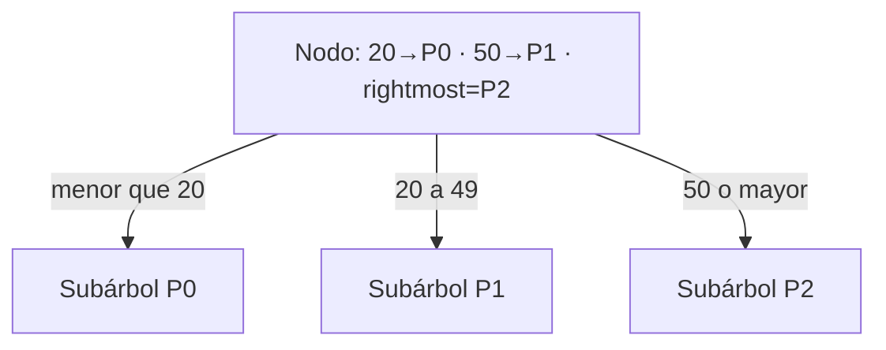
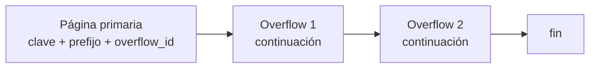

# Rightmost pointers, high keys y overflow

[[Obsidian/lecturas/database internals/00 Empieza aquí|Inicio del libro]] → [[Obsidian/lecturas/database internals/04 Implementación de B-Trees/00 Índice|Implementación de B-Trees]]

> [!info] Recuerda antes
> - Un nodo interno usa separadores para representar intervalos y su header declara cómo interpretar la página.
> - Las páginas tienen tamaño fijo, mientras que claves y valores pueden ser variables.
> Los casos de borde revelan metadatos que el modelo abstracto oculta: falta un hijo a la derecha de la última clave y algunos payloads no caben inline.

![[Obsidian/lecturas/database internals/Recursos visuales/08-rightmost-highkey-overflow.svg|1000]]

**Lo que demuestra la figura:** dos separadores producen tres intervalos y obligan a representar `P2`, el hijo del extremo derecho. El otro panel expone un borde diferente: un payload que supera la página primaria. Ambos casos convierten una omisión del modelo abstracto en metadatos persistentes —rightmost/high key u overflow ID— que deben mantenerse y recuperarse.

## Por qué `N` separadores producen `N + 1` hijos

Las claves internas son fronteras. Dos separadores, `20` y `50`, crean tres intervalos:

```text
P0: k < 20      P1: 20 ≤ k < 50      P2: k ≥ 50
```

Si cada celda guarda `(separador, puntero izquierdo)`, `P2` queda sin clave pareja. Ese es el **rightmost pointer**. Muchas implementaciones lo guardan aparte en el header.



**Lo que demuestra la partición:** `20` y `50` son límites, no tres registros. Delimitan `<20`, `[20,50)` y `≥50`; el último intervalo se extiende conceptualmente hasta `+∞` y necesita su propio puntero.

Cuando se divide el hijo derecho, el padre recibe un separador nuevo y el rightmost pointer debe pasar a señalar el nuevo extremo. Este caso necesita código especial porque ese puntero no usa la representación de las demás celdas.

## High keys: hacer explícito el límite

Una **high key** expresa el mayor valor permitido en el nodo o subárbol. En vez de tratar `+∞` como un caso implícito, cada par puede guardar un puntero y su límite superior.

```text
Sin high key: P0 --20-- P1 --50-- P2 --(+∞ implícito)
Con high key: P0 --20-- P1 --50-- P2 --80 (límite explícito)
```

Esto simplifica algunos casos de representación y ayuda bajo concurrencia. Si una búsqueda de `93` llega a una página cuya high key es `80`, sabe que esa página ya no cubre el valor, quizás porque ocurrió un split concurrente, y puede continuar a la derecha.

La high key no reemplaza al separador del padre. Son vistas relacionadas del rango: el padre decide a qué hijo entrar; la página puede comprobar si la clave todavía pertenece a su rango local.

## Payloads variables sobre páginas fijas

Una página fija simplifica caché, checksums, I/O y direccionamiento. Un valor de 20 KiB no cabe en una página de 4 KiB. Aumentar dinámicamente una página exigiría mover regiones y rompería el cálculo de offsets. Las **overflow pages** desacoplan el tamaño lógico del valor del tamaño físico de la página primaria.



El motor define `max_inline_payload`, una porción máxima que puede permanecer en el nodo. Al limitar cuánto ocupa cada celda, protege el fanout.

```text
valor de 300 B  → 300 B inline
valor de 2 KiB  → 400 B inline + 1.6 KiB overflow
valor de 10 KiB → 400 B inline + varias overflow pages
```

Para una clave, el prefijo inline puede resolver muchas comparaciones sin seguir la cadena. Para devolver el valor completo sí hay que reconstruir todas sus partes.

## El costo que la abstracción esconde

- una lectura lógica puede convertirse en varias lecturas aleatorias;
- hay que asignar, enlazar y liberar páginas auxiliares;
- una cadena dañada puede perder parte del valor;
- recovery debe tratar la página primaria y sus extensiones como una modificación coherente;
- las propias overflow pages pueden fragmentarse.

Si casi todos los valores usan overflow, el árbol actúa como un índice hacia blobs. Puede ser mejor guardar los objetos grandes en un sistema especializado y conservar solo una referencia estable.

> [!question]- ¿Por qué con dos separadores hay tres punteros?
> Porque dos fronteras parten el dominio en tres intervalos: antes, entre y después.

> [!question]- ¿Qué problema evita `max_inline_payload`?
> Impide que un único valor grande consuma la página y reduzca drásticamente el fanout del árbol.

**Fuente:** [[Obsidian/lecturas/database internals/Materiales/Database Internals - Parte I (fuente).pdf#page=60|PDF, capítulo 4, páginas 60–64]].

---

**Anterior:** [[Obsidian/lecturas/database internals/04 Implementación de B-Trees/01 Headers magic numbers y enlaces laterales|Headers y enlaces]] · **Índice:** [[Obsidian/lecturas/database internals/04 Implementación de B-Trees/00 Índice|Capítulo 4]] · **Siguiente:** [[Obsidian/lecturas/database internals/04 Implementación de B-Trees/03 Búsqueda binaria y breadcrumbs|Búsqueda y breadcrumbs]]
