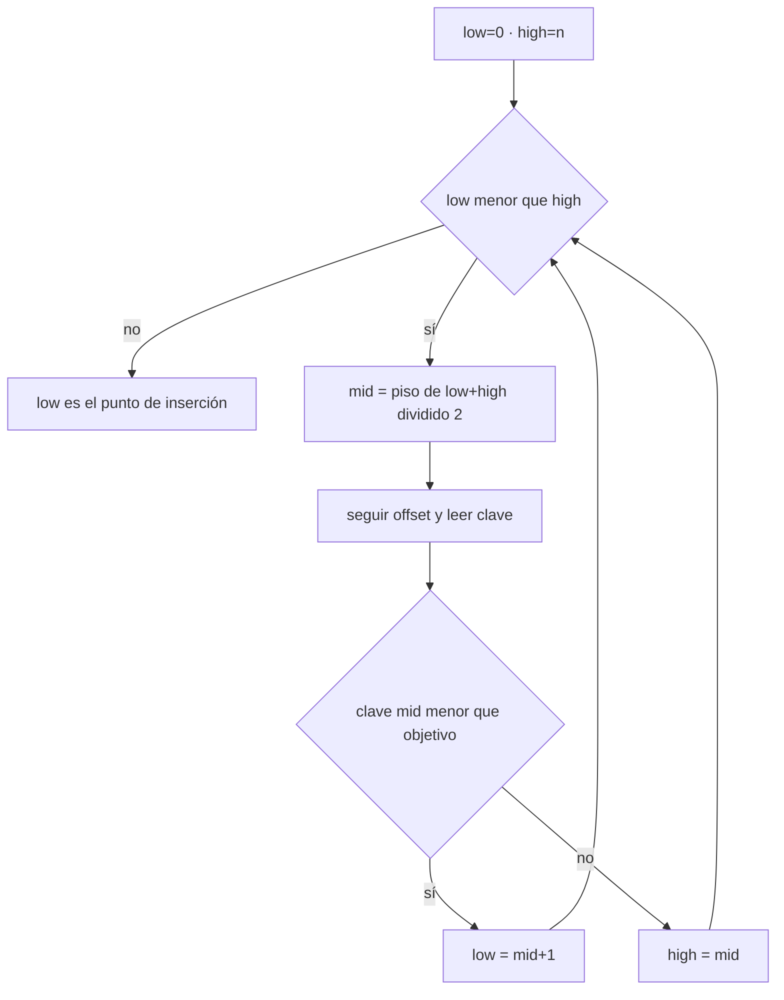
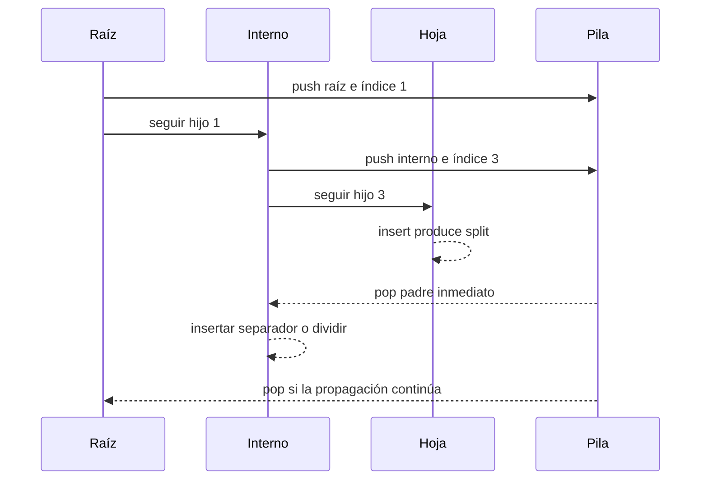

# Búsqueda binaria y breadcrumbs

[[Obsidian/lecturas/database internals/00 Empieza aquí|Inicio del libro]] → [[Obsidian/lecturas/database internals/04 Implementación de B-Trees/00 Índice|Implementación de B-Trees]]

> [!info] Recuerda antes
> - El directorio de slots mantiene el orden lógico aunque las celdas estén dispersas físicamente.
> - Descender por separadores basta para leer; un `split` propagado necesita regresar a cada padre de la ruta.
> La implementación combina ambos hechos: búsqueda binaria sobre offsets para bajar y breadcrumbs temporales para volver sin persistir parent pointers.

## Orden lógico sobre celdas físicamente dispersas

En una slotted page, las celdas pueden conservar su posición de escritura. El arreglo de offsets es el que permanece ordenado por clave.

```text
offsets lógicos: [o3, o0, o4, o1, o2]
                   │
                   └─ cada entrada conduce a una celda

área física: [o0][o1][hueco][o2][o3][o4]
```

La búsqueda binaria selecciona el offset central, salta a la celda, decodifica la clave y descarta la mitad izquierda o derecha del arreglo. La notación sigue siendo `O(log n)`, pero cada comparación tiene una indirección y trabajo de decodificación.



**Lo que demuestra el resultado:** la búsqueda no produce solo «encontrado/no encontrado». Cuando falta la clave, `low` queda en el primer elemento mayor y entrega directamente la posición de inserción que conserva el orden.

Con `[10,18,27,41]`, buscar `25` termina en la posición 2. Insertar un nuevo offset allí produce `[10,18,25,27,41]` sin mover inmediatamente los payloads.

## Descender es fácil; regresar requiere memoria

Para insertar, el árbol desciende hasta la hoja. Solo allí descubre si hay espacio. Si ocurre un split, debe añadir un separador al padre; si el padre también se llena, el cambio continúa hacia la raíz.

Una opción es guardar un parent pointer en cada página. El regreso es directo, pero un split, merge o rebalanceo del padre obliga a actualizar todos los hijos cuyo padre cambia. Persistir esa información añade escrituras e invariantes.

La alternativa son **breadcrumbs**: una pila en memoria con las páginas visitadas y el índice del hijo seleccionado.



**Lo que demuestra la secuencia:** cada descenso apila `(page_id, child_index)` antes de cargar al hijo. Durante la propagación, esos breadcrumbs se consumen en orden inverso para volver a los padres. La pila es estado temporal de la operación, no una red de punteros persistentes.

## Ejemplo de propagación

La hoja `L` se divide en `L` y `L2`, promoviendo `57`:

1. se extrae `(I, índice=3)` de la pila;
2. se localiza nuevamente la posición correcta en `I`;
3. se inserta `57` y el puntero a `L2`;
4. si `I` tiene espacio, termina;
5. si `I` se divide, se extrae el breadcrumb siguiente;
6. si la pila queda vacía y aún existe split, se crea una raíz nueva.

En un árbol concurrente, el índice guardado puede quedar obsoleto si otra operación modifica el nodo. El breadcrumb es una pista para volver, no una autorización para modificar sin validar. La implementación necesita latches, números de versión o una nueva búsqueda dentro del padre.

## Comparación

| Estrategia | Ventaja | Costo |
|---|---|---|
| parent pointer | regreso disponible desde cualquier nodo | mantenimiento persistente y escrituras adicionales |
| breadcrumbs | no cambia el formato y sirve al recorrido actual | debe validarse ante concurrencia; desaparece al terminar |

> [!question]- ¿Cómo puede haber búsqueda binaria si las celdas están desordenadas físicamente?
> Porque la vista lógica ordenada es el arreglo de offsets; cada comparación sigue una indirección.

> [!question]- ¿Por qué un breadcrumb guarda también el índice del hijo?
> Porque ayuda a localizar dónde se encontraba el rango modificado en el padre, aunque la implementación debe revalidarlo si hubo concurrencia.

**Fuente:** [[Obsidian/lecturas/database internals/Materiales/Database Internals - Parte I (fuente).pdf#page=64|PDF, capítulo 4, páginas 64–67]].

---

**Anterior:** [[Obsidian/lecturas/database internals/04 Implementación de B-Trees/02 Rightmost pointers high keys y overflow|Rightmost y overflow]] · **Índice:** [[Obsidian/lecturas/database internals/04 Implementación de B-Trees/00 Índice|Capítulo 4]] · **Siguiente:** [[Obsidian/lecturas/database internals/04 Implementación de B-Trees/04 Rebalanceo right-only y bulk loading|Rebalanceo y carga ordenada]]
