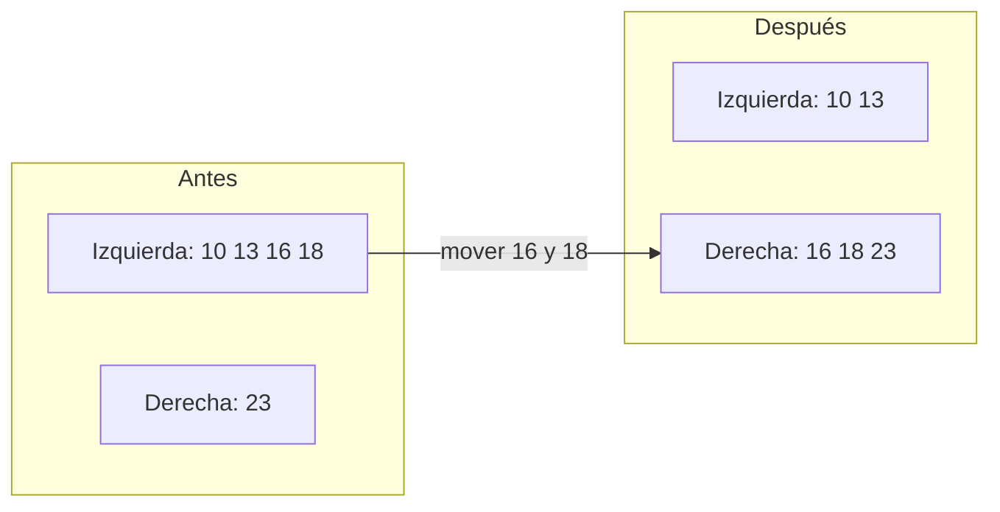
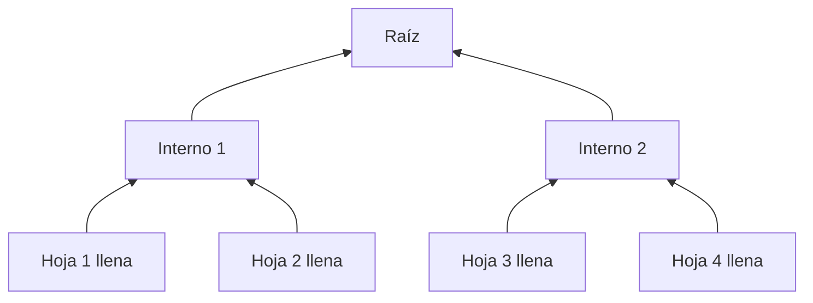

# Rebalanceo, right-only appends y bulk loading

[[Obsidian/lecturas/database internals/00 Empieza aquí|Inicio del libro]] → [[Obsidian/lecturas/database internals/04 Implementación de B-Trees/00 Índice|Implementación de B-Trees]]

> [!info] Recuerda antes
> - El algoritmo general divide una página llena y propaga una frontera hacia el padre.
> - Esa corrección funciona para cualquier orden de entrada, pero paga asignaciones, copias y actualizaciones de metadatos.
> Si la carga ofrece información adicional —un hermano con espacio o claves ya ordenadas— el motor puede evitar parte de ese trabajo sin cambiar los invariantes.

## Mover antes de dividir

El algoritmo básico divide una página llena en dos. Normalmente deja dos páginas alrededor de la mitad de ocupación. Si una hermana tiene espacio, puede ser más barato redistribuir.

**Lo que demuestra la redistribución:** mover entradas hacia la hermana evita asignar una página nueva, pero desplaza la frontera entre ambas. El separador del padre debe cambiar para que las búsquedas sigan llegando al hijo correcto; por eso el rebalanceo nunca es una modificación aislada de una sola página.

Las variantes B* intentan llenar dos hermanos y, cuando ya no alcanzan, distribuyen el contenido en tres páginas. Obtienen mayor ocupación media que un split simple, a costa de tocar más páginas y complicar locking, logging y recovery.

El rebalanceo conviene cuando la altura y el espacio importan mucho y el motor ya puede modificar varias páginas con seguridad. No es gratis: mover datos que pronto volverán a cambiar puede ser trabajo desperdiciado.

## Claves crecientes: una ruta predecible

Con IDs monotónicos, cada insert cae en la hoja derecha extrema. La búsqueda desde la raíz repite el mismo camino. Una fast path puede conservar la hoja derecha en caché y comprobar:

1. que la clave es mayor que la frontera conocida;
2. que la página todavía es la hoja derecha válida;
3. que dispone de espacio.

Si algo falla, se usa el algoritmo general. Una optimización correcta debe poder abandonar su premisa sin comprometer el resultado.

Cuando la hoja derecha está llena, otra estrategia asigna una página nueva a la derecha en vez de repartir todo. Empieza casi vacía, pero el stream creciente debería llenarla pronto. Esto evita mover la mitad de una página que ya está ordenada.

> [!warning] Optimización local, costo global
> Las claves crecientes dan localidad dentro del B-Tree, pero concentran escritores en la misma hoja. En un sistema particionado también pueden producir un shard caliente.

## Bulk loading: construir en vez de insertar

Si los datos ya están ordenados, buscar el destino y provocar splits repetidos no aporta información. El **bulk loading** llena hojas directamente y construye niveles superiores con sus primeras claves y page IDs.

**Lo que demuestra la construcción:** las hojas se escriben primero y sus fronteras alimentan padres que todavía no existen. Cada nivel terminado produce la entrada del siguiente. El bulk loading construye de abajo arriba en lugar de repetir descensos e inserciones desde la raíz.

Proceso:

1. consumir el stream ordenado;
2. llenar una hoja hasta la ocupación objetivo;
3. escribirla y recordar su primera clave y page ID;
4. repetir;
5. agrupar esas referencias en páginas internas;
6. continuar hasta producir una sola raíz.

Solo es necesario mantener en memoria el frente de construcción. Los hijos existen cuando el padre necesita sus direcciones.

Para un árbol inmutable, las páginas pueden quedar casi completas: no habrá inserts futuros. En un índice mutable, una ocupación inicial de 100 % puede provocar splits en cuanto llega la primera modificación. La carga masiva debe elegir densidad según el futuro, no solo según el dataset actual.

## Tres técnicas, tres premisas

| Técnica | Premisa | Trabajo que evita | Riesgo |
|---|---|---|---|
| rebalanceo | un hermano tiene espacio | split o merge inmediato | toca hermano y padre |
| right-only | las claves siguen creciendo | descenso y redistribución general | hot spot y premisa rota |
| bulk loading | entrada preordenada | búsquedas y splits repetidos | deja poco margen si se llena demasiado |

> [!question]- ¿Por qué bulk loading no es solo “inserts más rápidos”?
> Porque cambia el algoritmo: forma páginas y niveles directamente con el orden ya conocido.

> [!question]- ¿Qué debe ocurrir si llega una clave antigua a una fast path derecha?
> La condición debe fallar y la operación volver al camino normal desde la raíz.

**Fuente:** [[Obsidian/lecturas/database internals/Materiales/Database Internals - Parte I (fuente).pdf#page=67|PDF, capítulo 4, páginas 67–70]].

---

**Anterior:** [[Obsidian/lecturas/database internals/04 Implementación de B-Trees/03 Búsqueda binaria y breadcrumbs|Búsqueda y breadcrumbs]] · **Índice:** [[Obsidian/lecturas/database internals/04 Implementación de B-Trees/00 Índice|Capítulo 4]] · **Siguiente:** [[Obsidian/lecturas/database internals/04 Implementación de B-Trees/05 Compresión vacuum y freelist|Compresión y mantenimiento]]
