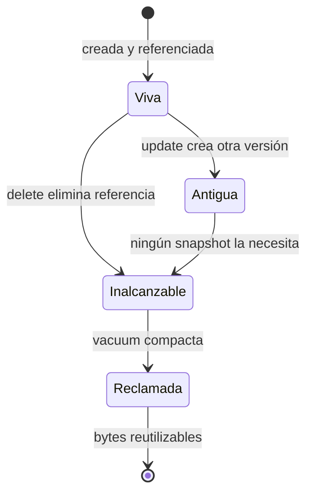

# Compresión, vacuum y freelist

[[Obsidian/lecturas/database internals/00 Empieza aquí|Inicio del libro]] → [[Obsidian/lecturas/database internals/04 Implementación de B-Trees/00 Índice|Implementación de B-Trees]]

> [!info] Recuerda antes
> - Las slotted pages desacoplan slots y payloads, pero updates y deletes dejan huecos y versiones obsoletas.
> - Que una versión no sea la actual no significa que ningún snapshot pueda verla todavía.
> Las optimizaciones de espacio deben distinguir tres trabajos: almacenar menos bytes, decidir qué bytes ya están muertos y registrar qué páginas completas pueden reutilizarse.

## Comprimir cambia bytes por CPU

Menos bytes pueden significar menos almacenamiento y menos I/O. Sin embargo, la unidad de compresión decide cuánto debe leerse o reescribirse para acceder a una pequeña parte.

| Unidad | Ventaja | Costo |
|---|---|---|
| archivo completo | mucho contexto y buena relación | acceso aleatorio y updates difíciles |
| página | integra compresión con page-in y flush | tamaño comprimido no coincide con bloques físicos |
| fila | lectura y actualización focalizadas | menos redundancia compartida |
| columna | valores similares comprimen bien | reconstrucción y actualización más complejas |

Una página lógica de 8 KiB puede comprimirse a 3 KiB, pero si el dispositivo transfiere bloques de 4 KiB, el ahorro físico será distinto. Si termina en 5 KiB, quizá requiera dos bloques. La métrica “tamaño comprimido” no equivale automáticamente a “lecturas físicas”.

Para elegir codec deben medirse al menos relación, velocidad de compresión, velocidad de descompresión y memoria temporal sobre los datos reales. Lecturas dominantes suelen valorar descompresión rápida; ingestión intensa también sufre el costo de comprimir.

## Libre en total no significa libre de forma utilizable

![[Obsidian/lecturas/database internals/Recursos visuales/04-vacuum-page.svg|1000]]

**Lo que demuestra la imagen:** la página izquierda suma 240 bytes entre celdas muertas y huecos, pero un registro de 150 bytes no cabe porque ningún tramo es continuo. Reescribir las celdas vivas convierte el mismo total en un bloque utilizable. El flujo inferior separa responsabilidades: MVCC decide cuándo una versión puede morir y la freelist registra páginas que ya quedaron completamente disponibles.

En una slotted page, borrar suele eliminar el offset, no limpiar los bytes. Actualizar puede escribir otra versión y dejar la anterior en la página. La celda vieja es lógicamente inaccesible desde el índice, pero sus bytes permanecen hasta ser sobrescritos o compactados.

```text
Header | offsets | libre | viva | basura | viva | basura
                  80 B           60 B           70 B

Libre total: 210 B
Mayor hueco: 80 B
Insert de 120 B: no cabe sin compactar
```

## MVCC retrasa la muerte física

Con control multiversión, “no es la versión actual” no significa “nadie puede verla”. Una transacción antigua puede conservar un snapshot que todavía referencia esos bytes. El motor necesita un horizonte de visibilidad para saber cuándo ninguna transacción activa o futura podrá requerirlos.



**Lo que demuestra la transición:** el update crea una versión antigua, pero todavía no la vuelve reciclable. La capacidad física solo puede recuperarse cuando desaparece de todos los snapshots relevantes. Vacuum aplica esa decisión de visibilidad; no la inventa.

## Sincrónico o en background

Si una escritura encuentra espacio total suficiente pero fragmentado, puede compactar en ese momento. Evita overflow o split, pero aumenta la latencia del usuario. Un proceso asincrónico suaviza las operaciones de foreground, aunque consume I/O y debe avanzar al ritmo de generación de basura.

Al reescribir, las celdas vivas se agrupan. Si una página queda completamente libre, su page ID se incorpora a una **freelist persistente**. Persistirla evita dos fallos:

- reutilizar una página todavía alcanzable;
- perder páginas libres después de un reinicio.

El tamaño del archivo visto por el sistema operativo puede no reducirse. Una página libre dentro de la base sigue ocupando un rango del archivo, pero el motor puede reutilizarlo. Reutilización interna y devolución de espacio al sistema son resultados distintos.

> [!warning] Borrado lógico no es borrado forense
> Los bytes pueden seguir presentes aunque ninguna consulta los devuelva. Requisitos de eliminación segura necesitan mecanismos adicionales.

> [!question]- Hay 300 bytes libres en tres huecos de 100. ¿Cabe una celda de 180?
> No directamente. Hay que compactar, usar overflow o cambiar la estructura.

**Fuente:** [[Obsidian/lecturas/database internals/Materiales/Database Internals - Parte I (fuente).pdf#page=70|PDF, capítulo 4, páginas 70–74]].

---

**Anterior:** [[Obsidian/lecturas/database internals/04 Implementación de B-Trees/04 Rebalanceo right-only y bulk loading|Rebalanceo y carga ordenada]] · **Índice:** [[Obsidian/lecturas/database internals/04 Implementación de B-Trees/00 Índice|Capítulo 4]] · **Siguiente:** [[Obsidian/lecturas/database internals/04 Implementación de B-Trees/06 Flujo completo e invariantes|Flujo completo e invariantes]]
