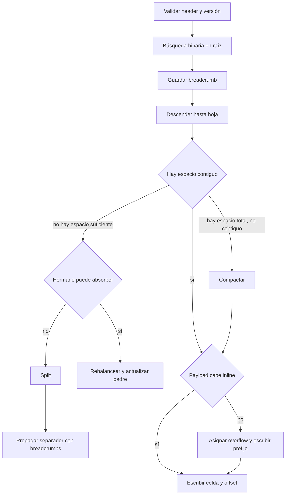

# Flujo completo e invariantes

[[Obsidian/lecturas/database internals/00 Empieza aquí|Inicio del libro]] → [[Obsidian/lecturas/database internals/04 Implementación de B-Trees/00 Índice|Implementación de B-Trees]]

> [!info] Recuerda antes
> - Headers validan el tipo; slots localizan celdas; búsqueda binaria elige posiciones; breadcrumbs conservan la ruta.
> - `Split`, overflow, rebalanceo y vacuum resuelven causas distintas de falta de espacio.
> La integración correcta no consiste en ejecutar todos los mecanismos, sino en escoger el que corresponde sin romper orden, rangos, alcanzabilidad ni recuperabilidad.

## Un insert conecta todo el capítulo

Supón la inserción de la clave `73` con un valor que podría superar el límite inline.

**Lo que demuestra el árbol de decisiones:** cada obstáculo activa un mecanismo distinto. La búsqueda encuentra la ubicación; el layout decide si la entrada cabe; overflow resuelve un valor demasiado grande; y `split` con breadcrumbs repara un cambio estructural. El flujo conecta responsabilidades, no prescribe el protocolo exacto de una base concreta.

Después de escribir todavía faltan logging, checksums, dirty-page tracking y reglas de commit según el motor. El diagrama se limita al B-Tree para no mezclar niveles.

## Invariantes para auditar una implementación

Una lista de pasos puede variar. Las invariantes son las condiciones que deben seguir ciertas antes y después:

1. **Orden lógico.** Los offsets se comparan en orden de clave aunque las celdas físicas estén dispersas.
2. **Cobertura de rangos.** Cada separador divide correctamente los subárboles; no deja huecos ni solapamientos indebidos.
3. **Aritmética de hijos.** Un nodo interno con `N` separadores representa `N + 1` intervalos, con rightmost pointer o high key según el formato.
4. **Altura uniforme.** Todas las hojas permanecen a la misma profundidad.
5. **Enlaces coherentes.** Si existen sibling links, ambos sentidos describen la misma vecindad.
6. **Overflow alcanzable.** Toda extensión viva parte de una celda viva y la cadena termina.
7. **Regreso válido.** Breadcrumbs o parent pointers identifican y revalidan el padre antes de cambiarlo.
8. **Espacio exclusivo.** Una página no puede estar a la vez en la freelist y alcanzable desde la raíz.
9. **Visibilidad segura.** Una versión se reclama solo cuando ningún snapshot puede observarla.
10. **Recuperabilidad.** Tras un crash, log y metadatos distinguen cambios comprometidos de escrituras parciales.

## Ejemplo de razonamiento ante un fallo

Imagina un split de la hoja `L`:

1. se asigna `L2`;
2. se copian celdas;
3. se actualiza el sibling link;
4. se añade el separador al padre;
5. se confirma la transacción.

Un fallo entre 2 y 4 puede dejar `L2` escrita pero sin ruta desde la raíz. Un fallo después de actualizar el padre pero antes de que `L2` sea durable puede dejar un puntero hacia datos incompletos. La implementación necesita un orden de WAL y flush que haga recuperable cada corte posible.

Preguntar “¿qué pasa si se apaga aquí?” en cada paso descubre dependencias que el algoritmo de libro suele omitir.

## Errores de razonamiento que ya puedes detectar

> [!failure] “La página tiene suficiente espacio libre, así que cabe.”
> Solo si el espacio es contiguo o se compacta.

> [!failure] “El split modifica únicamente la hoja llena.”
> Puede tocar hermano, padre, high keys, rightmost pointer, WAL y raíz.

> [!failure] “Más ocupación siempre mejora el índice.”
> Reduce altura y espacio, pero deja menos margen a futuras escrituras.

> [!failure] “Una fast path puede asumir que siempre llegan claves crecientes.”
> Debe comprobar la premisa en cada operación y volver al algoritmo general.

> [!failure] “Eliminar un offset borra el dato.”
> Elimina su alcanzabilidad lógica; los bytes pueden sobrevivir hasta vacuum.

## Método de estudio transferible

Para cualquier estructura de almacenamiento, pregunta:

- ¿cuál es la unidad de lectura y escritura?
- ¿qué metadatos permiten interpretar esa unidad?
- ¿qué punteros definen alcanzabilidad?
- ¿qué operación toca más de una unidad?
- ¿cómo se recupera tras cada posible fallo parcial?
- ¿qué trabajo se pospone y quién lo ejecuta después?

Si puedes contestar con un ejemplo numérico, ya no estás memorizando un dibujo: estás razonando como implementador.

> [!question]- ¿Qué diferencia una invariante de una optimización?
> La invariante debe mantenerse para que el resultado sea correcto; una optimización puede omitirse y el sistema seguir siendo correcto, aunque más lento o menos compacto.

> [!question]- ¿Qué condición detecta una página perdida?
> Está asignada físicamente pero no es alcanzable desde ninguna raíz viva ni aparece como libre. Recovery o una herramienta de consistencia debe reconciliarla.

**Fuente:** síntesis de [[Obsidian/lecturas/database internals/Materiales/Database Internals - Parte I (fuente).pdf#page=58|PDF, capítulo 4, páginas 58–74]].

---

**Anterior:** [[Obsidian/lecturas/database internals/04 Implementación de B-Trees/05 Compresión vacuum y freelist|Compresión y mantenimiento]] · **Índice:** [[Obsidian/lecturas/database internals/04 Implementación de B-Trees/00 Índice|Capítulo 4]] · **Siguiente:** [[Obsidian/lecturas/database internals/05 Práctica y repaso/00 Índice|Práctica y repaso]]
