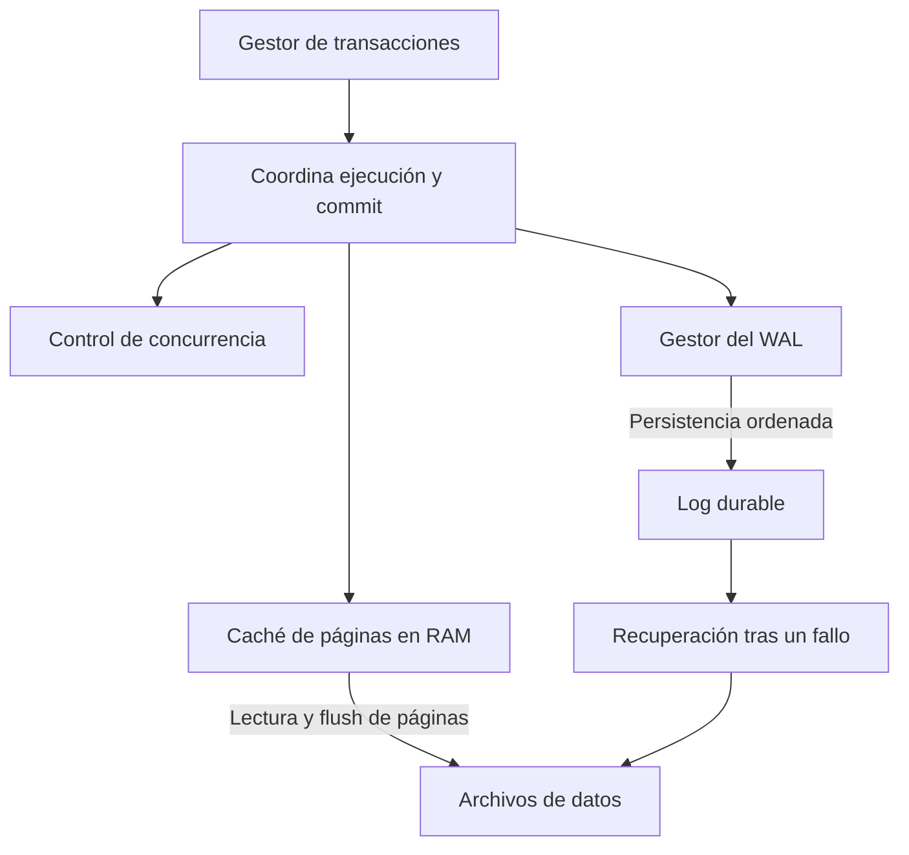

# Transacciones, ACID y los componentes que las hacen posibles

[[Obsidian/lecturas/database internals/05 Procesamiento de transacciones y recuperación/00 Índice|← Índice del capítulo 5]]

Una página de B-Tree puede estar perfectamente ordenada y, aun así, la base puede mostrar un saldo incorrecto. Los capítulos anteriores explicaban cómo guardar y encontrar datos. Este capítulo añade una pregunta: **¿cómo conservar un resultado correcto cuando varias operaciones se intercalan y el proceso puede detenerse en cualquier momento?**

Una **transacción** reúne operaciones en una unidad lógica que termina en `commit` —confirmación— o `abort` —cancelación—. No significa que todas sus instrucciones ocurran físicamente a la vez. Significa que el sistema controla sus efectos para ofrecer las garantías elegidas.

## Un ejemplo que conecta todo el capítulo

Este ejemplo es elaboración propia. Dos cuentas tienen `A = 100` y `B = 50`. Transferir 30 requiere comprobar las condiciones de negocio, restar a A y sumar a B. El estado final debe ser `A = 70`, `B = 80`; el total continúa siendo 150.

```sql
BEGIN;
UPDATE cuentas SET saldo = saldo - 30 WHERE id = 'A';
UPDATE cuentas SET saldo = saldo + 30 WHERE id = 'B';
COMMIT;
```

El SQL ilustra una unidad de trabajo, no una implementación completa de banca: aún habría que definir comprobación de fondos, restricciones y manejo de errores. Lo importante es que un fallo después del primer `UPDATE` no deje definitivamente `A = 70`, `B = 50`. Tampoco debería permitirse que otra operación tome decisiones sobre esa transferencia parcial bajo un aislamiento que prohíbe lecturas sucias.

## Las cuatro propiedades no responden a la misma pregunta

| Propiedad | Pregunta que responde | En la transferencia |
|---|---|---|
| Atomicidad | ¿Puede quedar aplicado solo un fragmento? | El débito y el crédito se conservan juntos o se revierten |
| Consistencia | ¿El estado respeta los invariantes definidos? | Se conserva el total y se respetan las reglas de saldo |
| Aislamiento | ¿Qué efectos concurrentes puede observar otra transacción? | Evita combinaciones de lecturas y escrituras prohibidas por el nivel elegido |
| Durabilidad | ¿Puede perderse una confirmación después de un fallo? | El `commit` reconocido con garantía durable sobrevive a la pérdida de RAM |

Un **invariante** es una condición que debe mantenerse en los estados válidos, por ejemplo «las referencias apuntan a filas existentes». El motor puede hacer cumplir una clave foránea; no puede adivinar una regla de negocio que nadie declaró ni implementó. Por eso la C de ACID depende también del programa. Usar una transacción no arregla por sí solo un cálculo equivocado.

La atomicidad tampoco promete deshacer cualquier efecto externo. Si el programa envió un correo entre los dos `UPDATE`, cancelar la transacción de la base no retira ese correo. Este límite es una ampliación didáctica para situar la garantía dentro del sistema que la implementa.

El aislamiento describe **visibilidad e interacción**, no necesariamente ejecución sincrónica. La serialización permite concurrencia siempre que el resultado sea equivalente a un orden serial válido. Los niveles más débiles aceptan algunas anomalías para reducir costos; la nota 06 explica cuáles.

La durabilidad no exige escribir inmediatamente todas las páginas modificadas. Es suficiente que exista una representación durable que permita reconstruir el resultado, normalmente el WAL. Así, atomicidad y durabilidad se implementan conjuntamente, pero necesitan trabajos distintos: deshacer lo incompleto y recuperar lo confirmado.

## Cuatro componentes cooperan

El **gestor de transacciones** registra qué unidad de trabajo está activa y cuándo termina. El **gestor de bloqueos** coordina accesos incompatibles a datos. La **caché de páginas**, también llamada *buffer pool*, mantiene copias de páginas en RAM. El **gestor del log** conserva la información necesaria para recuperar o revertir cambios.



Las cajas separan responsabilidades, no obligan a que sean procesos distintos. La caché permite modificar páginas sin escribirlas de inmediato. El WAL conserva las instrucciones o imágenes necesarias antes de que esos cambios deban sobrevivir en los archivos de datos. El control de concurrencia decide qué operaciones pueden convivir; recuperación decide qué estado queda después de un fallo.

Un log durable no elimina una anomalía de concurrencia: puede conservar fielmente un resultado incorrecto. Un bloqueo tampoco preserva RAM después de un apagón. Entender esta separación evita atribuir a una herramienta una garantía que depende de otra.

## Confirmar, publicar y escribir páginas son eventos diferentes

En un ejemplo con `no-force`, primero se generan registros de cambio; después se hace durable el log hasta el registro de commit; el sistema puede confirmar y publicar el resultado según su protocolo; las páginas de datos pueden escribirse más tarde. La nota 04 desarrolla el orden preciso y el caso de un cliente que pierde la conexión mientras espera la confirmación.

También hay que distinguir **crash recovery**, que reconstruye tras perder el proceso o RAM, de restaurar una copia de seguridad después de perder el soporte físico donde estaban datos y WAL. Este capítulo se centra en recuperación local; no desarrolla backups ni transacciones distribuidas.

> [!question]- Si A queda en 70 y B en 50 después de cancelar, ¿qué propiedad falló?
> Falló la atomicidad: persistió un fragmento de la transferencia. Además, el estado puede violar el invariante de conservación del dinero, pero la causa inmediata es la aplicación parcial.

> [!question]- Si ambos cambios se confirmaron y desaparecen al reiniciar, ¿qué faltó?
> Durabilidad. El problema puede ser que ni las páginas ni el WAL necesario se hicieron durables antes de reconocer el commit. No basta con que el programa haya ejecutado las dos instrucciones.

**Fuente:** PDF 1–2 · impresas 79–80. [[Obsidian/lecturas/database internals/Materiales/05 Procesamiento de transacciones y recuperación.pdf#page=1|ACID y arquitectura del procesamiento de transacciones]].

---

← [[Obsidian/lecturas/database internals/05 Procesamiento de transacciones y recuperación/00 Índice|Anterior]] · [[Obsidian/lecturas/database internals/05 Procesamiento de transacciones y recuperación/00 Índice|Índice]] · [[Obsidian/lecturas/database internals/05 Procesamiento de transacciones y recuperación/02 Caché de páginas y gestión de buffers|Siguiente →]]
