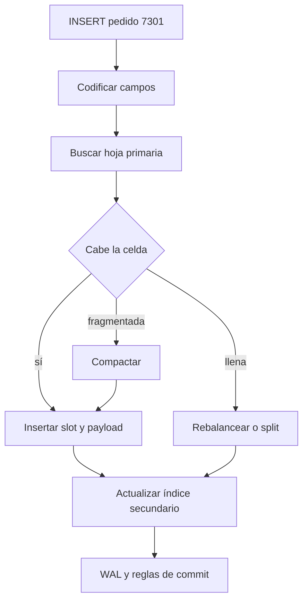
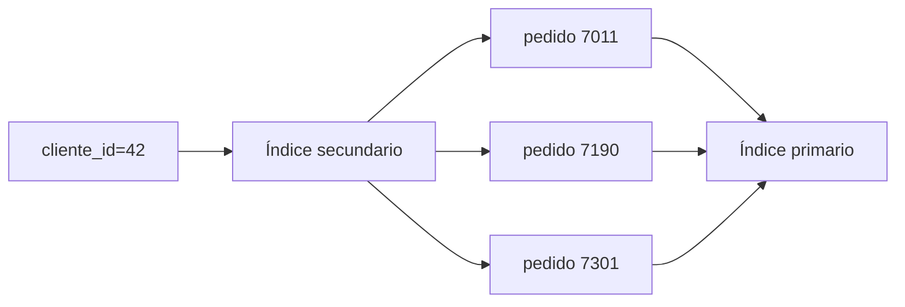

# Caso práctico: del pedido al vacuum

[[Obsidian/lecturas/database internals/00 Empieza aquí|Inicio del libro]] → [[Obsidian/lecturas/database internals/05 Práctica y repaso/00 Índice|Práctica y repaso]]

> [!info] Recuerda antes
> - Un cambio lógico puede tocar la fila, el índice primario, varios secundarios y el WAL.
> - Un payload grande puede ir a overflow; un update puede dejar una versión muerta; vacuum solo la retira cuando ya no es visible.
> El caso une esas piezas siguiendo una sola entidad para mostrar cuándo nace, se consulta, se mueve y finalmente libera espacio.

## Escenario

Una tabla `pedidos` conserva:

```text
pedido_id: uint64 creciente
cliente_id: uint64
estado: enum
total_centavos: uint64
nota: string variable
```

El índice primario está organizado por `pedido_id`. Existe un índice secundario por `(cliente_id, pedido_id)` para listar pedidos de un cliente en orden.

## Insertar el pedido 7301

La aplicación envía una operación lógica. El query processor valida tipos y el motor de ejecución solicita un insert al método de acceso. El transaction manager asigna el contexto y recovery registra información suficiente antes de depender de páginas aún no persistidas.

Como `pedido_id` crece, el B-Tree primario intenta la hoja derecha. La fast path solo es válida si `7301` supera la frontera actual y la página sigue siendo el extremo correcto.



**Lo que demuestra la secuencia:** insertar una fila también publica entradas en cada índice afectado. El secundario no es un efecto gratuito del primario, sino otra estructura con sus propias páginas e invariantes. Una sola operación lógica puede ensuciar varias páginas y generar varios registros de recuperación.

## La nota grande usa overflow

Si `nota` mide 12 KiB y la página 4 KiB, no puede almacenarse completa inline. La celda primaria conserva clave, campos pequeños, prefijo y `overflow_id`; el resto ocupa una cadena.

Esto preserva fanout, pero recuperar la fila completa necesita más I/O. Si la consulta solo proyecta `estado` y `total_centavos`, un formato que permita evitar el payload grande puede ahorrar ese recorrido.

## Listar pedidos del cliente 42

El índice secundario busca `(42, mínimo)` y recorre hojas hasta que `cliente_id` deja de ser 42. Si las hojas tienen sibling links, el recorrido continúa lateralmente.

Cada entrada secundaria puede guardar la primary key. Entonces obtener columnas que no están cubiertas requiere otra búsqueda en el índice primario. La primera búsqueda localiza; la segunda recupera.



**Lo que demuestra el recorrido:** tres coincidencias secundarias producen tres claves primarias y pueden exigir tres nuevos descensos para recuperar las filas. Un índice de cobertura elimina algunos saltos al guardar columnas adicionales, pero duplica bytes y encarece sus actualizaciones.

## Actualizar la nota

La nueva versión quizá no quepa en el mismo espacio. El motor puede:

- escribir otra celda y cambiar el slot;
- asignar más overflow pages;
- conservar la versión anterior para snapshots activos;
- marcar páginas dirty y registrar el cambio en WAL.

Aunque la versión vieja deje de ser actual, MVCC puede mantenerla visible para una transacción anterior. Solo después del horizonte seguro se vuelve garbage.

## Delete y vacuum

Borrar el pedido elimina su alcanzabilidad en los índices y deja versiones físicas pendientes. El espacio liberado puede estar repartido. Vacuum copia celdas vivas, consolida huecos y devuelve páginas completamente libres a la freelist.

El archivo no necesariamente se hace más pequeño: el motor puede reutilizar internamente una página libre sin devolverla al filesystem.

## Auditoría del caso

Antes de considerar correcta la operación, comprueba:

1. primario y secundario muestran el mismo estado comprometido;
2. no hay overflow pages vivas sin referencia ni referencias a páginas libres;
3. un split conserva todos los rangos;
4. una recuperación después de cada corte posible produce estado anterior o nuevo, no una mezcla invisible al protocolo;
5. vacuum no elimina versiones observables.

> [!question]- ¿Por qué la clave creciente ayuda y perjudica?
> Ayuda a predecir la hoja y aprovechar right-only appends; perjudica al concentrar escrituras y contención en el extremo derecho.

> [!question]- ¿Por qué listar tres pedidos puede requerir más de tres páginas?
> Hay que localizar el rango secundario, recorrer sus hojas y quizá ejecutar un lookup primario por cada entrada, además de overflow para valores grandes.

---

**Índice:** [[Obsidian/lecturas/database internals/05 Práctica y repaso/00 Índice|Práctica]] · **Siguiente:** [[Obsidian/lecturas/database internals/05 Práctica y repaso/02 Glosario y tarjetas de memoria|Glosario y tarjetas]]
