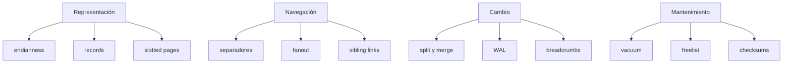

# Glosario y tarjetas de memoria

[[Obsidian/lecturas/database internals/00 Empieza aquí|Inicio del libro]] → [[Obsidian/lecturas/database internals/05 Práctica y repaso/00 Índice|Práctica y repaso]]

El glosario completo está en [[Obsidian/lecturas/database internals/05 Práctica y repaso/04 Glosario completo|Glosario — Database Internals]]. Estas tarjetas están diseñadas para recuperación activa.

> [!question]- ¿Qué diferencia hay entre storage engine y DBMS?
> El storage engine administra persistencia y acceso granular. El DBMS añade consultas, esquemas, ejecución, transacciones, seguridad y otras capas.

> [!question]- ¿Qué optimiza el fanout alto?
> Reduce altura y número de páginas visitadas al permitir muchos hijos por nodo.

> [!question]- ¿Qué diferencia una separator key de una fila?
> La separator key define la frontera de un rango; puede ser abreviada y no representar un registro de usuario completo.

> [!question]- ¿Por qué una slotted page separa slots de celdas?
> Para conservar orden lógico moviendo offsets pequeños mientras los payloads variables permanecen en su ubicación física.

> [!question]- ¿Qué garantiza un checksum?
> Detecta con alta probabilidad cambios accidentales según su algoritmo. No garantiza autenticidad ni reemplaza validaciones estructurales.

> [!question]- ¿Por qué un nodo con `N` separadores tiene `N+1` hijos?
> Porque `N` fronteras dividen el dominio en un intervalo anterior, `N-1` intermedios y uno posterior.

> [!question]- ¿Para qué sirve un breadcrumb?
> Para recordar la ruta de descenso y regresar a padres durante la propagación de splits o merges sin persistir parent pointers.

> [!question]- ¿Qué diferencia hay entre espacio libre y espacio contiguo?
> El primero es una suma; el segundo es un tramo único donde puede escribirse una celda. La fragmentación puede hacer grande la suma e insuficiente el tramo.

> [!question]- ¿Cuándo una versión antigua es garbage?
> Cuando ninguna ruta viva ni snapshot que deba respetarse puede observarla.

> [!question]- ¿Qué diferencia hay entre reutilizar una página y reducir el archivo?
> La base puede conservar el page ID en su freelist y usarlo después aunque el archivo mantenga el mismo tamaño externo.

> [!question]- ¿Qué debe incluir una comparación de dos motores?
> Workload, datos, caché, mantenimiento en régimen, percentiles, I/O, espacio, durabilidad y operación; no solo throughput promedio.

## Agrupa por relaciones

**Lo que demuestra el mapa:** los términos se agrupan por función y no por ortografía. Poder reconstruir «pila temporal para volver al padre» aunque se olvide la palabra *breadcrumb* demuestra comprensión del mecanismo; recordar solo la etiqueta no.

---

**Anterior:** [[Obsidian/lecturas/database internals/05 Práctica y repaso/01 Caso práctico del pedido al vacuum|Caso práctico]] · **Índice:** [[Obsidian/lecturas/database internals/05 Práctica y repaso/00 Índice|Práctica]] · **Siguiente:** [[Obsidian/lecturas/database internals/05 Práctica y repaso/03 Ejercicios integradores|Ejercicios]]
