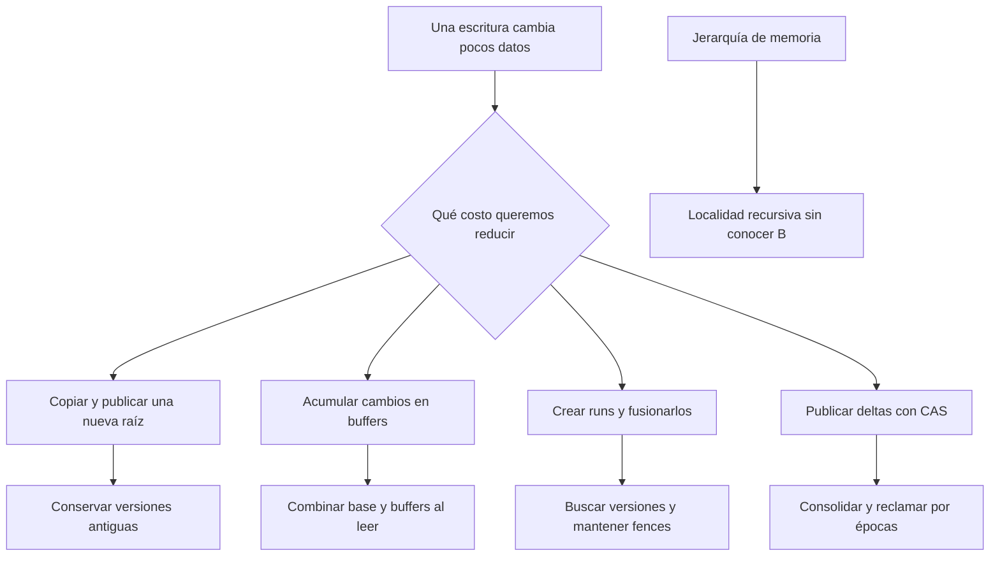

# Capítulo 6 · Variantes de B-Trees

[[Obsidian/lecturas/database internals/00 Empieza aquí|Inicio del libro]] → [[Obsidian/lecturas/database internals/06 Variantes de B-Trees/00 Índice|Capítulo 6]]

Este capítulo cambia la pregunta de los capítulos anteriores: ya sabemos buscar, dividir y fusionar nodos; ahora queremos hacerlo con menos escrituras, mejor concurrencia o mejor localidad de memoria. Una **variante** conserva la idea de un árbol ordenado, pero modifica la representación física y la manera de aplicar sus cambios.

Las notas desarrollan **las 18 páginas del escaneo, impresas 111–128**, incluida la bibliografía. La correspondencia es `página impresa = página PDF + 110`. El PDF 7 está girado en el original; se revisó orientándolo para leerlo. Los ejemplos con claves, bytes y operaciones son elaboración propia salvo que se indique que proceden del libro.

## Ruta de estudio

| Nota | Lo que podrás explicar |
|---|---|
| [[Obsidian/lecturas/database internals/06 Variantes de B-Trees/01 El costo de modificar un B-Tree y representar sus nodos\|01 El costo de modificar un B-Tree y representar sus nodos]] | Por qué un cambio pequeño puede mover una página grande y cómo se representa un nodo en RAM |
| [[Obsidian/lecturas/database internals/06 Variantes de B-Trees/02 Copy-on-write y snapshots en LMDB\|02 Copy-on-write y snapshots en LMDB]] | Crear un camino nuevo hasta la raíz, compartir páginas intactas y conservar vistas antiguas |
| [[Obsidian/lecturas/database internals/06 Variantes de B-Trees/03 Lazy B-Trees y reconciliación en WiredTiger\|03 Lazy B-Trees y reconciliación en WiredTiger]] | Leer y escribir mediante una base más actualizaciones pendientes |
| [[Obsidian/lecturas/database internals/06 Variantes de B-Trees/04 LA-Tree y buffers por subárbol\|04 LA-Tree y buffers por subárbol]] | Hacer descender lotes por rangos y pagar su materialización al llegar a las hojas |
| [[Obsidian/lecturas/database internals/06 Variantes de B-Trees/05 FD-Tree runs fences y fractional cascading\|05 FD-Tree runs fences y fractional cascading]] | Combinar un B-Tree pequeño con runs inmutables y reutilizar posiciones entre niveles |
| [[Obsidian/lecturas/database internals/06 Variantes de B-Trees/06 Bw-Tree cadenas de deltas y CAS\|06 Bw-Tree cadenas de deltas y CAS]] | Separar identidad y dirección, reconstruir un nodo y publicar cambios con CAS |
| [[Obsidian/lecturas/database internals/06 Variantes de B-Trees/07 Bw-Tree split merge consolidación y épocas\|07 Bw-Tree split merge consolidación y épocas]] | Conservar accesibilidad durante cambios estructurales y liberar memoria sin dañar lectores |
| [[Obsidian/lecturas/database internals/06 Variantes de B-Trees/08 Cache-oblivious layout vEB y packed arrays\|08 Cache-oblivious layout vEB y packed arrays]] | Mantener localidad recursiva y admitir inserciones mediante huecos distribuidos |
| [[Obsidian/lecturas/database internals/06 Variantes de B-Trees/09 Comparar variantes y conectar los mecanismos\|09 Comparar variantes y conectar los mecanismos]] | Identificar qué costo ahorra cada variante y qué trabajo añade |
| [[Obsidian/lecturas/database internals/06 Variantes de B-Trees/10 Laboratorio y repaso resuelto\|10 Laboratorio y repaso resuelto]] | Resolver cálculos y ejecutar una simulación que comprueba los mecanismos |

## La pregunta que une las variantes

Las ramas representan distintas decisiones físicas, no una competición con un ganador universal. Copy-on-write conserva vistas completas mediante raíces; los buffers posponen trabajo; los runs vuelven grandes y ordenadas las escrituras; los deltas evitan reescribir la base. El layout cache-oblivious ataca otra dimensión: dónde colocar los datos para que varios niveles de memoria aprovechen la proximidad.

## Guía visual del capítulo

| Figura del libro | Recreación explicada |
|---|---|
| 6-1 · Copy-on-write | Nota 02 · raíces antigua y nueva con páginas compartidas |
| 6-2 y 6-3 · WiredTiger | Nota 03 · página limpia, página modificada y lectura reconstruida |
| 6-4 · LA-Tree | Nota 04 · lotes separados por rangos |
| 6-5 · Fractional cascading | Nota 05 · muestras, puentes y consulta de 27 |
| 6-6 · FD-Tree | Nota 05 · cabeza mutable, runs y tombstones |
| 6-7 · Bw-Tree | Nota 06 · ID lógico, tabla de mapeo y cadena física |
| 6-8 · van Emde Boas | Nota 08 · grupos recursivos y orden físico |
| 6-9 · Packed array | Nota 08 · inserción en hueco y redistribución |

Hay **12 gráficos PNG**: además de las recreaciones, se representan las tres formas de trabajar con un nodo, la carrera entre escritores con CAS, las etapas de split/merge y la reclamación por épocas. Cada imagen tiene su explicación inmediatamente debajo en la nota correspondiente.

> [!tip] Si necesitas recordar el B-Tree de partida
> Usa [[Obsidian/lecturas/database internals/02 Fundamentos de B-Trees/00 Índice|Fundamentos de B-Trees]] y [[Obsidian/lecturas/database internals/04 Implementación de B-Trees/00 Índice|Implementación]]. En este capítulo, **nodo lógico** y **página física** pueden dejar de corresponder uno a uno.

**Referencia:** PDF 1–18 · impresas 111–128. [[Obsidian/lecturas/database internals/Materiales/06 Variantes de B-Trees.pdf#page=1|Fuente del capítulo]].

---

← [[Obsidian/lecturas/database internals/00 Empieza aquí|Anterior]] · [[Obsidian/lecturas/database internals/06 Variantes de B-Trees/00 Índice|Índice]] · [[Obsidian/lecturas/database internals/06 Variantes de B-Trees/01 El costo de modificar un B-Tree y representar sus nodos|Siguiente]] →
