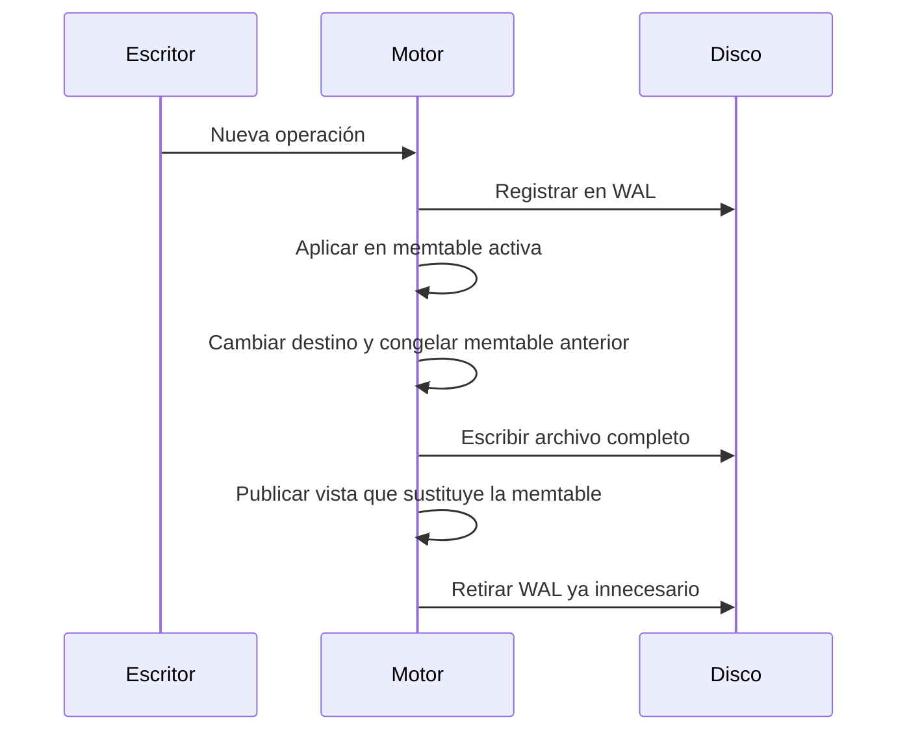

# Memtables flush y publicación de archivos

[[Obsidian/lecturas/database internals/07 Almacenamiento estructurado como log/00 Índice|Índice del capítulo 7]]

> [!abstract] La situación que queremos resolver
> Una memtable se llena mientras siguen llegando operaciones. El motor debe descargarla sin perder escrituras ni dejar un hueco en las lecturas.

## Cuatro estados que conviene separar

| Estado | Recibe escrituras nuevas | Puede servir lecturas |
|---|---|---|
| Memtable activa | Sí | Sí |
| Memtable congelada o en flush | No | Sí |
| Archivo de salida incompleto | No | No |
| Archivo terminado y publicado | No | Sí |

Al alcanzar un umbral de tamaño o tiempo se crea una memtable nueva. El motor cambia atómicamente el destino de las escrituras; la antigua queda congelada y sigue accesible para lectores. “Congelada” significa que ya no cambia su contenido, lo que permite recorrerla de principio a fin con una imagen estable.

Si un escritor sigue modificando una parte de la memtable antigua que el flush ya recorrió, su registro podría no entrar en el archivo resultante. Por eso el cambio necesita coordinación con operaciones en curso, no solo asignar otra variable.

## El ejemplo de una consulta durante el flush

Antes del cambio, `precio-7=18` está en la memtable M1. Durante el flush, M2 recibe `precio-7=20`. Una lectura actual compara ambas versiones y devuelve 20. Si pregunta por otra clave presente solo en M1, todavía puede obtenerla allí. El archivo parcial no se usa: un registro ausente en él podría significar que aún no fue escrito.

Cuando el archivo está completamente escrito y cumple los requisitos de durabilidad, el motor publica una nueva **vista de tablas**: el conjunto de fuentes que una lectura considera. La vista nueva reemplaza M1 por su archivo. Los lectores que ya tenían referencias a M1 pueden terminar; la memoria se libera después.

![[Obsidian/lecturas/database internals/Recursos visuales/Capítulo 07/01 ciclo_flush.png]]

La fila superior muestra la vista antes de publicar el resultado: la memtable activa y la congelada siguen sirviendo lecturas, mientras la salida incompleta está apartada. La fila inferior muestra el reemplazo de la congelada por una tabla completa. El cambio de vista evita un intervalo en el que los datos estén físicamente escritos pero no sean consultables.

## El WAL se retira después

Hasta que la tabla durable representa las operaciones de M1, el WAL es su protección frente a una caída. Si borramos el segmento antes y el proceso se detiene, podríamos perder tanto la copia de RAM como la posibilidad de reconstruirla.

La regla segura es conservar cada segmento hasta que todas las operaciones que protege estén materializadas y recuperables. Si un segmento de WAL contiene operaciones de varias memtables o tablas, un flush aislado no basta para retirarlo. La implementación necesita saber qué dependencias siguen pendientes.

La secuencia muestra dependencias lógicas. Una implementación puede agrupar escrituras y solapar trabajo. Confirmar al cliente depende de la política de durabilidad; una llamada que añade bytes al WAL no equivale por sí sola a que el dispositivo haya persistido esos bytes.

> [!question]- ¿Publicar el archivo y eliminar la memtable son dos pasos independientes?
> No pueden crear un hueco visible entre sí. Para consultas nuevas se publica una vista que hace el reemplazo de forma coherente; la liberación física puede ocurrir después de que terminen lectores antiguos.

**Puente al siguiente tema:** ahora una clave puede vivir en memoria y en varios archivos. Esa duplicación explica por qué borrar requiere escribir información adicional.

**Referencia:** PDF 6–8, 27–29 · impresas 134–136, 155–157 · figura 7-4. [[Obsidian/lecturas/database internals/Materiales/07 Almacenamiento estructurado como log.pdf#page=6|Fuente del capítulo]]. Los ejemplos propios se indican en el texto; las explicaciones son elaboración en español.

---

← [[Obsidian/lecturas/database internals/07 Almacenamiento estructurado como log/02 Dos componentes y múltiples archivos|Anterior]] · [[Obsidian/lecturas/database internals/07 Almacenamiento estructurado como log/00 Índice|Índice]] · [[Obsidian/lecturas/database internals/07 Almacenamiento estructurado como log/04 Actualizaciones borrados y tombstones|Siguiente]] →
