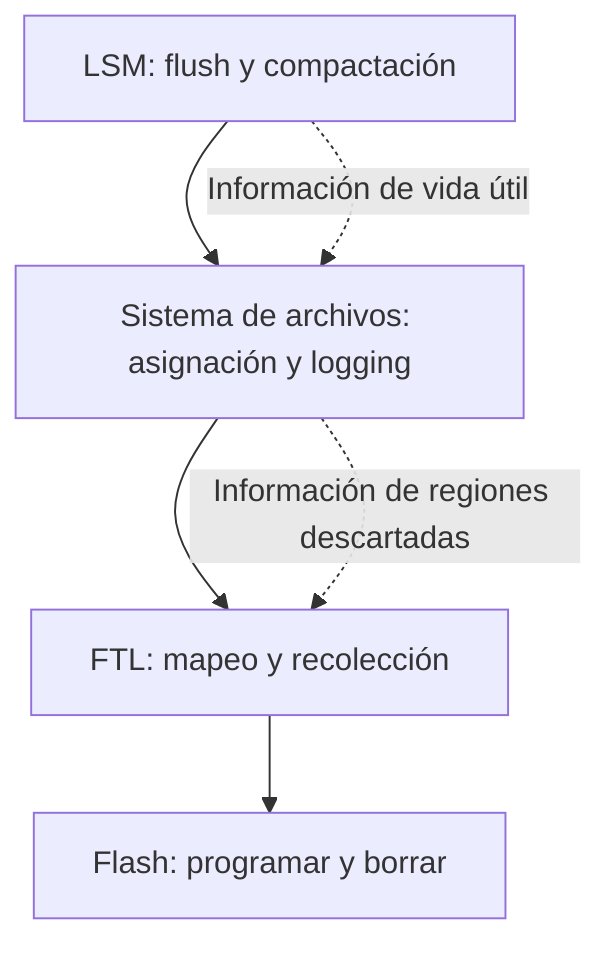

# Logs apilados FTL y cooperación con LLAMA

[[Obsidian/lecturas/database internals/07 Almacenamiento estructurado como log/00 Índice|Índice del capítulo 7]]

> [!abstract] Para ampliar el contexto
> Una LSM escribe archivos sobre un sistema de archivos y un SSD. Si cada capa agrupa, mueve y limpia datos por su cuenta, una mejora local puede ocultar trabajo duplicado.

## Lo que hace la memoria flash

La flash trabaja con unidades de programación y bloques de borrado. En el modelo del capítulo, se escribe una página previamente borrada y se borra un bloque que agrupa muchas páginas. Los tamaños concretos dependen del dispositivo; la cifra histórica de 64–512 páginas por bloque no es una especificación universal de SSD actuales.

La **FTL**, *Flash Translation Layer*, traduce direcciones lógicas a ubicaciones físicas y conserva el estado de páginas vivas, descartadas y libres. Al actualizar una dirección, puede escribir una ubicación nueva y dejar obsoleta la anterior. Para recuperar un bloque parcialmente obsoleto, copia sus páginas vivas a otro bloque, actualiza el mapeo y borra el bloque viejo.

Ejemplo propio: un bloque tiene ocho páginas, tres vivas y cinco inválidas. Para obtener ocho páginas borradas se copian las tres vivas a espacio libre y luego se borra el bloque. La recolección añade tres escrituras internas sin que la aplicación haya pedido actualizar esos datos.

**Wear leveling**, nivelación de desgaste, distribuye ciclos de borrado y programación para evitar concentrarlos en unos pocos bloques. Dado que las celdas admiten un número limitado de ciclos, la distribución ayuda a conservar vida útil.

## Dónde aparece el apilamiento

Las flechas continuas representan el recorrido de escrituras hacia el dispositivo. Las discontinuas representan información que sería útil para coordinar las capas; no afirman que toda plataforma la exponga. Cada capa puede copiar registros que otra ya considera obsoletos o que va a descartar pronto.

Segmentos de la aplicación y unidades de la capa inferior pueden no alinearse. Retirar un segmento superior entonces deja fragmentos vivos mezclados con otros segmentos inferiores, que habrá que mover. Además, WAL, datos y compactaciones generan flujos paralelos: cada uno puede ser secuencial por separado y aun así intercalarse físicamente.

## LLAMA conoce lo que guarda

> «Esa llama que estás viendo fue una vez un ser humano».
> — Kuzco, de *The Emperor’s New Groove*; traducción de un fragmento del epígrafe de la impresa 160.

El libro usa el juego con la llama para presentar el nombre LLAMA. La idea técnica que conviene asociarle es una capa de almacenamiento que conoce la estructura de lo que guarda y aprovecha esa información al reorganizarlo.

El capítulo describe **LLAMA**, *Latch-free, Log-structured, Access-method Aware*, debajo del Bw-Tree. Un nodo lógico Bw-Tree se representa con una base y deltas, enlazados mediante una tabla de mapeo. Los deltas físicos son inmutables aunque cambie el estado lógico del nodo.

Una capa genérica de recolección solo copia bytes vivos. LLAMA entiende que varios deltas corresponden al mismo nodo, así que puede agruparlos en una región física. Además puede **consolidar lógicamente**: aplicar los cambios a la base y producir una imagen nueva. Agrupar deltas contiguos reduce dispersión; consolidarlos reduce cuántos cambios debe aplicar el lector. Son beneficios distintos.

Una inserción seguida por eliminación puede cancelarse dentro de la consolidación cuando las reglas de visibilidad lo permiten. Si hay un lector que necesita el estado intermedio, no se elimina arbitrariamente su versión. El ejemplo de buffers de flush de 4 MB es un parámetro del sistema descrito, no un requisito general de LLAMA.

## Acceso más directo: responsabilidad adicional

El libro menciona Open-Channel SSDs, LOCS, LightNVM y Software Defined Flash como ejemplos históricos de mayor control sobre asignación, recolección y scheduling. Saltar capas puede evitar trabajos repetidos, pero traslada a software superior tareas que antes hacía el controlador. No se presentan aquí como recomendaciones de compra ni como estado actual de soporte.

`O_DIRECT` es una analogía de control más directo sobre la caché del kernel; no convierte automáticamente un SSD convencional en Open-Channel ni elimina la FTL. Elegir una API más baja y eliminar una capa de traducción son decisiones diferentes.

> [!question]- ¿Apilar logs siempre empeora el rendimiento?
> No. Coordinar semántica y ciclos de vida puede sumar beneficios. El problema es duplicar trabajo sin compartir la información necesaria; LLAMA ilustra una cooperación que aprovecha la estructura del árbol.

**Puente al siguiente tema:** las decisiones observadas se organizan en tres ejes: cuándo acumular cambios, qué representación puede modificarse y dónde se conserva el orden.

**Referencia:** PDF 29–34 · impresas 157–162 · figuras 7-13 a 7-16. [[Obsidian/lecturas/database internals/Materiales/07 Almacenamiento estructurado como log.pdf#page=29|Fuente del capítulo]]. Los ejemplos propios se indican en el texto; las explicaciones son elaboración en español.

---

← [[Obsidian/lecturas/database internals/07 Almacenamiento estructurado como log/12 Concurrencia snapshots y truncamiento del WAL|Anterior]] · [[Obsidian/lecturas/database internals/07 Almacenamiento estructurado como log/00 Índice|Índice]] · [[Obsidian/lecturas/database internals/07 Almacenamiento estructurado como log/14 Síntesis de la Parte I buffering mutabilidad y orden|Siguiente]] →
