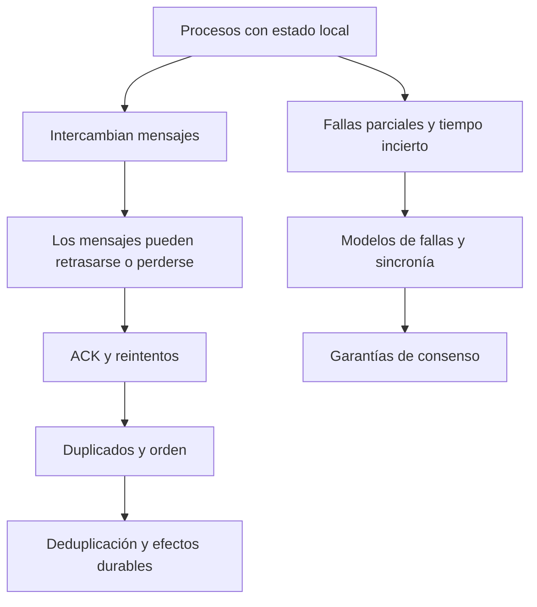

# Capítulo 8 · Introducción a sistemas distribuidos

[[Obsidian/lecturas/database internals/00 Empieza aquí|Inicio del libro]] → [[Obsidian/lecturas/database internals/08 Introducción a sistemas distribuidos/00 Índice|Capítulo 8]]

Antes de estudiar un algoritmo distribuido conviene entender qué puede ver cada participante y qué puede salir mal. Este capítulo aporta ese vocabulario: mensajes, tiempo, fallas y garantías. Las explicaciones parten de ejemplos cotidianos y separan la recepción de un mensaje del efecto que produce.

La fuente incluye la introducción de la Parte II (PDF 1–3, sin folios visibles) y las impresas 171–193 del capítulo 8 (PDF 4–26). Se cubren **todas las páginas compartidas**; el archivo termina con el resumen, sin una bibliografía posterior ni el capítulo 9.

## Ruta de lectura

| Nota | Pregunta que resuelve |
|---|---|
| [[Obsidian/lecturas/database internals/08 Introducción a sistemas distribuidos/01 Parte II del motor local al sistema distribuido\|01 Parte II y vocabulario]] | ¿Qué cambia al pasar de un motor local a varios nodos? |
| [[Obsidian/lecturas/database internals/08 Introducción a sistemas distribuidos/02 Concurrencia interleavings y estado compartido\|02 Concurrencia]] | ¿Cómo pueden las mismas operaciones dar resultados diferentes? |
| [[Obsidian/lecturas/database internals/08 Introducción a sistemas distribuidos/03 La red y sus supuestos peligrosos\|03 Supuestos de red]] | ¿Por qué una llamada remota puede quedar en estado desconocido? |
| [[Obsidian/lecturas/database internals/08 Introducción a sistemas distribuidos/04 Colas procesamiento y backpressure\|04 Colas y backpressure]] | ¿Por qué una cola más grande no crea capacidad? |
| [[Obsidian/lecturas/database internals/08 Introducción a sistemas distribuidos/05 Relojes consistencia y llamadas remotas\|05 Tiempo y consistencia]] | ¿Qué significa realmente una marca de tiempo o una vista compartida? |
| [[Obsidian/lecturas/database internals/08 Introducción a sistemas distribuidos/06 Fallas parciales particiones y cascadas\|06 Fallas y cascadas]] | ¿Cómo impedir que un problema local se propague? |
| [[Obsidian/lecturas/database internals/08 Introducción a sistemas distribuidos/07 Enlaces fair-loss ACK y retransmisión\|07 Enlaces y ACK]] | ¿Qué añade cada capa de comunicación? |
| [[Obsidian/lecturas/database internals/08 Introducción a sistemas distribuidos/08 Orden deduplicación e idempotencia\|08 Orden y efectos únicos]] | ¿Cómo tolerar duplicados sin cobrar dos veces? |
| [[Obsidian/lecturas/database internals/08 Introducción a sistemas distribuidos/09 Dos generales y conocimiento común\|09 Dos generales]] | ¿Por qué el último ACK deja una nueva duda? |
| [[Obsidian/lecturas/database internals/08 Introducción a sistemas distribuidos/10 Consenso FLP y sincronía\|10 Consenso y sincronía]] | ¿Qué impide FLP y qué condiciones permiten progresar? |
| [[Obsidian/lecturas/database internals/08 Introducción a sistemas distribuidos/11 Modelos de fallas y tolerancia\|11 Modelos de fallas]] | ¿Qué tipos de error promete soportar un algoritmo? |
| [[Obsidian/lecturas/database internals/08 Introducción a sistemas distribuidos/12 Laboratorio y repaso resuelto\|12 Laboratorio]] | ¿Puedes reconstruir carreras, colas y un reintento seguro? |

El diagrama conecta la necesidad con la siguiente dificultad. Los reintentos mejoran la oportunidad de entrega y crean duplicados; la deduplicación controla efectos, pero necesita memoria durable si los nodos reinician. Las hipótesis sobre tiempo y fallas delimitan las garantías de los algoritmos que vendrán después.

Las cuatro figuras del capítulo se desarrollan en las notas 02 (8-1), 07 (8-2 y 8-3) y 09 (8-4). Los ejemplos numéricos y el laboratorio son elaboración propia; se mantienen explícitos los supuestos de cada modelo.

**Cobertura y revisión:** [[Obsidian/lecturas/database internals/90 Fuentes y revisión/07 Cobertura y validación de sistemas distribuidos|Mapa de páginas y precisiones técnicas]].

**Referencia:** PDF 1–26 · introducción Parte II y capítulo 8, impresas 171–193. [[Obsidian/lecturas/database internals/Materiales/08 Sistemas distribuidos.pdf#page=1|PDF de consulta]].

---

← [[Obsidian/lecturas/database internals/07 Almacenamiento estructurado como log/00 Índice|Anterior: capítulo 7]] · [[Obsidian/lecturas/database internals/08 Introducción a sistemas distribuidos/00 Índice|Índice]] · [[Obsidian/lecturas/database internals/08 Introducción a sistemas distribuidos/01 Parte II del motor local al sistema distribuido|Siguiente]] →
