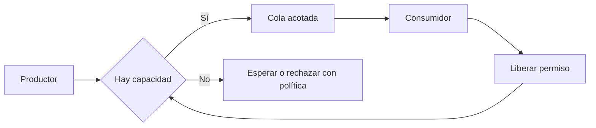

# Colas, procesamiento y backpressure

[[Obsidian/lecturas/database internals/08 Introducción a sistemas distribuidos/00 Índice|Índice del capítulo 8]]

Después de llegar al servidor, un mensaje puede esperar. Separar el tiempo de transporte del tiempo de cola explica por qué aumentar recursos de red o reintentar más rápido no resuelve automáticamente un servicio saturado.

Una **cola** guarda solicitudes pendientes. **Throughput** es la cantidad completada por unidad de tiempo; **latencia** es lo que tarda una solicitud en completar su recorrido. Recibir un mensaje no significa empezar a procesarlo en ese momento. CPU distintas, discos, versiones o configuraciones producen ritmos diferentes. Si una operación debe esperar a todos los participantes, el más lento determina ese tramo de su duración; si necesita solo un subconjunto, dependerá del protocolo de selección.

## Para qué sí sirve una cola

El capítulo atribuye a las colas tres usos. **Desacoplar** permite recibir y procesar en momentos distintos. **Pipelining**, o trabajo por etapas, permite que distintos componentes avancen solicitudes diferentes sin esperar el recorrido completo de una sola. **Absorber ráfagas** guarda un exceso temporal mientras los consumidores recuperan capacidad. Los tres usos pueden ser útiles; ninguno aumenta por sí solo la tasa sostenible de procesamiento.

Ejemplo propio: el consumidor completa 100 pedidos por segundo y durante 3 segundos llegan 160 por segundo. Si empieza sin pendientes y mantiene esa tasa, la cola aumenta en `(160 − 100) × 3 = 180 pedidos`. Cuando la llegada baja a 70 por segundo, el margen de vaciado es `100 − 70 = 30 pedidos/s` y tarda `180 / 30 = 6 s` en desaparecer. Una cola de 500 pedidos soporta esa ráfaga, pero si 160/s llega para siempre, acaba llena.

Si una solicitud encuentra 180 pedidos delante y el consumidor mantiene 100/s en orden, puede esperar aproximadamente `180 / 100 = 1,8 s` antes de iniciar. Es una estimación del ejemplo, sin prioridad, paralelismo adicional ni cambios de tasa. Aumentar el límite de cola a 1 000 solo permitiría que esperaran más pedidos; no reduciría esa espera.

## Backpressure hace visible la falta de capacidad

**Backpressure**, o contrapresión, transmite a los productores que deben reducir la velocidad cuando los consumidores no pueden seguirla. Puede usar límites de solicitudes en vuelo, permisos, ventanas de envío o bloqueo controlado. También se puede rechazar trabajo cuando no hay capacidad, siempre que el cliente tenga una política de reintento que no amplifique la carga.

Las cajas representan el ingreso y consumo de trabajo; la flecha de retorno devuelve capacidad disponible. Cuando la cola se llena, el productor deja de añadir trabajo libremente. Así la sobrecarga queda acotada, aunque el usuario puede percibir espera o rechazo. Un límite de cola necesita ir acompañado de esa decisión explícita.

## Elegir el tamaño requiere una carga y un objetivo

Para una carga estable conviene medir tiempo de servicio y espera, sosteniendo la latencia aceptable mientras sube el throughput. Para ráfagas se necesita margen compatible con la duración y volumen de esas ráfagas. Una cola enorme puede guardar trabajo que ya no sirve: el cliente agotó su plazo, pero el servidor sigue gastando recursos en él.

Incluso una respuesta rápida puede ser un resultado negativo válido: registro ausente, validación rechazada o fallo de escritura. «Llegó a tiempo» y «tuvo éxito» son propiedades distintas.

> [!question]- Si duplico la cola y mantengo igual el consumidor, ¿duplico throughput?
> No. Puedes absorber más exceso temporal, pero la tasa de salida sigue limitada por el consumidor. Bajo carga sostenida superior a su capacidad aumentarán los pendientes hasta llegar al nuevo límite.

**Referencia:** PDF 8–9 · impresas 175–176. [[Obsidian/lecturas/database internals/Materiales/08 Sistemas distribuidos.pdf#page=8|PDF de consulta]].

---

← [[Obsidian/lecturas/database internals/08 Introducción a sistemas distribuidos/03 La red y sus supuestos peligrosos|Anterior]] · [[Obsidian/lecturas/database internals/08 Introducción a sistemas distribuidos/00 Índice|Índice]] · [[Obsidian/lecturas/database internals/08 Introducción a sistemas distribuidos/05 Relojes consistencia y llamadas remotas|Siguiente]] →
