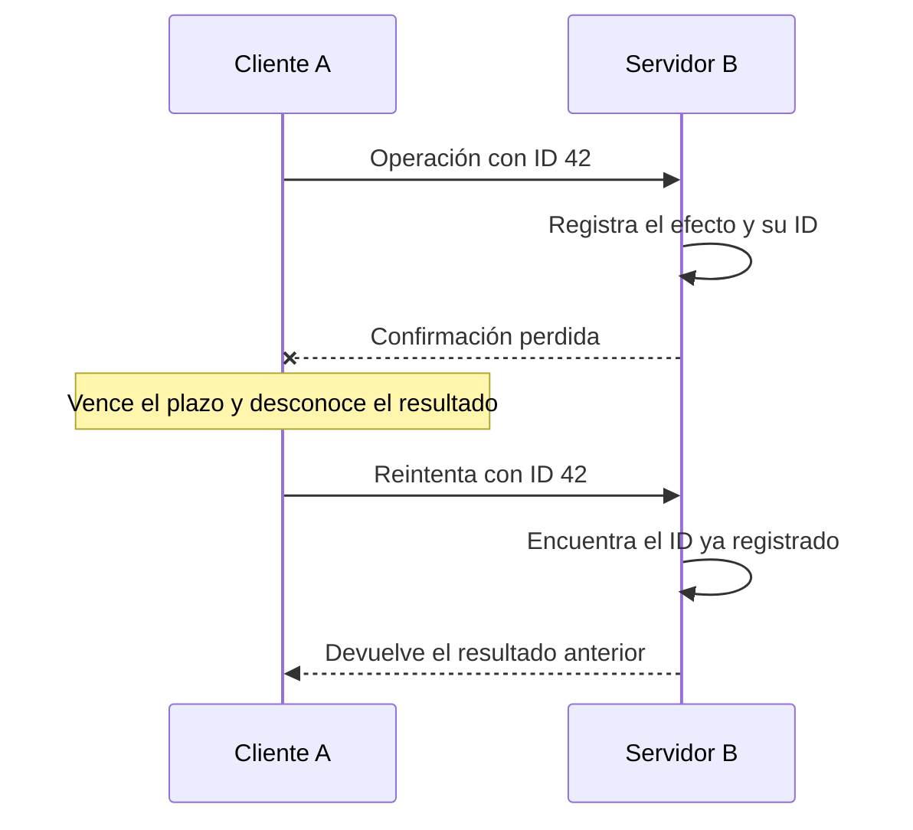

# Enlaces fair-loss, ACK y retransmisión

[[Obsidian/lecturas/database internals/08 Introducción a sistemas distribuidos/00 Índice|Índice del capítulo 8]]

Para mejorar una comunicación necesitamos decir primero qué promete la capa más simple. Las abstracciones de enlaces permiten razonar sobre garantías sin confundir un mecanismo concreto, como UDP o TCP, con todo el comportamiento de una aplicación.

## Fair-loss: puede perder, pero no bloquear para siempre todo reintento

Un **enlace fair-loss** admite pérdida y retraso. Sus propiedades clásicas son: **pérdida justa**, si un proceso correcto envía un mismo mensaje infinitas veces a otro correcto, se entrega infinitas veces; **duplicación finita**, un número finito de envíos no produce infinitas entregas; y **no creación**, todo mensaje entregado fue enviado. La nota al pie de la impresa 183 aporta la formulación precisa de pérdida justa; «se entrega alguna vez» es una consecuencia más débil.

Un **proceso correcto** cumple el modelo y continúa participando según las hipótesis. «Infinitas veces» describe un argumento matemático sobre ejecuciones, no una recomendación para generar tráfico infinito. El modelo excluye una pérdida sistemática permanente de todos los intentos entre esos procesos; si existe una partición eterna, no podemos aplicar esa garantía a ese enlace.

Tras un solo envío A no sabe si M está pendiente, se perdió o ya llegó a B. La figura 8-2 dibuja esa comunicación unidireccional. La analogía con UDP ayuda a recordar que un datagrama no incluye por sí solo un protocolo de aplicación que confirme y vuelva a enviar; no demuestra que todo entorno UDP satisfaga todas las hipótesis de fair-loss.

## El ACK añade evidencia de recepción

Un **ACK**, o acuse de recibo, es una respuesta que identifica el mensaje recibido. La figura 8-3 muestra `M(n)` de A a B y `ACK(n)` de B a A. `n` puede ser un número de secuencia creciente o cualquier identificador único con ámbito definido. Un hash exige tratar posibles colisiones; «mismo hash» no demuestra matemáticamente «mismo mensaje» sin más condiciones.

El ACK también puede perderse. Si no llega, A conserva incertidumbre. Si llega un ACK válido, A puede concluir lo que la implementación definió que ese ACK confirma. Un ACK de transporte confirma recepción en su capa; no certifica por sí solo un commit durable, una escritura replicada o una acción externa.

La cruz marca la pérdida de respuesta, no la pérdida del efecto. El cliente usa el mismo ID y el servidor devuelve lo registrado. La seguridad del ejemplo depende de que efecto e ID se conserven juntos; la próxima nota desarrolla esa condición.

## Stubborn: la persistencia del reintento

Un **enlace stubborn** sigue retransmitiendo. Construido sobre fair-loss, sus reintentos permiten entregar repetidamente el mensaje a participantes correctos bajo las hipótesis del modelo. No promete un plazo finito conocido y no impide duplicados. En la práctica se combinan retransmisiones con ACK para dejar de insistir cuando hay evidencia suficiente.

| Capa de estudio | Lo que añade | Riesgo pendiente |
|---|---|---|
| Fair-loss | No creación y oportunidad eventual bajo reintentos infinitos | Un único envío puede perderse |
| Stubborn | Reenvío persistente | Varias entregas del mismo mensaje |
| Perfect | Entrega eventual, sin duplicación ni creación | No define efectos durables de la aplicación |

Un **enlace perfecto** se obtiene conceptualmente añadiendo deduplicación a la entrega fiable. Sus garantías se entienden bajo procesos correctos y el modelo correspondiente. El libro presenta también un mecanismo FIFO; el orden FIFO es una propiedad adicional, no una consecuencia automática de las tres propiedades de enlace perfecto.

La diferencia principal es entre la interfaz lógica y el tráfico físico: la capa superior puede recibir una vez aunque la capa inferior retransmita muchas veces. Eso todavía no responde qué ocurre si el servidor ejecuta y luego reinicia.

**Referencia:** PDF 15–19 · impresas 182–186 · figuras 8-2 y 8-3. [[Obsidian/lecturas/database internals/Materiales/08 Sistemas distribuidos.pdf#page=15|PDF de consulta]].

---

← [[Obsidian/lecturas/database internals/08 Introducción a sistemas distribuidos/06 Fallas parciales particiones y cascadas|Anterior]] · [[Obsidian/lecturas/database internals/08 Introducción a sistemas distribuidos/00 Índice|Índice]] · [[Obsidian/lecturas/database internals/08 Introducción a sistemas distribuidos/08 Orden deduplicación e idempotencia|Siguiente]] →
