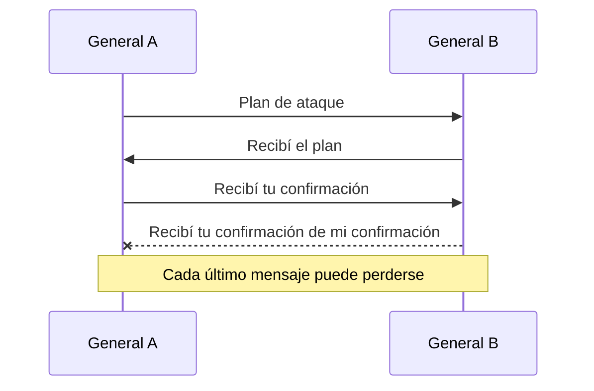

# Dos generales y conocimiento común

[[Obsidian/lecturas/database internals/08 Introducción a sistemas distribuidos/00 Índice|Índice del capítulo 8]]

Saber que otro recibió un mensaje no es igual a saber que ambos saben que lo recibieron. El problema de los dos generales convierte esa diferencia en una cadena de confirmaciones sin un último paso que cierre toda la incertidumbre.

## El último mensajero siempre importa

Dos generales solo quieren atacar si ambos están coordinados. Los mensajeros pueden perderse. A envía el plan a B. Si B lo recibe, envía un ACK, pero ese mensajero también puede desaparecer. B no sabe si A recibió su confirmación; entonces A puede confirmar el ACK y aparece una nueva duda en A sobre la llegada de esa última confirmación.

Cada flecha añade conocimiento sobre la flecha anterior. La última respuesta perdida deja una asimetría: uno posee información que el otro no puede confirmar. El problema no es que los generales tengan dificultades calculando el plan; es el requisito de coordinación infalible con comunicación que puede perder mensajes.

## Conocimiento común es más que dos opiniones iguales

A puede saber que el plan es P y B también saberlo. **Conocimiento común** exige además que ambos sepan que ambos saben, que ambos sepan que ambos saben que ambos saben, y así sucesivamente. Esta definición explica por qué un número finito de ACK no cierra la cadena en ese modelo.

Una intuición del argumento es retirar el último mensaje de un protocolo supuestamente infalible. Si puede perderse, el emisor no puede basar con certeza su decisión en que llegó. Su pérdida deja una ejecución indistinguible para ese emisor; repetir el razonamiento muestra que una cadena finita no fabrica la certeza requerida. Las impresas 188–189 desarrollan esta idea mediante la figura 8-4.

## Qué límite enseña y qué no enseña

El modelo no establece cotas de tiempo ni permite inferir por espera cuánto tardará un mensajero. No afirma que dos servicios jamás puedan acordar nada o que toda coordinación práctica sea inútil. Cambiar el contrato, permitir probabilidad de fallo o asumir un transporte y unos fallos diferentes cambia lo que se puede garantizar.

Tampoco equivale al resultado FLP. Dos generales estudia el requisito de coordinación con mensajeros que pueden perderse y el conocimiento común. FLP estudia consenso determinista en un modelo asíncrono con hasta una caída de proceso, incluso con mensajes fiables entre participantes correctos.

El **enlace perfecto** de la nota 07 es una abstracción de transporte bajo supuestos. Su nombre no promete que los participantes sigan vivos siempre, ni que una acción de la aplicación se haya comprometido ni que todos tengan conocimiento común. Mantener esas capas separadas evita concluir que un protocolo de transporte resuelve por sí solo el acuerdo entre procesos.

> [!question]- Si añadimos un tercer ACK, ¿resolvemos la última duda?
> Solo confirmamos una etapa más. Quien envía el tercer ACK desconoce si ese nuevo mensaje llegó. El mismo razonamiento reaparece para cualquier número finito de confirmaciones en el modelo de mensajeros que pueden perderse.

**Referencia:** PDF 20–22 · impresas 187–189 · figura 8-4. [[Obsidian/lecturas/database internals/Materiales/08 Sistemas distribuidos.pdf#page=20|PDF de consulta]].

---

← [[Obsidian/lecturas/database internals/08 Introducción a sistemas distribuidos/08 Orden deduplicación e idempotencia|Anterior]] · [[Obsidian/lecturas/database internals/08 Introducción a sistemas distribuidos/00 Índice|Índice]] · [[Obsidian/lecturas/database internals/08 Introducción a sistemas distribuidos/10 Consenso FLP y sincronía|Siguiente]] →
