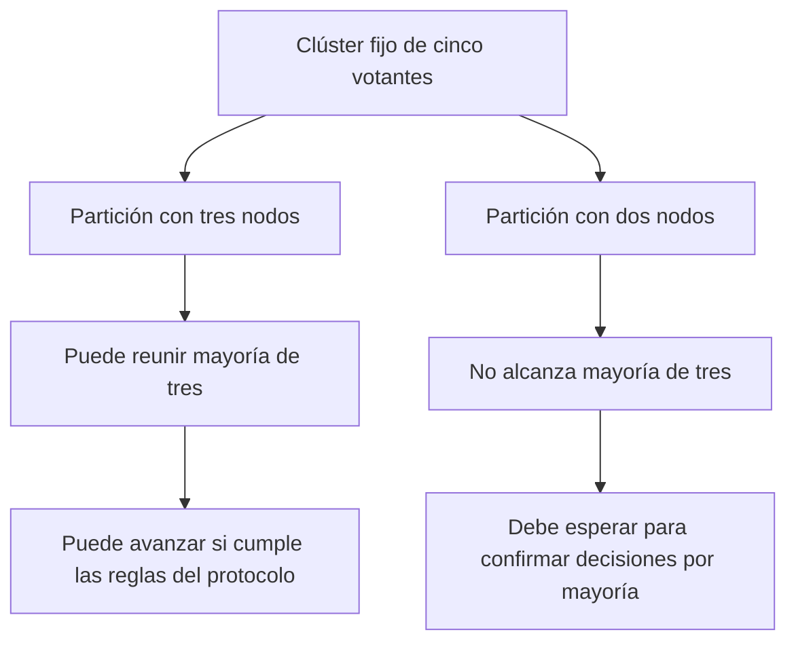

# Split brain, mayorías y relación con consenso

[[Obsidian/lecturas/database internals/10 Elección de líder/00 Índice|Índice del capítulo]]

## El límite común

Bully, sus optimizaciones, invitación y anillo permiten que conjuntos separados terminen con líderes diferentes. Los dibujos de elección muestran cómo se encuentra un coordinador con una vista estable y accesible; no muestran una barrera que impida a otro conjunto elegir el suyo. El resumen del capítulo identifica esta debilidad compartida.

Supón que una base de datos conserva un saldo 100 en cinco réplicas. Una partición separa {1, 2, 3} de {4, 5}. Si cada lado elige su líder y ambos permiten retirar 80 del mismo saldo, cada uno puede responder con saldo 20. Cuando vuelva la comunicación habrá dos retiros confirmados sobre fondos que solo permitían uno. El problema no es simplemente que existan dos nombres de líder: es que ambos puedan convertir decisiones incompatibles en efectos válidos.

Las ramas representan dos partes de la misma membresía de cinco votantes. La mayoría sigue siendo tres aunque un lado solo vea dos procesos. La rama izquierda puede reunirla y la derecha no; las cajas finales delimitan la autoridad para confirmar, que depende también de las reglas del protocolo. Recalcular la mayoría únicamente entre los visibles destruiría esa separación, porque ambos lados podrían declararse suficientes.

## Qué aporta la mayoría

Una **mayoría estricta** para n votantes tiene tamaño q=⌊n/2⌋+1. Con cinco votantes, q=3. Dos conjuntos de tres elegidos del mismo universo de cinco deben intersectarse: 3+3−5=1, así que comparten al menos un participante.

Esa intersección es la razón de seguridad que aprovechan los protocolos. Si cada participante puede votar como máximo por un candidato en una misma ronda, dos candidatos distintos no pueden conseguir simultáneamente mayorías en **esa ronda**: el participante compartido tendría que votar dos veces. Para que el argumento siga valiendo después de reinicios, el estado que impide ese doble voto debe sobrevivirlos. Esta explicación de la intersección y sus condiciones es elaboración propia para precisar la frase del resumen sobre mayorías.

Una mayoría **por sí sola** no es un protocolo completo. Si los votantes cambian de candidato sin conservar las restricciones de ronda, podrían crear quórums sucesivos para líderes incompatibles. Si cambia la membresía, la demostración ya no puede asumir automáticamente un mismo universo. Y si un líder antiguo sigue creyéndose válido, el protocolo debe impedir que confirme operaciones incompatibles con el líder nuevo.

Por eso conviene separar dos cosas: «un proceso se considera líder» y «sus operaciones pueden quedar confirmadas». Durante una transición pueden coexistir creencias locales antiguas. La seguridad de los datos exige reglas de votación, rondas, aceptación y confirmación que controlen sus consecuencias.

## La información local envejece

La frase «mi líder es 5» describe el conocimiento de un proceso en cierto momento. Otros procesos pueden haber iniciado una elección que todavía no ha llegado a él. La elección debe combinarse con detección de fallas para reconocer falta de progreso y obtener un reemplazo, pero el detector conserva la incertidumbre descrita en el capítulo 9: un proceso lento puede parecer caído.

El libro menciona la **elección de líder estable** como una combinación de rondas, un líder estable y detección basada en timeouts. Su propósito es conservar al coordinador mientras siga sano y accesible. Bajo los supuestos que permiten estabilizar la comunicación, evita reelegir continuamente. Estas páginas no especifican el algoritmo completo ni una garantía incondicional con demoras ilimitadas.

## Relación con consenso

**Consenso** busca que los participantes acuerden un valor bajo unas garantías de validez, acuerdo y terminación. La identidad de un líder puede ser ese valor; por eso una elección fuerte guarda relación con consenso. Sin embargo, elegir un coordinador que eventualmente sea estable es una abstracción diferente de decidir una identidad que permanezca como resultado acordado por todos.

El resumen plantea que, si podemos acordar la identidad, podemos usar mecanismos semejantes para acordar otras cosas. Eso no significa que los algoritmos sencillos anteriores implementen consenso seguro por sí solos. Tampoco implica que el líder pueda escoger valores libremente después de elegido: al reemplazarlo, las decisiones ya confirmadas deben seguir protegidas por las reglas de replicación.

El capítulo adelanta tres familias: **ZAB**, **Multi-Paxos** y **Raft** usan liderazgo para reducir la coordinación habitual. Cada una incorpora mecanismos propios de elección, detección de fallas y resolución de conflictos. El detalle de esos protocolos está remitido al capítulo 14, ausente en este PDF.

En **Multi-Paxos**, los líderes o proponentes pueden competir. La seguridad depende de los quórums y de las reglas con que los aceptantes prometen y aceptan propuestas, no de asumir que nunca existirán dos proponentes. El libro resume la resolución como la obtención de un segundo quórum. Hay que leer esa afirmación en el contexto de una misma decisión o posición del registro: Paxos sí puede decidir valores distintos en posiciones distintas; lo que debe impedir es decisiones incompatibles para la misma posición.

En **Raft**, un **término** identifica una época del protocolo mediante un número creciente. Un proceso que descubre un término superior actualiza su estado y abandona el liderazgo anterior cuando corresponde. Dos procesos pueden conservar temporalmente creencias de liderazgo de términos distintos porque uno está aislado. Esto no contradice la unicidad de líder dentro de un mismo término garantizada por la regla de votos y las mayorías; tampoco permite que el antiguo confirme por su cuenta cualquier entrada.

La última página utiliza la expresión «falta de seguridad» al hablar de permitir líderes en competencia. La precisión necesaria es que puede faltar la unicidad inmediata de las creencias de liderazgo, **sin abandonar la seguridad de las decisiones del consenso**. Un protocolo seguro no confirma dos decisiones incompatibles y luego intenta repararlas: sus reglas evitan esa confirmación incompatible desde el principio.

## Cuándo la elección cuesta demasiado

El resumen dice que las elecciones infrecuentes no dominan el costo global. Esa observación presupone estabilidad. Un detector que sospecha continuamente de líderes sanos o una preferencia por un nodo que falla a menudo transforma la elección en costo habitual. Para evaluar la arquitectura hay que preguntar cuántas elecciones ocurren, cuánto tarda la recuperación y qué trabajo queda bloqueado durante ella.

> [!question]- Si el lado de dos nodos elige a 5, ¿ha roto necesariamente el consenso?
> No por el mero hecho de que 5 se llame líder. Lo peligroso es aceptar o confirmar decisiones sin satisfacer las reglas de mayoría y del protocolo. Una creencia local de liderazgo puede quedar obsoleta; las decisiones confirmadas no deben depender solo de esa creencia.

## Bibliografía que cierra el capítulo

La impresa 213 remite a las notas de algoritmos distribuidos de Nancy Lynch y Boaz Patt-Shamir (1993), al texto de computación distribuida de Hagit Attiya y Jennifer Welch (2004), y al libro de sistemas distribuidos de Andrew Tanenbaum y Maarten van Steen (segunda edición, 2006). Esas obras son referencias sugeridas por el autor; no se consultaron para ampliar estas notas. La explicación de este bloque se apoya en las páginas compartidas y mantiene explícitos los límites de sus anticipaciones sobre consenso.

**Referencia:** PDF 17–18 · impresas 212–213 · resumen, mayorías, líder estable y relación con Multi-Paxos y Raft. [[Obsidian/lecturas/database internals/Materiales/09 a 11 Detección de fallas liderazgo y replicación.pdf#page=17|Fuente y precisiones del resumen]].

---

← [[Obsidian/lecturas/database internals/10 Elección de líder/05 Elección en anillo y máximo acumulado|Anterior]] · [[Obsidian/lecturas/database internals/10 Elección de líder/00 Índice|Índice]] · [[Obsidian/lecturas/database internals/10 Elección de líder/07 Laboratorio y repaso resuelto|Siguiente]] →
