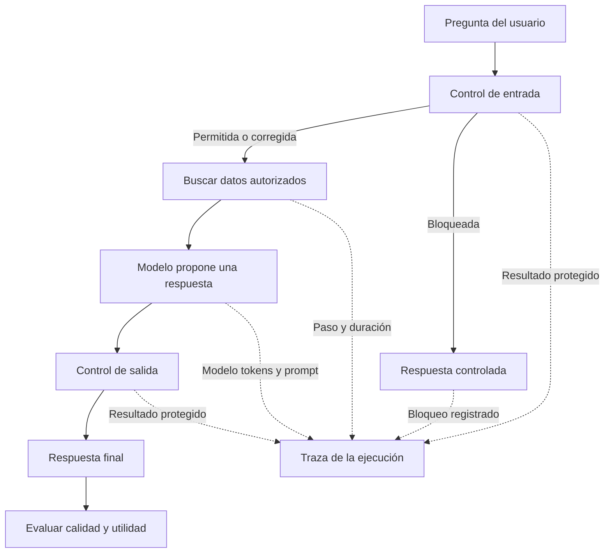

# Entender qué ocurrió y decidir qué puede ocurrir

[[Obsidian/posgrado/master/IA GENERATIVA Y AGENTES/00 Inicio/00 INICIO - Ruta de aprendizaje|Inicio de la materia]]

Imagina un asistente que responde preguntas sobre las ventas de una tienda. Recibe una pregunta, busca datos, pide al modelo que los explique y devuelve una respuesta. Aunque termine sin un error técnico, puede dar una cifra equivocada, enviar datos personales a un proveedor o gastar demasiado. Las sesiones 17 y 18 enseñan a estudiar y controlar ese recorrido.

La **observabilidad** permite reconstruir qué hizo el sistema. Un **guardrail** es un control que se aplica en un punto del recorrido para dejar pasar, corregir o bloquear una operación según una regla. Una **evaluación** comprueba si la respuesta satisface un criterio. Las tres capacidades se complementan: el registro describe, el control interviene y la evaluación juzga con un criterio que también puede tener errores.

## Un mismo ejemplo conecta las dos sesiones

La pregunta es: «ventas de las tiendas 101 102 103». Antes de buscar las ventas, un control revisa la entrada. La expresión regular para teléfonos del PDF admite dígitos y espacios, por lo que confunde esa lista de identificadores con un teléfono, sustituye los números y destruye información necesaria. La aplicación puede continuar y devolver una respuesta fluida, pero ya está respondiendo a otra pregunta.

La sesión 18 explica **por qué sucede**: una regla para teléfonos reconoce formas de texto; no comprende automáticamente que esos números identifican tiendas. Ese bloqueo o corrección equivocado es un **falso positivo**. La sesión 17 explica **cómo descubrirlo**: registrar el resultado del control, los tipos de transformación y los pasos posteriores, con datos protegidos, permite identificar el punto donde se perdió información.

No hace falta guardar un correo real para demostrar que se enmascaró. Se puede registrar `correo_redactado: true`, la versión del control y el resultado de la validación. La evidencia tiene que permitir diagnosticar sin crear una nueva fuga de datos.

Las flechas continuas representan el recorrido de la consulta. Las flechas punteadas representan el registro de evidencia sobre ese recorrido. Un bloqueo también produce un resultado que se debe poder explicar. La evaluación aparece después de la respuesta para separar el hecho de que se entregó una salida de la pregunta de si esa salida fue correcta. Es un esquema didáctico propio; un sistema real puede evaluar también durante la ejecución.

## Qué significa cada palabra

| Término | Explicación sencilla | Ejemplo |
| --- | --- | --- |
| Traza | Registro de una ejecución completa, con una identidad que permite localizarla. | Todo lo que ocurrió al contestar una pregunta de ventas. |
| Span | Registro de un paso, con inicio, duración, resultado y atributos pertinentes. | La consulta de datos o una llamada al modelo. |
| Token | Unidad de texto que el modelo procesa; puede ser una palabra, parte de ella u otro símbolo. | Una pregunta utiliza varios tokens, aunque tenga pocas palabras. |
| Latencia | Tiempo de espera entre dos puntos definidos. | Desde recibir la pregunta hasta terminar la respuesta. |
| Versión del prompt | Identificador del texto y configuración de instrucciones utilizados. | `v1` pide explicar; `v2` exige abstenerse si faltan datos. |
| Golden set | Conjunto de casos de referencia con resultados o criterios esperados. | Preguntas conocidas con respuestas comprobables y casos fuera de alcance. |
| Falso positivo | El control marca como riesgoso algo legítimo. | Confundir números de tienda con un teléfono. |
| Falso negativo | El control deja pasar un riesgo que debía detectar. | Un dato personal que su patrón no reconoce. |
| Rollback | Volver a una versión anterior que se conserva y se puede seleccionar. | Cambiar la versión activa de `v2` a `v1`. |
| Caché | Reutilizar algo ya calculado o guardado, con condiciones de validez. | Reusar un prefijo procesado o una respuesta anterior son mecanismos distintos. |

## Ruta de estudio recomendada

1. [[Obsidian/posgrado/master/IA GENERATIVA Y AGENTES/17 Observabilidad y versionado de prompts/00 Índice - S17 Observabilidad y prompts|Sesión 17: observabilidad y prompts]]. Primero entenderás la traza, sus pasos y las métricas. Luego aprenderás a relacionar una respuesta con la versión que la produjo y a proteger lo que se registra.
2. [[Obsidian/posgrado/master/IA GENERATIVA Y AGENTES/18 Guardrails costo y latencia/00 Índice - S18 Guardrails costo y latencia|Sesión 18: guardrails, costo y latencia]]. Verás cómo escribir controles, medir sus errores y calcular el costo de estrategias concretas. Termina con cachés, streaming y selección de versiones.
3. Ejecuta las prácticas locales al final de cada ruta y responde las preguntas con las soluciones plegadas. Los ejercicios usan datos ficticios y no son mediciones de un modelo real.

El [[Obsidian/posgrado/master/IA GENERATIVA Y AGENTES/00 Inicio/02 Caso resuelto - Diagnosticar y mejorar un asistente de ventas|caso completo de un asistente de ventas]] conecta las dos rutas: muestra una pregunta que pierde sus identificadores, la evidencia que localiza el fallo, una política nueva y una ejecución explicada con tiempos, costo y evaluación. Puede leerse primero para entender el propósito o al final para comprobar que las piezas encajan.

## Cuatro preguntas para analizar cualquier cambio

**¿Mejora la respuesta?** Hay que compararla con casos y criterios claros. Producir JSON válido solo demuestra que su estructura cumple un formato; los valores pueden seguir estando equivocados.

**¿Cuánto cuesta?** En el ejercicio sin caché se multiplica el número de tokens de entrada por su tarifa, y el de salida por la suya. En un sistema completo también pueden existir reintentos, herramientas y tarifas de escritura o lectura de caché. Las notas distinguen las tarifas históricas del material de una cotización vigente.

**¿Cuánto tarda?** Mostrar un primer token pronto y terminar la respuesta pronto son medidas distintas. El streaming puede mejorar la espera percibida sin reducir por sí mismo el número de tokens facturados.

**¿Qué operaciones permite?** Pedir al modelo que no ejecute una acción no sustituye una comprobación de permisos antes de la herramienta. Ese control debe formar parte del flujo que realmente se ejecuta.

> [!question]- Si una respuesta terminó rápido y con HTTP 200, ¿podemos afirmar que fue buena?
> No. HTTP 200 expresa que la petición terminó con éxito según el protocolo; no comprueba la verdad de la respuesta. La rapidez tampoco informa por sí sola del costo, de los permisos ni de la calidad. Se necesitan evidencias distintas para esas preguntas.

Estas explicaciones son una síntesis didáctica propia de [[Obsidian/posgrado/master/IA GENERATIVA Y AGENTES/Materiales/S17 Observabilidad y versionado de prompts.pdf#page=2|S17, PDF pp. 2–6 y 20]] y [[Obsidian/posgrado/master/IA GENERATIVA Y AGENTES/Materiales/S18 Guardrails costo y latencia.pdf#page=2|S18, PDF pp. 2–5 y 23–29]]. Las notas de cobertura relacionan todas las páginas con sus explicaciones.

← [[Obsidian/posgrado/master/IA GENERATIVA Y AGENTES/00 Inicio/00 INICIO - Ruta de aprendizaje|Anterior: inicio]] · [[Obsidian/posgrado/master/IA GENERATIVA Y AGENTES/17 Observabilidad y versionado de prompts/00 Índice - S17 Observabilidad y prompts|Siguiente: sesión 17]] →
