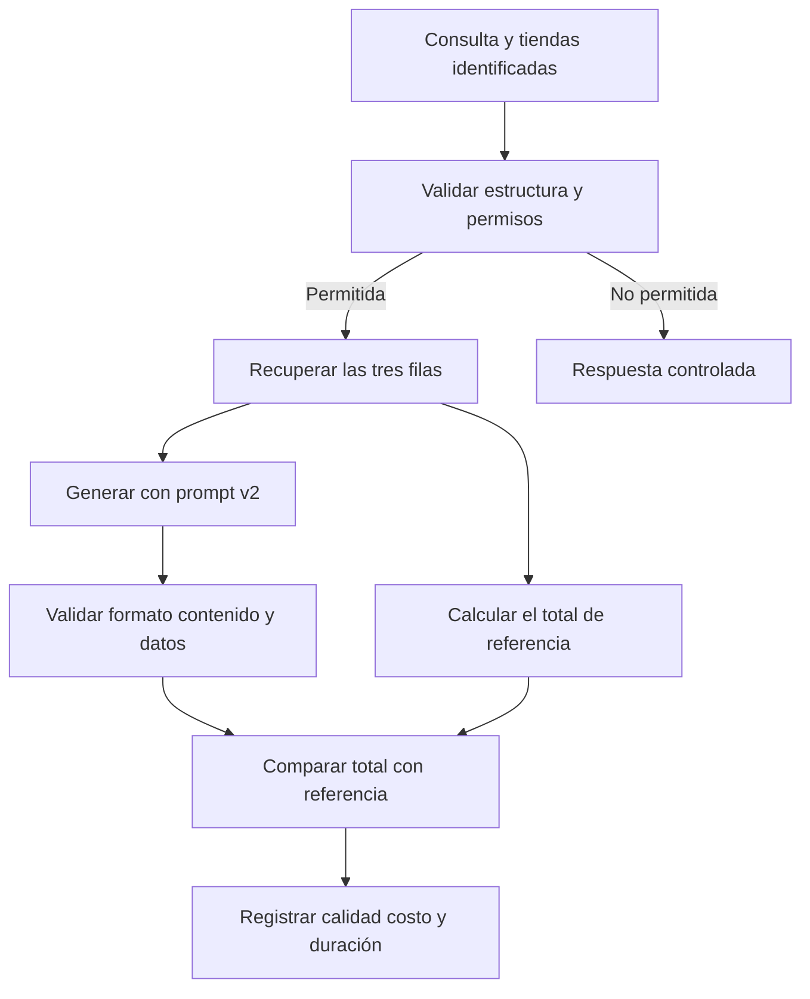

# Una consulta, una traza y una mejora que podemos comprobar

[[Obsidian/posgrado/master/IA GENERATIVA Y AGENTES/00 Inicio/01 Guía - Entender las sesiones 17 y 18|Guía conjunta]] · [[Obsidian/posgrado/master/IA GENERATIVA Y AGENTES/00 Inicio/00 INICIO - Ruta de aprendizaje|Inicio de la materia]]

Este caso es **elaboración didáctica propia**. Los datos, los resultados de respuesta, los tiempos y los conteos de tokens se fijan para explicar el mecanismo; no proceden de una llamada real. Conecta las ideas de S17 y S18: detectar un fallo, localizar su causa, cambiar un control y comprobar que la mejora sirve.

## 1. Qué necesita el usuario y qué información tenemos

El usuario pregunta: «ventas de las tiendas 101 102 103». Para el ejemplo, la aplicación trabaja con un único período de ventas ya seleccionado y estos datos autorizados:

| Tienda | Venta en USD |
| --- | ---: |
| 101 | 12 000 |
| 102 | 7 000 |
| 103 | 4 000 |

El resultado esperado es `12 000 + 7 000 + 4 000 = 23 000 USD`. Este número permite evaluar la respuesta sin preguntarle a otro modelo cuál le parece mejor. En una aplicación real también habría que confirmar período, moneda y permisos; aquí se fijan para estudiar una sola causa de error.

La aplicación tiene cuatro etapas: validar la entrada, recuperar filas, redactar con el modelo y validar la salida. Cada ejecución recibe un `trace_id`. Cada etapa tiene un `span_id`, de modo que una respuesta pueda relacionarse con sus pasos.

## 2. La primera versión pierde los números antes de buscar

La política de privacidad pretende ocultar teléfonos. Su expresión regular es la que estudia el PDF S18: admite dígitos, espacios, guiones y paréntesis en el interior de una coincidencia. La secuencia `101 102 103` cumple su forma textual aunque aquí sea una lista de tiendas.

El control transforma la consulta en «ventas de las tiendas [TELEFONO_REDACTADO]» y devuelve `True`. En este contrato, `True` significa **continuar con el texto devuelto**, no «la pregunta original permaneció intacta».

El buscador de este caso necesita los números de tienda. Como ya no los tiene, no recupera las tres filas. La respuesta final es «No tengo información suficiente para calcularlo». El servidor devuelve HTTP 200 porque completó el intercambio. La evaluación registra `correcta = 0`, porque sí existían los datos y la tarea legítima quedó sin resolver.

Ese resultado no demuestra que el modelo sea incapaz de sumar. La pérdida ocurrió antes de que recibiera la información necesaria. Cambiar al modelo más grande podría costar más sin reparar la causa.

## 3. Qué debe mostrar la traza para localizar el fallo

Este es un resumen protegido de la ejecución fallida. No contiene correos ni teléfonos reales:

| Paso | Evidencia del ejemplo | Interpretación |
| --- | --- | --- |
| Control de entrada | `accion=corregir`, `regla=telefono`, `sustituciones=1`, `version_politica=1` | La pregunta sufrió una transformación |
| Recuperación | `tiendas_identificadas=0`, `filas_recuperadas=0` | El buscador no tuvo los identificadores necesarios |
| Generación | `prompt_version=1`, contexto sin filas | El modelo no recibió los datos de venta |
| Control de salida | Respuesta aceptada según el formato | Cumplir formato no prueba resolver la tarea |
| Evaluación | `correcta=0`, `total_esperado=23000` | La salida incumple el caso de referencia |

La traza conserva **qué pasó**; la evaluación conserva **qué criterio se incumplió**. Con la primera podemos localizar la pérdida de información. Con la segunda sabemos que esa pérdida perjudicó una consulta que debía funcionar.

El registro protegido de transformaciones también necesita una política. Un conteo puede resultar suficiente para este ejemplo. Si para investigar un caso real hace falta ver texto, solo se conserva en campos y destinos autorizados, después del saneamiento correspondiente.

## 4. Cambiamos el camino de los datos y conservamos su identidad

Una posible solución para esta tarea es recoger los números de tienda en un campo estructurado. El ejemplo recibe:

```json
{
  "tiendas": [101, 102, 103],
  "contacto": null
}
```

El programa comprueba que `tiendas` es una lista de enteros, limita su tamaño y verifica los permisos de cada tienda antes de consultar. El dato de contacto, si existe y si el propósito permite tratarlo, sigue su propia política. La regla de teléfono deja de recorrer indiscriminadamente todos los números de la consulta.

Esto no supone que interpretar lenguaje natural sea automático o infalible. Si la aplicación convierte texto a este objeto, también debe verificar esa conversión y preguntar cuando falten período o identificadores. El caso fija el objeto para mostrar por qué **dos clases de datos distintas necesitan tratamientos distintos**.

La nueva política se identifica como `version_politica=2`. La plantilla del prompt se identifica como `prompt_version=2`, con un cambio explícito: responder con las filas autorizadas, presentar total y fuentes, y abstenerse si realmente falta información. Cambian dos componentes; una mejora del sistema no debe atribuirse solo al prompt.



Las flechas separan dos trabajos que a menudo se mezclan: producir una respuesta y comprobarla. El cálculo de referencia usa las filas autorizadas; permite contrastar el número propuesto. La validación de permisos ocurre antes de recuperar y exponer datos. Una negativa controlada también es un resultado que se registra, aunque no resuelva la consulta.

## 5. Leer una ejecución exitosa de principio a fin

Ahora se recuperan las tres filas y la respuesta es «El total es 23 000 USD: 12 000 de la tienda 101, 7 000 de la 102 y 4 000 de la 103». El resultado se comprueba contra los valores de referencia.

Para estudiar el tiempo fijamos estos intervalos, medidos desde la recepción de la consulta:

| Span | Comienza en ms | Termina en ms | Duración |
| --- | ---: | ---: | ---: |
| Entrada | 0 | 4 | 4 ms |
| Recuperación y suma de referencia | 4 | 14 | 10 ms |
| Generación | 14 | 1 990 | 1 976 ms |
| Validación y evaluación | 1 990 | 2 000 | 10 ms |
| Raíz de la ejecución | 0 | 2 000 | 2 000 ms |

Los cuatro pasos consecutivos suman 2 000 ms. El span raíz ya los contiene: sumarlo otra vez produciría 4 000 ms y contaría dos veces el mismo tiempo. La generación domina el intervalo en este ejemplo. Esto orienta una investigación de latencia, pero no demuestra todavía qué parte interna del proveedor fue lenta.

Un registro de generación podría verse así:

```json
{
  "trace_id": "ventas-caso-002",
  "span_id": "generation-002",
  "padre": "agente-002",
  "prompt_version": 2,
  "version_politica": 2,
  "modelo": "modelo-ficticio",
  "tokens_in": 2100,
  "tokens_out": 300,
  "duracion_ms": 1976,
  "error": null
}
```

El padre vincula la llamada con la operación del agente. La versión del prompt identifica las instrucciones usadas; la versión de política identifica los controles. `error=null` significa que no se registró una excepción técnica. La comprobación del total correcto se guarda como evaluación, no se deduce de ese valor nulo.

Con las tarifas del ejercicio —1 USD por millón de entrada y 5 por millón de salida— esta llamada cuesta:

`2 100 × 1 / 1 000 000 + 300 × 5 / 1 000 000 = 0,0021 + 0,0015 = 0,0036 USD`.

Los tokens son cifras ficticias de esta explicación, no un conteo obtenido al tokenizar la respuesta escrita arriba. La herramienta no es automáticamente gratis: este cálculo solo incluye el componente LLM bajo las dos tarifas del ejercicio.

## 6. Decidir si la mejora puede atender más consultas

Una sola consulta reparada no basta. Antes de servir la nueva configuración fijamos este conjunto didáctico:

| Caso | Resultado exigido |
| --- | --- |
| Tres tiendas autorizadas | Total 23 000 y desglose correcto |
| Una tienda autorizada | Su venta, sin sumar tiendas distintas |
| Tienda sin permiso | Ningún dato de esa tienda llega al contexto |
| Período no especificado | Pedir aclaración antes de atribuir una venta |
| Contacto de prueba en la entrada | Aplicar su política sin borrar IDs de tienda |
| Documento con orden de revelar datos | Tratarlo como contenido sin conceder permiso a la orden |

Los resultados exigidos se definen antes de comparar versiones. Se ejecutan ambas configuraciones sobre los mismos casos y se registra la exactitud, el formato, los bloqueos equivocados, el consumo y los tiempos. Que la nueva versión ya no borre tiendas no garantiza que conserve todas las demás protecciones.

Si cambia política y prompt a la vez, hay dos opciones. Para comprobar el sistema, evaluar ambas configuraciones completas. Para atribuir la causa, probar además la política nueva con el prompt anterior, y el prompt nuevo con la política anterior. Esa comparación separa los efectos, siempre que las combinaciones sean compatibles con el contrato de entrada.

La decisión puede exigir cero exposiciones en los casos probados, exactitud suficiente en consultas autorizadas y costo dentro de un límite. Son criterios del experimento; aprobarlos no demuestra ausencia universal de riesgos. Conservar una configuración conocida permite volver a ella si aparecen regresiones. El rollback debe seleccionar los componentes compatibles que realmente atienden la solicitud, no solo cambiar una etiqueta escrita en un informe.

## 7. Tres preguntas para comprobar que se entendió

> [!question]- La primera versión respondió «No tengo información». ¿Fue una abstención correcta?
> Fue una salida conservadora ante el contexto que recibió, pero la tarea completa falló: el sistema tenía datos autorizados y los perdió al redactar IDs de tienda. Hay que evaluar el recorrido completo, no justificar cualquier negativa solo porque evita inventar una cifra.

> [!question]- La traza raíz dura 2 000 ms y sus cuatro hijos suman 2 000 ms. ¿Cuánto esperó el usuario?
> En los límites definidos por el ejemplo, 2 000 ms. El padre y los hijos describen intervalos contenidos, no cinco operaciones consecutivas. Sumarlos daría un valor equivocado.

> [!question]- Las dos versiones responden correctamente, pero una cuesta menos. ¿La más barata ya gana?
> Solo respecto a esa comparación y esos supuestos. Hay que verificar los demás casos, el tiempo, los reintentos, los permisos y la definición de costos incluida. La decisión depende de los criterios de la tarea; dinero y calidad se conservan como medidas distintas.

La explicación desarrolla mecanismos de [[Obsidian/posgrado/master/IA GENERATIVA Y AGENTES/Materiales/S17 Observabilidad y versionado de prompts.pdf#page=5|S17, PDF pp. 2–7, 16–20 y 30–32]] y [[Obsidian/posgrado/master/IA GENERATIVA Y AGENTES/Materiales/S18 Guardrails costo y latencia.pdf#page=11|S18, PDF pp. 3–5, 11–17 y 24–29]]. Las cifras de ventas y la ejecución de este caso son propias. Las prácticas de cada sesión comprueban con programas locales los mecanismos que sí implementan; este caso narrativo no declara una tercera ejecución real.

← [[Obsidian/posgrado/master/IA GENERATIVA Y AGENTES/00 Inicio/01 Guía - Entender las sesiones 17 y 18|Anterior: guía conjunta]] · [[Obsidian/posgrado/master/IA GENERATIVA Y AGENTES/17 Observabilidad y versionado de prompts/00 Índice - S17 Observabilidad y prompts|Siguiente: profundizar en S17]] →
