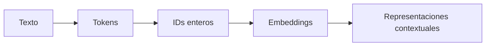
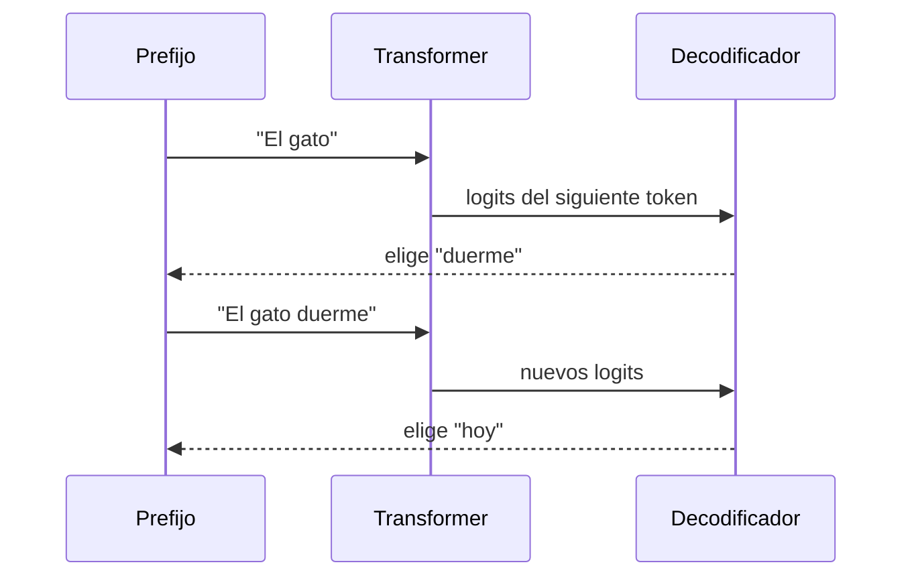

# 18 S02 - Transformer de extremo a extremo

[[00 INICIO - Ruta de aprendizaje|Volver al índice]]

## 1. El problema que resuelve

Un modelo de lenguaje debe representar el siguiente factor:

$$P(x_t\mid x_{<t}),$$

es decir, la distribución del siguiente token condicionada por todos los tokens anteriores. La regla del producto

$$P(x_1,\ldots,x_n)=\prod_{t=1}^{n}P(x_t\mid x_{<t})$$

es una identidad; todavía no dice **cómo** calcular cada factor. Un bigrama conserva un token de historia. Un HMM comprime la historia en un estado discreto. El transformer usa todo el prefijo disponible y aprende qué partes combinar mediante atención.

> [!important] Idea central
> El modelo entrega una distribución sobre el vocabulario. El procedimiento de decodificación elige un token después. Son dos operaciones distintas.

## 2. El recorrido completo

Lee el gráfico de izquierda a derecha:

1. El **tokenizador** parte el texto en unidades y las convierte en IDs.
2. Una tabla entrenable transforma cada ID en un **embedding**.
3. Se añade o aplica información de **posición**.
4. Los bloques transformer alternan atención y redes feed-forward.
5. La **LM head** proyecta la representación al tamaño del vocabulario y produce logits.
6. Softmax convierte esos logits en probabilidades.
7. Un algoritmo externo elige o muestrea el siguiente token.

El diagrama omite conexiones residuales y normalización para dejar visible el flujo principal. No significa que un bloque real solo contenga dos operaciones.

## 3. Un token no es necesariamente una palabra

El pipeline correcto es:

Un token puede ser una palabra, un fragmento, puntuación o parte de una secuencia de bytes. El número de tokens depende del tokenizador. Por eso dos modelos pueden cobrar cantidades distintas para el mismo texto y un ID grande no implica mayor importancia.

El embedding inicial de un token es una fila de una matriz entrenable. Más adelante, el transformer produce una representación **contextual**: el vector de «banco» en «banco central» puede diferir del de «banco del parque» aunque el ID inicial sea el mismo.

## 4. Qué hace cada parte del bloque

| Parte | Pregunta que resuelve | Tipo de operación |
| --- | --- | --- |
| Atención | ¿Qué posiciones anteriores aportan información a esta posición? | Mezcla información entre tokens |
| Red feed-forward | ¿Cómo transformar la representación de esta posición? | Opera por posición con pesos compartidos |
| Residual | ¿Cómo conservar una ruta directa para la señal? | Suma la entrada de una subcapa |
| Normalización | ¿Cómo mantener magnitudes numéricas controladas? | Reescala representaciones |

La comunicación entre posiciones ocurre en la atención. La red feed-forward transforma cada flujo por separado, aunque usa los mismos parámetros para todas las posiciones.

## 5. Por qué sustituyó a la recurrencia en muchos LLM

En una RNN, el estado del paso $t$ depende del estado $t-1$. Ese orden impide calcular todos los pasos de una secuencia a la vez durante entrenamiento. La auto-atención conecta posiciones directamente y reduce la profundidad secuencial.

| Mecanismo por capa | Costo aproximado | Operaciones secuenciales | Camino entre posiciones lejanas |
| --- | ---: | ---: | ---: |
| Auto-atención | $O(n^2d)$ | $O(1)$ | $O(1)$ |
| Recurrencia | $O(nd^2)$ | $O(n)$ | $O(n)$ |

$n$ es la longitud de la secuencia y $d$ la dimensión de las representaciones. La atención no elimina el costo: cambia recurrencia por una matriz de interacciones que crece cuadráticamente con $n$.

## 6. Generación autorregresiva

Cada ciclo agrega un token al prefijo. En inferencia ordinaria los pesos no cambian. Lo que cambia es el contexto de la siguiente llamada al modelo.

## 7. Ventana de contexto no significa memoria permanente

La ventana de contexto indica cuántos tokens puede procesar juntos una ejecución. Si una conversación supera el límite, alguna parte debe truncarse, resumirse o recuperarse desde fuera. Un token presente en una llamada no queda guardado automáticamente para otra.

> [!warning] Error frecuente
> «El modelo recuerda porque tiene una ventana grande» mezcla dos conceptos. Una ventana grande amplía el texto visible en una ejecución; una memoria persistente requiere almacenamiento y lógica adicionales.

## 8. Qué debes poder explicar

El transformer decoder-only aprende $P(x_t\mid x_{<t})$. Los embeddings convierten IDs en vectores; la posición conserva el orden; la atención incorpora contexto; la red feed-forward transforma cada posición; la LM head y softmax producen una distribución. La elección final del token no pertenece a los pesos del modelo.

## Fuentes de esta explicación

- [[sesion-02.pdf#page=7|Sesión 02, páginas 7–9: recurrencia, tokenización y bloques]]
- [[sesion-02.pdf#page=21|Sesión 02, páginas 21–23: posición, familias e implementación de P(X)]]
- [[16 AMPLIACIÓN - Cómo aprende un LLM desde el texto|Ampliación previa: objetivos y pérdida]]

## Preguntas para comprobar que entendiste

> [!question]- ¿La fórmula de la regla del producto ya es un modelo de lenguaje?
> No. Es una identidad exacta. Hace falta parametrizar cada distribución condicional; el transformer es una forma de hacerlo.

> [!question]- ¿El modelo devuelve directamente una palabra?
> Devuelve logits y, tras softmax, una distribución sobre tokens. Un procedimiento de decodificación elige después.

> [!question]- ¿Qué parte mezcla información entre posiciones?
> La atención. La red feed-forward transforma por separado la representación de cada posición.

> [!question]- ¿Por qué una ventana de contexto no es memoria permanente?
> Porque solo delimita lo que entra en la ejecución actual. Persistir información entre llamadas requiere un sistema externo.
