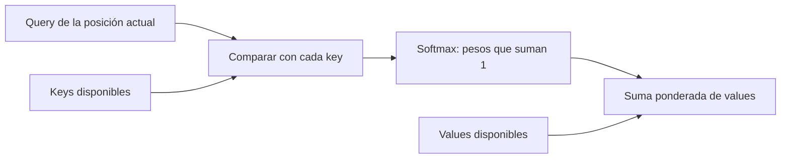

# 19 S02 - Atención Q, K y V paso a paso

[[00 INICIO - Ruta de aprendizaje|Volver al índice]]

## 1. La atención es una suma ponderada

Para una posición concreta, la atención realiza dos trabajos:

1. puntúa la compatibilidad entre su **query** y las **keys** disponibles;
2. utiliza esos puntajes para combinar los **values**.

La query pregunta «¿qué busco?», la key participa en la comparación y el value aporta el contenido. Es una metáfora útil para recordar los papeles, no una afirmación de que el modelo formule preguntas conscientes.

## 2. Q, K y V salen de parámetros aprendidos

Si $X$ contiene una fila por token, se calculan tres proyecciones:

$$Q=XW_Q,\qquad K=XW_K,\qquad V=XW_V.$$

$W_Q$, $W_K$ y $W_V$ son parámetros del modelo. En cambio, los pesos de atención se recalculan para cada entrada.

> [!question]- ¿Los pesos de atención quedan guardados después del entrenamiento?
> Como parámetros entrenados, no. Se guardan las matrices de proyección. Los pesos de atención dependen de la entrada; en inferencia puede reutilizarse una caché de keys y values del prefijo, sin convertir esos valores en parámetros aprendidos.

## 3. La fórmula en cuatro movimientos

$$\operatorname{Attention}(Q,K,V)=\operatorname{softmax}\left(\frac{QK^\top}{\sqrt{d_k}}+M\right)V.$$

| Paso | Operación | Resultado |
| --- | --- | --- |
| 1 | $QK^\top$ | Scores de compatibilidad |
| 2 | dividir por $\sqrt{d_k}$ | Scores con escala controlada |
| 3 | sumar máscara $M$ y aplicar softmax | Pesos no negativos que suman 1 por fila |
| 4 | multiplicar por $V$ | Vector de contexto |

La máscara $M$ vale 0 en conexiones permitidas y $-\infty$ en conexiones prohibidas. Después de softmax, una posición con $-\infty$ recibe peso 0.

## 4. Ejemplo numérico con tres tokens

Supón los tokens «el», «gato» y «duerme», con

$$Q=\begin{bmatrix}1&0\\0&1\\1&1\end{bmatrix},\qquad
K=\begin{bmatrix}1&0\\0&1\\1&0\end{bmatrix}.$$

Antes de escalar:

$$QK^\top=\begin{bmatrix}1&0&1\\0&1&0\\1&1&1\end{bmatrix}.$$

Con máscara causal:

- «el» solo puede atender a «el»: $[1,0,0]$;
- «gato» puede atender a «el» y «gato»;
- «duerme» puede atender a las tres posiciones.

Para la segunda fila, dividir entre $\sqrt2$ y aplicar softmax da aproximadamente $[0.330,0.670,0]$. Si $v_1=[1,0]$ y $v_2=[0,2]$, la salida es

$$0.330v_1+0.670v_2=[0.330,1.340].$$

No eligió un único token: construyó una combinación.

La figura usa otros pesos didácticos para mostrar el triángulo causal. Cada fila representa una query; cada columna, una key/value disponible.

## 5. Por qué se divide entre $\sqrt{d_k}$

Si los componentes de $q$ y $k$ tienen media 0 y varianza 1, el producto punto suma $d_k$ productos y su varianza crece aproximadamente como $d_k$. Scores muy grandes hacen que softmax se acerque a una función escalón: casi todo el peso cae en una posición y los gradientes se vuelven pequeños.

Dividir por $\sqrt{d_k}$ devuelve la varianza a una escala cercana a 1. No cambia el orden de los scores, pero evita que su magnitud crezca solo porque aumentó la dimensión.

## 6. Máscara causal

La máscara causal impone la factorización autorregresiva. Durante entrenamiento la frase completa puede estar en memoria, pero cada posición solo debe usar su pasado.

| Query | Puede usar | No puede usar |
| --- | --- | --- |
| «el» | «el» | «gato», «duerme» |
| «gato» | «el», «gato» | «duerme» |
| «duerme» | las tres | nada futuro |

Enmascarar **antes** de softmax convierte las conexiones ilegales en probabilidad 0 sin una renormalización separada.

## 7. Multi-head attention

Una sola cabeza produce una mezcla en un único espacio. Con $h$ cabezas se aprenden $h$ conjuntos de proyecciones. Cada cabeza calcula su atención, las salidas se concatenan y una matriz $W_O$ las proyecta de nuevo:

$$\operatorname{MHA}(X)=\operatorname{Concat}(head_1,\ldots,head_h)W_O.$$

Si $d_k=d_v=d_{model}/h$, repartir la dimensión entre cabezas mantiene un costo parecido al de una cabeza de dimensión completa, con el mismo $d_{model}$ y longitud de secuencia. Más cabezas no garantizan mejor calidad: distribuyen la capacidad disponible.

> [!warning] Interpretación cuidadosa
> Un heatmap muestra pesos de combinación. Por sí solo no demuestra que una cabeza «entienda» gramática ni que el peso más alto sea una explicación causal de la respuesta.

## Fuentes de esta explicación

- [[sesion-02.pdf#page=11|Sesión 02, páginas 11–18: Q, K, V, escalado, máscara y multi-cabeza]]
- [[18 S02 - Transformer de extremo a extremo|Arquitectura completa]]

## Preguntas para comprobar que entendiste

> [!question]- ¿Qué se aprende: los pesos de atención o las matrices W?
> Se aprenden las matrices $W_Q$, $W_K$, $W_V$ y $W_O$. Los pesos de atención se derivan dinámicamente de cada entrada.

> [!question]- ¿Qué aporta V que no aporta K?
> K participa en la puntuación de relevancia; V contiene la información que finalmente se combina.

> [!question]- ¿Por qué una conexión futura termina con peso cero?
> Su score se reemplaza por $-\infty$ antes de softmax; $e^{-\infty}$ tiende a cero.

> [!question]- ¿La salida de atención copia el value con mayor peso?
> No necesariamente. Es una suma ponderada de todos los values permitidos.
