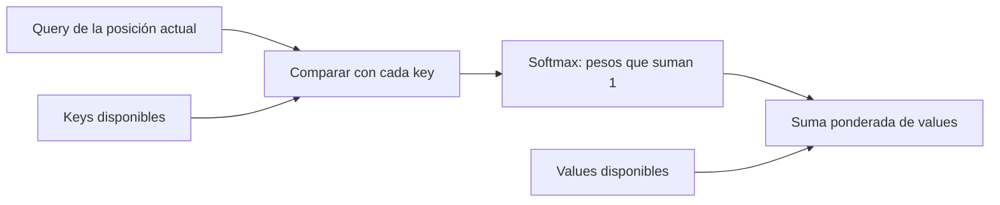
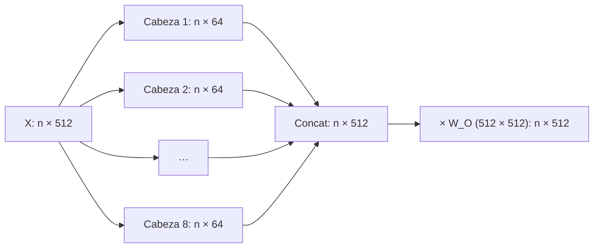

# 19 S02 - Atención Q, K y V paso a paso

[[00 INICIO - Ruta de aprendizaje|Volver al índice]]

## 0. El problema que resuelve la atención

Después del embedding, cada token es un vector **aislado**: el vector de «banco» es el mismo en «banco central» y en «banco del parque». Para predecir bien el siguiente token, cada posición necesita incorporar información de las demás.

La atención es la operación que hace esa mezcla. Toma los vectores de todas las posiciones permitidas y produce, para cada posición, un vector nuevo que ya incluye contexto. En atención bidireccional, «banco» en «me senté en el banco del parque» puede combinar «senté» y «parque». En un decoder causal, «banco» puede consultar «senté», pero no «parque», que viene después; la representación de la posición final «parque» sí puede integrar todo ese prefijo.

> [!important] Idea central
> En el primer bloque, la entrada parte de embeddings y posición. En bloques posteriores ya contiene contexto de capas previas. La atención incorpora o refina información entre posiciones; conserva la cantidad de vectores y cambia su contenido.

## 1. La atención es una suma ponderada

Vaswani et al. la definen así: se transforma una **query** y un conjunto de pares **key–value** en una salida. Todos son vectores. La salida es una **suma ponderada de los values**, y el peso de cada value se obtiene al comparar la query con la key correspondiente.

Para una posición concreta, la atención realiza dos trabajos:

1. **Puntuar la relevancia**: calcula qué tan compatible es su query con cada key disponible.
2. **Combinar la información**: usa esos puntajes como pesos para mezclar los values.


```mermaid
flowchart LR
    Q["Query de la posición actual"] --> S["Comparar con cada key"]
    K["Keys disponibles"] --> S
    S --> P["Softmax: pesos que suman 1"]
    P --> C["Suma ponderada de values"]
    V["Values disponibles"] --> C
```

### De dónde sale el vocabulario

Los nombres vienen de la recuperación de información y las bases de datos:

| Papel | En una biblioteca | En la atención |
| --- | --- | --- |
| **Query** | Lo que escribes en el buscador | Lo que la posición actual «busca» |
| **Key** | La ficha o etiqueta de cada libro | Contra lo que se compara la query |
| **Value** | El contenido del libro | La información que se entrega si hay coincidencia |

La diferencia con una base de datos es que la búsqueda no devuelve un único resultado exacto. Devuelve **un poco de cada libro**, según la coincidencia de su etiqueta. Es una recuperación **suave**.

> [!note] Metáfora, no mecanismo mental
> Decir que la query «pregunta» sirve para recordar los papeles. El modelo no formula preguntas conscientes: solo multiplica matrices y aplica softmax.

### Auto-atención frente a atención cruzada

- **Auto-atención** (*self-attention*): Q, K y V salen de la **misma** secuencia. Cada token se compara con los tokens de su propia frase. Es la atención que usan los LLM decoder-only como GPT.
- **Atención cruzada** (*cross-attention*): Q sale de una secuencia y K, V de otra. En el transformer original, el decoder genera las queries y el encoder aporta keys y values; por ejemplo, la frase en alemán consulta la frase en inglés.

En esta nota, «atención» significa auto-atención salvo que se indique otra cosa.

## 2. Q, K y V salen de parámetros aprendidos

Si $X$ contiene una fila por token, se calculan tres proyecciones lineales:

$$Q=XW_Q,\qquad K=XW_K,\qquad V=XW_V.$$

Para el token $i$ se calcula lo mismo, fila por fila: $q_i=x_iW_Q$, $k_i=x_iW_K$ y $v_i=x_iW_V$. Es **el mismo vector** $x_i$ proyectado a tres espacios distintos, uno para cada papel.

### Formas de las matrices

Sea $n$ el número de tokens y $d_{model}$ la dimensión de los embeddings:

| Objeto | Forma | Qué es |
| --- | --- | --- |
| $X$ | $n\times d_{model}$ | Un vector por token, entrada del bloque |
| $W_Q$, $W_K$ | $d_{model}\times d_k$ | **Parámetros aprendidos** |
| $W_V$ | $d_{model}\times d_v$ | **Parámetro aprendido** |
| $Q$, $K$ | $n\times d_k$ | Una query y una key por token |
| $V$ | $n\times d_v$ | Un value por token |

$Q$ y $K$ deben compartir la dimensión $d_k$ porque se multiplican entre sí. $V$ puede tener otra dimensión, aunque en la práctica suele valer $d_v=d_k$.

$W_Q$, $W_K$ y $W_V$ son parámetros del modelo. En cambio, los pesos de atención se recalculan para cada entrada.

> [!question]- ¿Los pesos de atención quedan guardados después del entrenamiento?
> Como parámetros entrenados, no. Se guardan las matrices de proyección. Los pesos de atención dependen de la entrada; en inferencia puede reutilizarse una caché de keys y values del prefijo, sin convertir esos valores en parámetros aprendidos.

### ¿Por qué tres matrices y no usar $X$ directamente?

Si se usara $QK^\top=XX^\top$, cada token tendría score propio $x_i\cdot x_i=\lVert x_i\rVert^2$, y la matriz sería simétrica. Con normas iguales, Cauchy–Schwarz garantiza que ningún producto con otro vector supera ese score propio, aunque puede empatar. Con normas distintas no hay tal garantía: $x_1=[1,0]$ y $x_2=[2,0]$ dan score propio 1 y score hacia el otro 2 para la primera fila. La afirmación de dominio propio de la sesión 02, p. 12, necesita esa condición; las proyecciones no se justifican por un dominio universal de la diagonal.

Las proyecciones separadas resuelven tres problemas:

1. **Asimetría.** Con $W_Q\neq W_K$, el score de $i$ hacia $j$ ($q_i\cdot k_j$) puede diferir del score de $j$ hacia $i$ ($q_j\cdot k_i$). «Duerme» puede necesitar mucho a «gato» aunque «gato» no necesite a «duerme».
2. **Separar «cómo me encuentran» de «qué entrego».** La key decide si un token es relevante; el value decide qué información aporta. Un token puede ser muy fácil de encontrar por su rol gramatical y, aun así, aportar información semántica.
3. **Aprendizaje.** El modelo ajusta durante el entrenamiento qué rasgos usa para comparar y qué rasgos transmite.

## 3. Por qué el producto punto mide compatibilidad

$$q\cdot k=\sum_{j=1}^{d_k}q_jk_j=\lVert q\rVert\,\lVert k\rVert\cos\theta.$$

- Si $q$ y $k$ apuntan en direcciones parecidas, $\cos\theta\approx1$ y el score es alto.
- Si son ortogonales, el score vale aproximadamente 0.
- Si apuntan en direcciones opuestas, el score es negativo.

El paper eligió el producto punto en lugar de la atención aditiva, que usa una pequeña red neuronal, por **velocidad**: todas las comparaciones se calculan con una única multiplicación de matrices $QK^\top$, que las GPU ejecutan de forma muy eficiente.

## 4. La fórmula en cuatro movimientos

$$\operatorname{Attention}(Q,K,V)=\operatorname{softmax}\left(\frac{QK^\top}{\sqrt{d_k}}+M\right)V.$$

| Paso | Operación | Forma | Resultado |
| --- | --- | --- | --- |
| 1 | $S=QK^\top$ | $n\times n$ | Scores crudos: la entrada $(i,j)$ es $q_i\cdot k_j$ |
| 2 | $S/\sqrt{d_k}$ | $n\times n$ | Scores con escala controlada |
| 3 | $A=\operatorname{softmax}(S/\sqrt{d_k}+M)$ | $n\times n$ | Pesos no negativos que suman 1 **por fila** |
| 4 | $Z=AV$ | $n\times d_v$ | Un vector de contexto por token |

Los pasos 1 a 3 son **puntuación de relevancia**. El paso 4 es **combinación de información**.

### Cómo leer la matriz $A$

- **Fila $i$**: la posición $i$ actúa como query y reparte su atención entre las posiciones.
- **Columna $j$**: la posición $j$ aporta su key para la comparación y su value para la mezcla.
- $A_{ij}$ indica qué fracción del value $v_j$ entra en la salida del token $i$.

Por eso la salida del token $i$ es:

$$z_i=\sum_j A_{ij}\,v_j.$$

### Qué hace softmax

Softmax convierte un vector de números cualesquiera en una distribución de probabilidad:

$$\operatorname{softmax}(s)_j=\frac{e^{s_j}}{\sum_l e^{s_l}}.$$

- La exponencial vuelve positivos todos los valores.
- Dividir entre la suma hace que los pesos sumen 1.
- Conserva el orden: el score más alto recibe el mayor peso.
- Es **sensible a las diferencias**: si un score supera por mucho a los demás, se queda casi con todo el peso. Esto explica la sección 6.

La máscara $M$ vale 0 en conexiones permitidas y $-\infty$ en conexiones prohibidas. Como $e^{-\infty}=0$, después de softmax una posición con $-\infty$ recibe peso 0.

## 5. Ejemplo numérico completo con tres tokens

Supón los tokens «el», «gato» y «duerme», con $d_k=2$. Para ahorrar cálculos, se parte de $Q$, $K$ y $V$ **ya proyectados**; es decir, se supone que $XW_Q$, $XW_K$ y $XW_V$ ya se calcularon.

$$Q=\begin{bmatrix}1&0\\0&1\\1&1\end{bmatrix},\qquad
K=\begin{bmatrix}1&0\\0&1\\1&0\end{bmatrix},\qquad
V=\begin{bmatrix}1&0\\0&2\\2&1\end{bmatrix}.$$

La fila 1 corresponde a «el», la fila 2 a «gato» y la fila 3 a «duerme».

> [!note] Sobre $v_3$
> La diapositiva solo usa $v_1=[1,0]$ y $v_2=[0,2]$. Aquí se supone $v_3=[2,1]$ para completar la tercera fila. Las filas 1 y 2 no dependen de ese valor.

### Paso 1: scores crudos $QK^\top$

Cada entrada es el producto punto entre la query de una fila y la key de una columna. Por ejemplo, $q_3\cdot k_2=[1,1]\cdot[0,1]=1$.

$$QK^\top=\begin{array}{c|ccc}
 & k_{\text{el}} & k_{\text{gato}} & k_{\text{duerme}}\\\hline
q_{\text{el}} & 1 & 0 & 1\\
q_{\text{gato}} & 0 & 1 & 0\\
q_{\text{duerme}} & 1 & 1 & 1
\end{array}$$

### Paso 2: escalar entre $\sqrt{d_k}=\sqrt2\approx1.414$

$$\frac{QK^\top}{\sqrt2}\approx\begin{bmatrix}0.707&0&0.707\\0&0.707&0\\0.707&0.707&0.707\end{bmatrix}.$$

### Paso 3: sumar la máscara causal y aplicar softmax por fila

$$M=\begin{bmatrix}0&-\infty&-\infty\\0&0&-\infty\\0&0&0\end{bmatrix}
\quad\Rightarrow\quad
\frac{QK^\top}{\sqrt2}+M\approx\begin{bmatrix}0.707&-\infty&-\infty\\0&0.707&-\infty\\0.707&0.707&0.707\end{bmatrix}.$$

Softmax fila por fila:

- **«el»**: $[0.707,-\infty,-\infty]$. Solo queda una posición permitida, así que recibe todo el peso: $[1,0,0]$.
- **«gato»**: $[0,0.707,-\infty]$. Se calcula $e^{0}=1$ y $e^{0.707}\approx2.028$; la suma es $3.028$. Los pesos son $[1/3.028,\ 2.028/3.028,\ 0]\approx[0.330,\ 0.670,\ 0]$.
- **«duerme»**: $[0.707,0.707,0.707]$. Los tres scores son iguales, así que el reparto es uniforme: $[1/3,1/3,1/3]$.

$$A\approx\begin{bmatrix}1&0&0\\0.330&0.670&0\\0.333&0.333&0.333\end{bmatrix}.$$

Comprueba que cada fila suma 1 y que todo lo que está sobre la diagonal vale 0.

### Paso 4: combinar los values, $Z=AV$

- **«el»**: $1\cdot v_1=[1,\ 0]$
- **«gato»**: $0.330\,[1,0]+0.670\,[0,2]=[0.330,\ 1.340]$
- **«duerme»**: $\tfrac13\,([1,0]+[0,2]+[2,1])=[1,\ 1]$

$$Z\approx\begin{bmatrix}1&0\\0.330&1.340\\1&1\end{bmatrix}.$$

«Gato» no eligió un único token: construyó una **combinación**, con 67 % de su propio value y 33 % del value de «el». Su nuevo vector ya no es solo «gato»; es «gato en el contexto de *el*».

### Lo que el ejemplo enseña al cambiar una pieza

| Variante | Fila afectada | Resultado | Lección |
| --- | --- | --- | --- |
| Sin escalar entre $\sqrt2$ | «gato» | $[0.269,\ 0.731]$ en lugar de $[0.330,\ 0.670]$ | Sin escala, el reparto es más extremo |
| Sin escalar | «duerme» | Sigue siendo uniforme | Con scores iguales, el escalado no cambia nada |
| Sin máscara | «el» | $[0.401,\ 0.198,\ 0.401]$ | «el» tomaría 40 % de «duerme», un token futuro: **fuga de información** |
| Sin máscara | «gato» | $[0.248,\ 0.503,\ 0.248]$ | También miraría «duerme» |


La figura usa otros pesos didácticos para mostrar el **triángulo causal**. Cada fila representa una query; cada columna, una key/value disponible. Las celdas sobre la diagonal están vacías porque son posiciones futuras.

### El mismo cálculo en código

```python
import numpy as np

def softmax(x, axis=-1):
    x = x - x.max(axis=axis, keepdims=True)  # estabilidad numérica
    e = np.exp(x)
    return e / e.sum(axis=axis, keepdims=True)

def atencion(Q, K, V, causal=False):
    d_k = K.shape[-1]
    scores = Q @ K.T / np.sqrt(d_k)                            # pasos 1 y 2
    if causal:
        n = scores.shape[0]
        mascara = np.triu(np.ones((n, n), dtype=bool), k=1)    # True sobre la diagonal
        scores = np.where(mascara, -np.inf, scores)            # paso 3a
    pesos = softmax(scores, axis=-1)                           # paso 3b
    return pesos @ V, pesos                                    # paso 4

Q = np.array([[1, 0], [0, 1], [1, 1]])
K = np.array([[1, 0], [0, 1], [1, 0]])
V = np.array([[1, 0], [0, 2], [2, 1]])
Z, A = atencion(Q, K, V, causal=True)
# A ≈ [[1, 0, 0], [0.330, 0.670, 0], [0.333, 0.333, 0.333]]
# Z ≈ [[1, 0], [0.330, 1.340], [1, 1]]
```

## 6. Por qué se divide entre $\sqrt{d_k}$

Si los componentes de $q$ y $k$ son independientes, con media 0 y varianza 1, entonces:

$$q\cdot k=\sum_{j=1}^{d_k}q_jk_j\quad\Rightarrow\quad \operatorname{Var}(q\cdot k)=d_k.$$

Cada producto $q_jk_j$ tiene varianza 1, y la suma de $d_k$ términos independientes tiene varianza $d_k$. La desviación típica crece como $\sqrt{d_k}$. Con $d_k=64$, la desviación estándar bajo estos supuestos es 8: es una escala de dispersión, no que todos los scores valgan aproximadamente 8.

¿Qué problema causa? Softmax reacciona a las **diferencias absolutas** entre scores:

| Scores | Softmax | Situación |
| --- | --- | --- |
| $[8,\ 4,\ 0]$ (sin escalar, $d_k=64$) | $[0.982,\ 0.018,\ 0.000]$ | Casi *one-hot* |
| $[1,\ 0.5,\ 0]$ (divididos entre $\sqrt{64}=8$) | $[0.506,\ 0.307,\ 0.186]$ | Reparto informativo |

Cuando softmax se acerca a una función escalón:

1. casi todo el peso cae en una sola posición;
2. su gradiente respecto de los scores se vuelve casi 0, porque un cambio pequeño en un score casi no altera la salida;
3. el entrenamiento se vuelve muy lento o se estanca.

Dividir entre $\sqrt{d_k}$ devuelve la varianza a 1:

$$\operatorname{Var}\!\left(\frac{q\cdot k}{\sqrt{d_k}}\right)=\frac{d_k}{d_k}=1.$$

No cambia el orden de los scores, pero evita que su magnitud crezca solo porque aumentó la dimensión. La sesión 02, p. 15, describe una demostración con $d=4,\ 64,\ 256$. Una muestra de dimensión alta puede producir pesos casi *one-hot* sin escala, pero no todas las matrices de dimensión 256 lo harán. La justificación es probabilística, no un umbral universal.

## 7. Máscara causal

Un LLM decoder-only aprende $P(x_t\mid x_{<t})$. Durante el entrenamiento, la frase completa está en memoria y todas las posiciones se procesan **en paralelo**. Sin máscara, al predecir el token que sigue a «gato», el modelo podría mirar «duerme», que es precisamente la respuesta. Aprendería a copiar en lugar de predecir, y la factorización autorregresiva sería falsa.

| Query | Puede usar | No puede usar |
| --- | --- | --- |
| «el» | «el» | «gato», «duerme» |
| «gato» | «el», «gato» | «duerme» |
| «duerme» | las tres | nada futuro |

La máscara es una matriz triangular: 0 en y bajo la diagonal, $-\infty$ sobre ella. En el código, `np.triu(..., k=1)` marca exactamente las posiciones sobre la diagonal.

Enmascarar **antes** de softmax convierte las conexiones ilegales en probabilidad 0 sin una renormalización separada. La alternativa ingenua es aplicar softmax, poner ceros y volver a dividir para que la fila sume 1. Da el mismo resultado, pero requiere más operaciones.

> [!tip] Máscara y generación
> En la generación token a token no existe futuro que ocultar, porque todavía no se ha generado. La máscara es imprescindible en el **entrenamiento paralelo**. En inferencia se mantiene la misma lógica: cada token nuevo solo ve su prefijo. Por eso las keys y values anteriores pueden guardarse en la **caché KV**.

## 8. Multi-head attention

### El problema de una sola cabeza

Una cabeza produce **un** reparto de pesos por token. Pero una palabra puede necesitar varias cosas a la vez. Por ejemplo, «duerme» puede necesitar su sujeto («gato»), el tiempo verbal y el contexto de la frase. Si una sola softmax intenta cubrir todo, **promedia** esas necesidades y las diluye. El paper lo resume así: con una sola cabeza, el promediado impide atender a distintos subespacios de representación.

### La solución

Con $h$ cabezas se aprenden $h$ conjuntos **independientes** de proyecciones $(W_Q^{(i)},W_K^{(i)},W_V^{(i)})$. Cada cabeza calcula su propia atención en paralelo. Las salidas se concatenan y una matriz $W_O$ las proyecta de nuevo:

$$head_i=\operatorname{Attention}(XW_Q^{(i)},\,XW_K^{(i)},\,XW_V^{(i)}),$$

$$\operatorname{MHA}(X)=\operatorname{Concat}(head_1,\ldots,head_h)W_O.$$


```mermaid
flowchart LR
    X["X: n × 512"] --> H1["Cabeza 1: n × 64"]
    X --> H2["Cabeza 2: n × 64"]
    X --> H3["…"]
    X --> H8["Cabeza 8: n × 64"]
    H1 --> C["Concat: n × 512"]
    H2 --> C
    H3 --> C
    H8 --> C
    C --> O["× W_O (512 × 512): n × 512"]
```

### Dimensiones del modelo base

En el modelo base del paper, $d_{model}=512$ y $h=8$, así que $d_k=d_v=512/8=64$.

- Cada cabeza trabaja con queries, keys y values de 64 dimensiones.
- Al concatenar 8 salidas de 64 se recuperan 512 dimensiones.
- $W_O$, de tamaño $512\times512$, mezcla la información de todas las cabezas y devuelve la forma original $n\times d_{model}$. Así se puede sumar la conexión residual.

Si $d_k=d_v=d_{model}/h$, repartir la dimensión entre cabezas mantiene un costo parecido al de una cabeza de dimensión completa, con el mismo $d_{model}$ y la misma longitud de secuencia. Se conserva el ancho total y un orden de costo parecido, pero sí cambia la familia de funciones: varias distribuciones de atención pueden combinar diferentes posiciones a la vez. Igual ancho o número parecido de parámetros no implica igual capacidad de representación.

### Más cabezas no siempre es mejor

Vaswani et al. compararon distintas cantidades de cabezas con cómputo constante en traducción inglés→alemán, usando el conjunto de desarrollo y BLEU como métrica:

| Cabezas | $d_k$ | BLEU |
| ---: | ---: | ---: |
| 1 | 512 | 24.9 |
| 8 | 64 | **25.8** |
| 32 | 16 | 25.4 |

En ese experimento, 32 cabezas rindieron menos que 8. La reducción de dimensión por cabeza ofrece una explicación posible, pero esa tabla no demuestra que toda arquitectura empeore por esa única causa ni fija un óptimo universal.

> [!warning] Interpretación cuidadosa
> Un heatmap muestra pesos de combinación. Por sí solo no demuestra que una cabeza «entienda» gramática ni que el peso más alto sea una explicación causal de la respuesta. El paper dice que muchas cabezas **parecen exhibir** comportamientos sintácticos: se observa después, no se programa.

## 9. Qué pasa con la salida y cuánto cuesta

### Dentro del bloque

La salida de la atención no va directamente a la LM head. En un bloque de tipo **pre-norm**, omitiendo dropout, ocurre de forma simplificada:

$$H=X+\operatorname{MHA}(\operatorname{Norm}(X)),\qquad \text{salida}=H+\operatorname{FFN}(\operatorname{Norm}(H)).$$

- La **conexión residual** suma la entrada original. La atención añade contexto a lo que ya había, en lugar de reemplazarlo.
- La **red feed-forward** transforma después cada posición por separado.
- Al apilar muchos bloques, las representaciones se vuelven cada vez más contextuales. Consulta [[18 S02 - Transformer de extremo a extremo|la arquitectura completa]].

### Costo

La matriz $A$ tiene tamaño $n\times n$. Duplicar la longitud del contexto multiplica por 4 el número de scores. El cómputo de la atención es $O(n^2d)$ y la memoria de la matriz de pesos es $O(n^2)$. Por eso los contextos largos son caros y existen técnicas como la caché KV o FlashAttention.

## 10. Resumen en cinco líneas

1. Cada token se proyecta en query, key y value mediante matrices **aprendidas**.
2. $QK^\top$ compara cada query con cada key; dividir entre $\sqrt{d_k}$ evita que softmax se sature.
3. La máscara causal pone $-\infty$ en el futuro; softmax convierte cada fila en pesos que suman 1.
4. La salida de cada token es la **suma ponderada** de los values: una mezcla, no una elección.
5. Varias cabezas hacen esto en paralelo en subespacios distintos, y $W_O$ reúne sus resultados.

## Alcance de la caché y de la matriz cuadrática

Al procesar el prompt completo, el modelo calcula keys y values para sus posiciones. En generación causal, agregar un token no cambia las representaciones anteriores: ninguna de ellas puede leer ese futuro. Una **caché KV** conserva las keys y values de cada capa y permite que la query del token nuevo las consulte sin recalcular todo el prefijo. Guarda activaciones temporales, no conocimiento nuevo en los pesos.

Con $n$ posiciones previas, una query nueva compara contra aproximadamente $n$ keys por cabeza: la parte de atención de ese paso crece linealmente con $n$. Generar muchos tokens sigue acumulando ese costo; construir las interacciones de una secuencia completa conserva el orden cuadrático. La caché crece con contexto, capas y dimensiones de K y V. **FlashAttention** reduce movimiento de datos y evita materializar toda la matriz de atención en memoria; no convierte por sí solo la atención densa exacta en una operación de costo aritmético lineal. [Dao et al., FlashAttention, 2022](https://arxiv.org/abs/2205.14135).

La salida $Z=AV$ es una combinación convexa de values solo en el cálculo simplificado de cada cabeza con pesos no negativos que suman 1. Proyección de salida, suma residual y transformaciones posteriores ya no tienen esa interpretación. Durante entrenamiento puede aplicarse dropout a los pesos de atención; entonces una realización concreta tampoco está obligada a sumar exactamente 1. El ejemplo numérico de esta nota omite dropout.

## Fuentes de esta explicación

- [[sesion-02.pdf#page=11|Sesión 02, páginas 11–18: Q, K, V, escalado, máscara y multi-cabeza]]
- Vaswani et al. (2017), *Attention Is All You Need*, §3.2 y Tabla 3.
- Raschka (2024), *Build a Large Language Model (From Scratch)*, cap. 3.
- [[18 S02 - Transformer de extremo a extremo|Arquitectura completa]]

## Preguntas para comprobar que entendiste

> [!question]- ¿Qué se aprende: los pesos de atención o las matrices W?
> Se aprenden las matrices $W_Q$, $W_K$, $W_V$ y $W_O$. Los pesos de atención se derivan dinámicamente de cada entrada.

> [!question]- ¿Qué aporta V que no aporta K?
> K participa en la puntuación de relevancia; V contiene la información que finalmente se combina.

> [!question]- ¿Por qué no usar directamente $XX^\top$ como scores?
> El score propio es $\lVert x_i\rVert^2$, pero solo es máximo garantizado con normas iguales; con $x_1=[1,0]$ y $x_2=[2,0]$, la primera fila tiene 1 hacia sí y 2 hacia el otro. $XX^\top$ sí es siempre simétrica. Proyecciones separadas permiten aprender relaciones asimétricas y separar selección de contenido.

> [!question]- En la matriz de atención, ¿qué representa la fila $i$ y qué la columna $j$?
> La fila $i$ es la posición que consulta, con su query. La columna $j$ es la posición consultada, con su key y su value. $A_{ij}$ indica qué fracción de $v_j$ entra en la salida de $i$.

> [!question]- ¿Por qué una conexión futura termina con peso cero?
> Su score se reemplaza por $-\infty$ antes de softmax; $e^{-\infty}$ tiende a cero.

> [!question]- ¿Qué pasaría si se entrena un LLM sin máscara causal?
> Cada posición vería el token que debe predecir. La pérdida bajaría copiando, no prediciendo, y en generación, donde el futuro no existe, el modelo fallaría.

> [!question]- ¿Qué ocurre con softmax si no se divide entre $\sqrt{d_k}$ y $d_k$ es grande?
> Bajo los supuestos de media cero y varianza uno, la dispersión de los scores crece como $\sqrt{d_k}$. Si sus diferencias son grandes, softmax puede saturarse y producir gradientes pequeños. Es una dificultad posible, no una garantía de estancamiento para toda entrada.

> [!question]- En el ejemplo, ¿por qué la fila de «duerme» es uniforme con o sin escalado?
> Sus tres scores son iguales, $[1,1,1]$. Dividir todos entre $\sqrt2$ los mantiene iguales, y softmax de valores iguales siempre da un reparto uniforme.

> [!question]- ¿La salida de atención copia el value con mayor peso?
> No necesariamente. Es una suma ponderada de todos los values permitidos.

> [!question]- Si $d_{model}=768$ y $h=12$, ¿cuánto vale $d_k$ y qué forma tiene la concatenación?
> $d_k=768/12=64$. La concatenación de las 12 cabezas tiene forma $n\times768$, y $W_O$ es de $768\times768$.
