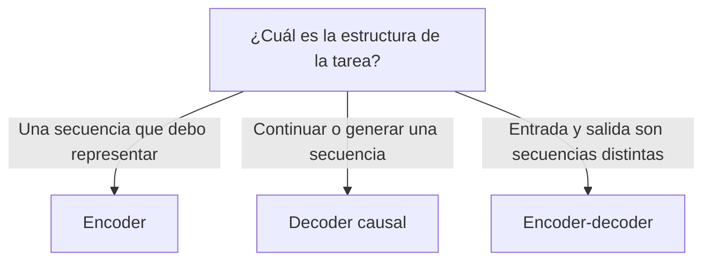
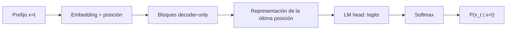

# 20 S02 - Posición, familias y arquitectura decoder-only

[[00 INICIO - Ruta de aprendizaje|Volver al índice]]

## 1. La auto-atención sola no conoce el orden

En una auto-atención bidireccional sin señal de posición, permutar los tokens también permuta sus vectores, pero no comunica cuál apareció primero. «El gato muerde al perro» y «El perro muerde al gato» contienen los mismos tokens y no deberían representar la misma situación. Una máscara causal ya distingue pasado de futuro, pero no proporciona por sí sola una representación explícita de las distancias entre posiciones.

Por eso se incorpora posición explícitamente.

## 2. Tres maneras de representar la posición

| Método | Dónde actúa | Qué se aprende |
| --- | --- | --- |
| Sinusoidal absoluta | Se suma al embedding | Nada en la señal de posición |
| Absoluta aprendida | Se suma al embedding | Un vector por posición |
| RoPE | Rota queries y keys | En la versión habitual, las frecuencias se fijan; las proyecciones que generan Q y K sí se aprenden |

Las dos primeras producen una representación del tipo

$$h_i^{(0)}=e(x_i)+p_i.$$

RoPE no suma un vector a la entrada: modifica la geometría de queries y keys para que el score incorpore posición relativa.

> [!important] Lo esencial
> La fórmula concreta puede cambiar entre modelos. La necesidad no cambia: el orden debe entrar en el cálculo de alguna manera.

## 3. Encoder, decoder y encoder-decoder

Las tres familias usan bloques parecidos. La diferencia decisiva está en la máscara y en las fuentes de Q, K y V.

| Familia | Atención | Uso típico | Ejemplos históricos |
| --- | --- | --- | --- |
| Encoder | Bidireccional: cada posición ve toda la secuencia | Representar, clasificar, extraer | BERT |
| Decoder | Causal: cada posición ve pasado y presente | Generar | GPT |
| Encoder-decoder | Encoder bidireccional; decoder causal y atención cruzada | Transformar una secuencia en otra | Transformer original, T5, BART |



## 4. Qué añade la atención cruzada

En un encoder-decoder, el decoder tiene una subcapa adicional:

- las queries provienen del decoder;
- las keys y values provienen de la salida del encoder.

Así, al generar una traducción, el decoder puede consultar la representación completa de la frase fuente. En un LLM decoder-only, el texto de entrada y la respuesta se colocan en una sola secuencia: el prompt es el prefijo.

## 5. Por qué muchos LLM generativos son decoder-only

Para modelado de lenguaje puro no existe necesariamente una secuencia fuente separada. Todo puede expresarse como continuación:

```text
<sistema> Reglas...
<usuario> Pregunta...
<asistente> Respuesta...
```

La máscara causal deja que los tokens de la respuesta consulten sistema y usuario, pero impide que una posición use tokens futuros de esa misma respuesta.

## 6. Encoder de VAE y encoder de transformer no son lo mismo

| Término | Entrada | Salida | Función |
| --- | --- | --- | --- |
| Codificador de VAE | Un dato $x$ | Parámetros de $q(z\mid x)$ | Aproximar un latente continuo |
| Encoder de transformer | Secuencia de tokens | Representaciones contextuales | Incorporar contexto bidireccional |

Comparten el nombre «codificador» porque transforman una representación en otra. No comparten necesariamente objetivo, arquitectura ni tipo de variable latente.

## 7. Cómo se implementa $P(x_t\mid x_{<t})$



La máscara obliga a que las representaciones respeten el prefijo. Durante entrenamiento, una secuencia y sus objetivos desplazados permiten calcular muchas predicciones a la vez: la salida de la posición $t$ predice $x_{t+1}$ sin ver ese token. Durante generación, la representación de la última posición disponible produce la distribución del siguiente token.

## 8. Mapa de decisiones conceptuales

- Si cambia el **orden**, necesitas posición.
- Si una posición no debe leer el **futuro**, necesitas máscara causal.
- Si existe una entrada separada que debe consultarse durante la salida, la arquitectura encoder-decoder ofrece atención cruzada.
- Si todo puede escribirse como un prefijo seguido de continuación, decoder-only es suficiente como planteamiento.

## Fuentes de esta explicación

- [[sesion-02.pdf#page=21|Sesión 02, páginas 21–23: posición, familias y P(X)]]
- [[10 S01 - VAE espacio latente y ELBO|VAE y su codificador probabilístico]]
- [[18 S02 - Transformer de extremo a extremo|Flujo de un transformer decoder-only]]

## Preguntas para comprobar que entendiste

> [!question]- ¿Por qué el embedding del token no basta para conocer el orden?
> Porque el mismo ID obtiene el mismo embedding inicial sin importar en qué posición aparece.

> [!question]- ¿Qué diferencia inmediata hay entre encoder y decoder?
> El encoder suele usar atención bidireccional; el decoder generativo usa una máscara causal.

> [!question]- ¿De dónde salen K y V en la atención cruzada?
> De la salida del encoder; las queries salen del decoder.

> [!question]- ¿El encoder de un transformer infiere necesariamente un z continuo como el VAE?
> No. Produce representaciones contextuales de tokens; es un concepto distinto del codificador probabilístico del VAE.
