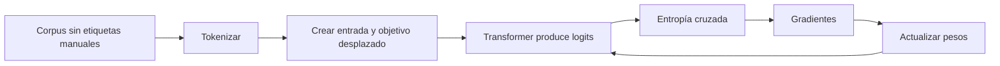

# 21 S03 - Preentrenamiento autosupervisado y máxima verosimilitud

[[00 INICIO - Ruta de aprendizaje|Volver al índice]]

## 1. La etiqueta está dentro del texto

En aprendizaje supervisado clásico alguien suele asignar una etiqueta. En preentrenamiento autorregresivo, el propio corpus proporciona el objetivo al desplazar la secuencia una posición.

```text
Entrada:   El      gato     duerme    sobre
Objetivo:  gato    duerme   sobre     la
```

Cada posición intenta predecir el token que realmente apareció después. Por eso se llama **autosupervisión**: la señal se construye a partir de los datos sin que una persona etiquete cada token.



## 2. De logits a pérdida

Para cada posición, softmax convierte logits en probabilidades. Si el objetivo observado es $y_t$, la pérdida es

$$\ell_t=-\log P_\theta(y_t\mid x_{<t}).$$

Para un lote con $N$ posiciones válidas:

$$L(\theta)=-\frac{1}{N}\sum_{t=1}^{N}\log P_\theta(y_t\mid x_{<t}).$$

Asignar probabilidad alta al token observado reduce la pérdida. Asignar 0.8 produce $-\log(0.8)\approx0.223$; asignar 0.05 produce aproximadamente 2.996.

## 3. Por qué esto también es máxima verosimilitud

Maximizar la probabilidad del texto observado equivale a maximizar su log-verosimilitud:

$$\max_\theta \sum_t \log P_\theta(x_t\mid x_{<t}).$$

Minimizar el negativo produce exactamente el objetivo anterior. Por eso se puede describir el mismo entrenamiento como:

- minimizar entropía cruzada;
- minimizar log-probabilidad negativa;
- maximizar verosimilitud.

Son perspectivas del mismo objetivo, no tres entrenamientos distintos.

## 4. Del error a los pesos

El gradiente indica cómo cambia la pérdida si cambia cada parámetro:

$$\theta\leftarrow\theta-\eta\nabla_\theta L(\theta).$$

$\eta$ es la tasa de aprendizaje. El signo menos mueve los parámetros en dirección opuesta al aumento de la pérdida.

En un bucle simplificado:

```python
optimizer.zero_grad()  # elimina gradientes anteriores
loss.backward()        # calcula derivadas
optimizer.step()       # actualiza parámetros
```

La pérdida es un número; el gradiente es un vector con una componente por parámetro. Confundirlos oculta cómo aprende la red.

## 5. Perplejidad

Si $L$ es la pérdida promedio por token con logaritmo natural,

$$\operatorname{PPL}=e^L.$$

Si el modelo asignara siempre $1/4$ al token correcto, $L=\log4$ y la perplejidad sería 4. Puede interpretarse como una medida del grado de incertidumbre bajo ese corpus y tokenizador, pero no como «cantidad literal de opciones».

> [!warning] Qué no mide
> Una perplejidad menor no demuestra veracidad, utilidad, seguridad ni capacidad de seguir instrucciones. Compararla entre tokenizadores o corpus distintos también puede ser engañoso.

## 6. Qué produce un modelo base

El preentrenamiento puede producir:

- continuación de texto coherente;
- patrones lingüísticos y conocimiento estadístico del corpus;
- capacidades que no fueron etiquetadas como tareas separadas;
- cierto aprendizaje en contexto mediante ejemplos en el prompt.

Pero el objetivo solo premió predecir texto. No enseñó explícitamente a responder una pregunta, rechazar una solicitud dañina ni preferir una respuesta clara sobre una confusa.

Ejemplo:

```text
Prompt: ¿Cuál es la capital de Francia?
Modelo base: ¿Cuál es la capital de Alemania? ¿Cuál es la capital de Italia?
```

La continuación puede ser plausible bajo una página de preguntas aunque no sea la conducta esperada de un asistente.

## 7. Escala: qué cambia y qué no

Más datos, parámetros y cómputo amplían la capacidad, pero no sustituyen el objetivo. Un modelo muy grande que optimiza siguiente token sigue optimizando siguiente token. Por eso un modelo alineado más pequeño puede ser preferido frente a un modelo base mucho mayor.

Las cifras de tamaño y costo de los PDF son hitos históricos, no precios ni capacidades vigentes. Úsalas para entender órdenes de magnitud, no para elegir un modelo actual.

## 8. De preentrenamiento a alineamiento


La pila conceptual es:

1. **preentrenamiento:** aprender regularidades de texto;
2. **SFT:** imitar demostraciones de conducta deseada;
3. **preferencias:** favorecer unas respuestas sobre otras;
4. **inferencia:** usar los pesos sin actualizarlos.

## Fuentes de esta explicación

- [[sesion-03-1.pdf#page=2|Sesión 03, páginas 2–8: ciclo, autosupervisión, pérdida, gradiente y modelo base]]
- [[16 AMPLIACIÓN - Cómo aprende un LLM desde el texto|Ejemplo desarrollado con una frase corta]]
- [[22 S03 - SFT RLHF DPO y Constitutional AI|Continuación: alineamiento]]

## Preguntas para comprobar que entendiste

> [!question]- ¿Quién escribe la etiqueta de cada token en preentrenamiento?
> El propio corpus: el token siguiente observado actúa como objetivo.

> [!question]- ¿MLE y entropía cruzada son objetivos incompatibles?
> No. Maximizar la log-verosimilitud equivale a minimizar su negativo, que toma la forma usual de entropía cruzada para estos objetivos.

> [!question]- ¿La pérdida y el gradiente son lo mismo?
> No. La pérdida resume el error del lote; el gradiente indica cómo cambiaría esa pérdida respecto de cada parámetro.

> [!question]- ¿Por qué un modelo base puede completar una pregunta sin responderla?
> Porque fue optimizado para continuar texto probable, no para obedecer instrucciones de un asistente.
