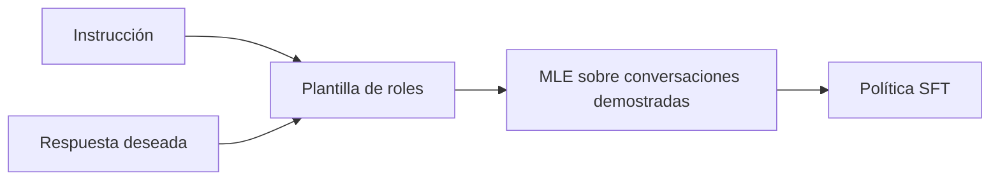
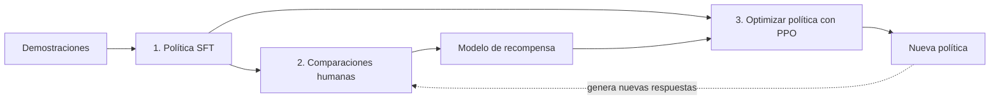

# 22 S03 - SFT, RLHF, DPO y Constitutional AI

[[00 INICIO - Ruta de aprendizaje|Volver al índice]]

## 1. El problema no siempre es falta de conocimiento

Un modelo base puede contener patrones necesarios para responder y aun así continuar el prompt de una manera poco útil. El alineamiento cambia la señal de entrenamiento para acercar la conducta a demostraciones o preferencias seleccionadas.

> [!important] Alineado no significa verdadero
> Significa ajustado hacia una señal concreta. Puede seguir alucinando, equivocarse o reflejar sesgos de quienes construyeron esa señal.

## 2. SFT: imitar demostraciones

En **supervised fine-tuning** se construyen pares de instrucción y respuesta deseada:

```text
Instrucción: Explica qué es un token para alguien que empieza.
Respuesta: Un token es una unidad de texto que el modelo procesa...
```

El par se serializa con una plantilla de roles. El modelo sigue prediciendo el siguiente token; cambia la distribución de datos sobre la que se entrena.



SFT enseña principalmente el formato y estilo de asistente. No define por sí solo cómo ordenar dos respuestas razonables.

## 3. Datos de preferencia

Para un mismo prompt $x$, se producen dos respuestas:

- $y_w$: preferida o ganadora;
- $y_l$: rechazada o perdedora.

La etiqueta no tiene por qué significar «verdadera» frente a «falsa». Puede ordenar dos respuestas correctas según claridad, utilidad, concisión o seguridad. El criterio debe declararse.

## 4. RLHF en tres pasos



El modelo de recompensa produce un escalar $r_\phi(x,y)$. PPO actualiza la política para obtener recompensa alta, pero añade una penalización KL respecto de una política de referencia. Esa restricción limita cuánto puede alejarse el modelo para explotar defectos del proxy.

## 5. El modelo de recompensa aprende diferencias

Una pérdida típica de preferencias es

$$L(\phi)=-\mathbb E\left[\log\sigma\left(r_\phi(x,y_w)-r_\phi(x,y_l)\right)\right].$$

Solo importa la diferencia. Sumar 10 a ambas recompensas no cambia la probabilidad de preferencia. Por eso un valor aislado como 7.3 no tiene significado universal.

El modelo de recompensa es un **proxy** de preferencias observadas. No mide directamente verdad ni bondad; aproxima las etiquetas de un grupo concreto.

## 6. Por qué existe la penalización KL

Si solo se maximiza un proxy, la política puede descubrir respuestas que reciben puntajes altos por razones no deseadas. La penalización KL introduce un costo por alejarse de la referencia:

$$\text{objetivo}\approx \mathbb E[r_\phi(x,y)]-\beta D_{KL}(\pi_\theta\Vert\pi_{ref}).$$

$\beta$ controla el compromiso. Una restricción fuerte conserva el comportamiento anterior; una débil permite más cambio y más riesgo de sobreoptimización.

## 7. DPO: conservar preferencias sin el bucle de RL

DPO consume los mismos pares $(x,y_w,y_l)$, pero elimina:

- el modelo de recompensa separado;
- el bucle de PPO;
- el muestreo en línea durante el ajuste descrito por el método original.

Conserva una política de referencia y una restricción implícita. La recompensa puede interpretarse como

$$\hat r_\theta(x,y)=\beta\log\frac{\pi_\theta(y\mid x)}{\pi_{ref}(y\mid x)}.$$

La recompensa no desaparece conceptualmente: queda expresada mediante la razón entre política entrenada y referencia.

## 8. Constitutional AI

En la etapa supervisada, el modelo:

1. genera una respuesta;
2. la critica según un principio escrito;
3. la revisa;
4. aprende de las respuestas revisadas.

Después pueden generarse preferencias con IA y combinarlas con señales humanas. El trabajo humano se desplaza hacia escribir principios, decidir qué optimizar y evaluar utilidad; no desaparece.

## 9. Comparación de métodos

| Método | Dato principal | Recompensa separada | Bucle de RL | Qué enseña |
| --- | --- | --- | --- | --- |
| SFT | Demostraciones | No aplica | No | Formato y conducta demostrada |
| RLHF | Preferencias humanas | Sí | Sí, PPO | Criterio de preferencia |
| DPO | Pares preferido/rechazado | No, implícita | No | Preferencia relativa con referencia |
| Constitutional AI | Principios, crítica y preferencias | Puede usar modelo de preferencias | Puede usar RL | Conducta derivada de reglas explícitas |


No son cuatro alternativas equivalentes desde cero. Normalmente el modelo ya fue preentrenado; SFT y el ajuste por preferencias forman pisos sucesivos.

## 10. Impuesto y límites del alineamiento

Optimizar preferencias puede mejorar utilidad percibida y a la vez reducir desempeño en otras tareas. Mezclar datos de preentrenamiento o imponer restricciones puede mitigar esa regresión.

Además:

- los anotadores discrepan;
- la señal representa a personas y criterios concretos;
- una métrica de inocuidad no cubre toda la seguridad;
- «honestidad» suele medirse con proxies de veracidad;
- ninguna señal alinea simultáneamente con todas las preferencias humanas.

## 11. Qué cambia y qué permanece

| Etapa | Objetivo de entrenamiento | En inferencia |
| --- | --- | --- |
| Preentrenamiento | MLE sobre texto | Distribución sobre el vocabulario |
| SFT | MLE sobre respuestas demostradas | Distribución sobre el vocabulario |
| RLHF/DPO | Preferencia relativa con referencia | Distribución sobre el vocabulario |

La arquitectura sigue siendo generativa y autorregresiva. Cambia la distribución hacia la que se empujan sus respuestas.

## Fuentes de esta explicación

- [[sesion-03-1.pdf#page=10|Sesión 03, páginas 10–24: SFT, RLHF, DPO, Constitutional AI y límites]]
- [[21 S03 - Preentrenamiento autosupervisado y MLE|Etapa anterior: preentrenamiento]]

## Preguntas para comprobar que entendiste

> [!question]- ¿SFT cambia el objetivo de siguiente token?
> Conserva la predicción de siguiente token, pero la aplica a un corpus de instrucciones y respuestas demostradas.

> [!question]- ¿Un puntaje de recompensa aislado tiene significado universal?
> No. El entrenamiento de Bradley-Terry depende de diferencias entre respuestas del mismo prompt.

> [!question]- ¿Qué elimina DPO respecto de RLHF?
> El modelo de recompensa separado y el bucle de optimización por refuerzo; conserva datos de preferencia y política de referencia.

> [!question]- ¿Constitutional AI elimina la participación humana?
> No. La reubica en principios, criterios y evaluación, aunque parte de las preferencias pueda producirla otra IA.

> [!question]- ¿Alineado equivale a seguro y verdadero?
> No. Describe ajuste hacia una señal; seguridad y veracidad deben evaluarse por separado.
