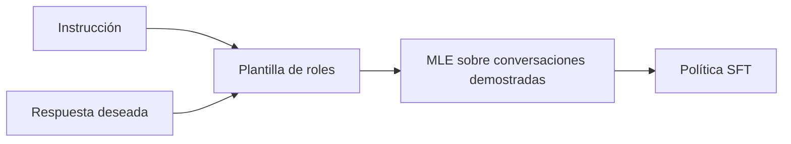
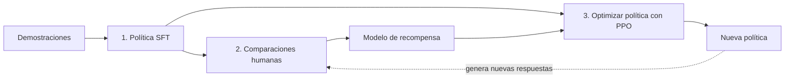

# 22 S03 - SFT, RLHF, DPO y Constitutional AI

[[00 INICIO - Ruta de aprendizaje|Volver al índice]]

## 1. El problema no siempre es falta de conocimiento

Un modelo base puede contener patrones necesarios para responder y aun así continuar el prompt de una manera poco útil. El alineamiento cambia la señal de entrenamiento para acercar la conducta a demostraciones o preferencias seleccionadas.

> [!important] Alineado no significa verdadero
> Significa ajustado hacia una señal concreta. Puede seguir alucinando, equivocarse o reflejar sesgos de quienes construyeron esa señal.

## 2. SFT: imitar demostraciones

En **supervised fine-tuning** se construyen pares de instrucción y respuesta deseada:

```text
Instrucción: Explica qué es un token para alguien que empieza.
Respuesta: Un token es una unidad de texto que el modelo procesa...
```

El par se serializa con una plantilla de roles. El modelo sigue prediciendo el siguiente token; cambian los datos y, a menudo, qué posiciones contribuyen a la pérdida: puede calcularse solo sobre los tokens de la respuesta, dejando la instrucción como contexto.


```mermaid
flowchart LR
    A["Instrucción"] --> T["Plantilla de roles"]
    B["Respuesta deseada"] --> T
    T --> M["MLE sobre conversaciones demostradas"]
    M --> P["Política SFT"]
```

SFT enseña a imitar las respuestas demostradas, incluidos contenido, formato y estilo. La calidad y cobertura de las demostraciones limitan lo aprendido; una pérdida sobre una única respuesta objetivo no expresa directamente la preferencia entre dos respuestas alternativas.

## 3. Datos de preferencia

Para un mismo prompt $x$, se producen dos respuestas:

- $y_w$: preferida o ganadora;
- $y_l$: rechazada o perdedora.

La etiqueta no tiene por qué significar «verdadera» frente a «falsa». Puede ordenar dos respuestas correctas según claridad, utilidad, concisión o seguridad. El criterio debe declararse.

## 4. RLHF en tres pasos


```mermaid
flowchart LR
    D["Demostraciones"] --> S["1. Política SFT"]
    S --> R["2. Comparaciones humanas"]
    R --> RM["Modelo de recompensa"]
    S --> PPO["3. Optimizar política con PPO"]
    RM --> PPO
    PPO --> N["Nueva política"]
    N -. "genera nuevas respuestas" .-> R
```

En la variante clásica ilustrada aquí, el modelo de recompensa produce un escalar $r_\phi(x,y)$. PPO actualiza la política para obtener recompensa alta y se añade una penalización KL respecto de una política de referencia. RLHF también puede emplear otros algoritmos de optimización; PPO es un ejemplo, no su definición. La penalización limita cuánto puede alejarse el modelo para explotar defectos del proxy.

## 5. El modelo de recompensa aprende diferencias

Una pérdida típica de preferencias es

$$L(\phi)=-\mathbb E\left[\log\sigma\left(r_\phi(x,y_w)-r_\phi(x,y_l)\right)\right].$$

Solo importa la diferencia. Sumar 10 a ambas recompensas no cambia la probabilidad de preferencia. Por eso un valor aislado como 7.3 no tiene significado universal.

El modelo de recompensa es un **proxy** de preferencias observadas. No mide directamente verdad ni bondad; aproxima las etiquetas de un grupo concreto.

## 6. Por qué existe la penalización KL

Si solo se maximiza un proxy, la política puede descubrir respuestas que reciben puntajes altos por razones no deseadas. La penalización KL introduce un costo por alejarse de la referencia:

$$\text{objetivo}\approx \mathbb E[r_\phi(x,y)]-\beta D_{KL}(\pi_\theta\Vert\pi_{ref}).$$

$\beta$ controla el compromiso. Una restricción fuerte conserva el comportamiento anterior; una débil permite más cambio y más riesgo de sobreoptimización.

## 7. DPO: conservar preferencias sin el bucle de RL

DPO se entrena con pares de preferencia $(x,y_w,y_l)$ y, en su formulación original, evita:

- el modelo de recompensa separado;
- el bucle de PPO;
- el muestreo en línea durante su ajuste original con pares de preferencias ya recopilados.

Conserva una política de referencia y una restricción implícita. La recompensa equivalente puede escribirse, salvo una constante que depende solo de $x$, como

$$\hat r_\theta(x,y)=\beta\log\frac{\pi_\theta(y\mid x)}{\pi_{ref}(y\mid x)}.$$

La constante se cancela al comparar dos respuestas para el mismo prompt. La recompensa no desaparece conceptualmente: queda expresada mediante la razón entre política entrenada y referencia. El ajuste optimiza una pérdida de clasificación de preferencias derivada de esa razón, no maximiza directamente $\hat r_\theta$ para cada respuesta aislada.

## 8. Constitutional AI

En la etapa supervisada, el modelo:

1. genera una respuesta;
2. la critica según un principio escrito;
3. la revisa;
4. aprende de las respuestas revisadas.

Después pueden generarse preferencias con IA y combinarlas con señales humanas. El trabajo humano se desplaza hacia escribir principios, decidir qué optimizar y evaluar utilidad; no desaparece.

## 9. Comparación de métodos

| Método | Dato principal | Recompensa separada | Bucle de RL | Qué enseña |
| --- | --- | --- | --- | --- |
| SFT | Demostraciones | No aplica | No | Contenido, formato y conducta demostrados |
| RLHF clásico con PPO | Preferencias humanas | Sí | Sí | Criterio de preferencia |
| DPO | Pares preferido/rechazado | No, implícita | No | Preferencia relativa con referencia |
| Constitutional AI | Principios, crítica y preferencias | Puede usar modelo de preferencias | Puede usar RL | Conducta derivada de reglas explícitas |


No son cuatro alternativas equivalentes desde cero. Normalmente el modelo ya fue preentrenado; SFT y el ajuste por preferencias forman pisos sucesivos.

## 10. Impuesto y límites del alineamiento

Optimizar preferencias puede mejorar utilidad percibida y a la vez reducir desempeño en otras tareas. Mezclar datos de preentrenamiento o imponer restricciones puede mitigar esa regresión.

Además:

- los anotadores discrepan;
- la señal representa a personas y criterios concretos;
- una métrica de inocuidad no cubre toda la seguridad;
- «honestidad» suele medirse con proxies de veracidad;
- ninguna señal alinea simultáneamente con todas las preferencias humanas.

## 11. Qué cambia y qué permanece

| Etapa | Objetivo de entrenamiento | En inferencia |
| --- | --- | --- |
| Preentrenamiento | MLE sobre texto | Distribución sobre el vocabulario |
| SFT | MLE sobre respuestas demostradas | Distribución sobre el vocabulario |
| RLHF/DPO | Preferencia relativa con referencia | Distribución sobre el vocabulario |

La arquitectura sigue siendo generativa y autorregresiva. Cambia la distribución hacia la que se empujan sus respuestas.

## Calcula una pérdida de preferencia antes de entrenar

La sigmoide logística es $\sigma(a)=1/(1+e^{-a})$. En el modelo de recompensa, si la ganadora tiene recompensa 2.4 y la perdedora 1.1, la diferencia es 1.3: la probabilidad modelada de preferir la primera es $\sigma(1.3)\approx0.786$ y su pérdida $-\log\sigma(1.3)\approx0.241$. Si las recompensas se empatan, la probabilidad es 0.5 y la pérdida aproximadamente 0.693. Si el modelo ordena al revés, la pérdida aumenta. El entrenamiento busca diferencias compatibles con las comparaciones, sin fijar por sí solo un origen absoluto de la escala.

La pérdida completa de DPO es:

$$L_{DPO}=-\mathbb E_D\left[\log\sigma\left(\beta\left[
\log\frac{\pi_\theta(y_w\mid x)}{\pi_{ref}(y_w\mid x)}-
\log\frac{\pi_\theta(y_l\mid x)}{\pi_{ref}(y_l\mid x)}\right]\right)\right].$$

Son probabilidades de **respuestas completas**. Para una respuesta $y=(y_1,\ldots,y_m)$, $\log\pi(y\mid x)=\sum_t\log\pi(y_t\mid x,y_{<t})$: se evalúan los tokens observados de cada respuesta usando el prompt y sus prefijos. La referencia se mantiene congelada; los gradientes actualizan la política entrenada.

Ejemplo didáctico con $\beta=1$: referencia da 0.1 a ambas respuestas; política actual da 0.2 a la preferida y 0.1 a la rechazada. La diferencia de log-cocientes es $\log2-\log1=\log2$, su sigmoide es $2/3$ y la pérdida $-\log(2/3)\approx0.405$. Las probabilidades restantes se reparten entre otras respuestas posibles. Inicializar política igual a referencia da diferencia cero y pérdida $\log2$. Cambiar $\beta$ altera el ajuste y su relación con la referencia; no conviene trasladar mecánicamente la intuición de una penalización KL explícita a cada efecto de una actualización DPO.

Esta ecuación procede de [[rafailov-2023-dpo.pdf#page=4|Rafailov et al., ec. 7, PDF 4]]; las cuentas son elaboración propia. «No es MLE sobre el texto» se refiere al objetivo de siguiente token del preentrenamiento. La pérdida DPO sí puede describirse como máxima verosimilitud de **las etiquetas de preferencia** bajo Bradley–Terry; cambia qué observaciones se modelan.

## Constitutional AI completo y el alcance de sus resultados

El esquema de vida del modelo es una simplificación. En el estudio original de Constitutional AI hay dos etapas: aprendizaje supervisado sobre respuestas criticadas y revisadas, y aprendizaje por refuerzo contra un **modelo de preferencias**. Para la segunda, una IA compara pares según principios de inocuidad; esas etiquetas se mezclan con comparaciones humanas de utilidad para entrenar el modelo de preferencias. Luego la política supervisada se optimiza contra él. La crítica dentro de un prompt solo genera material: los pesos cambian cuando se entrena con ese material.

El paper usó 16 principios de inocuidad, muestreados durante la revisión. Es una configuración del estudio, no un número obligatorio del método. Tampoco una autocrítica acertada está garantizada: el propio estudio describe críticas inexactas o exageradas. [[bai-2022-constitutional-ai.pdf#page=5|Bai et al., §1.2, PDF 5]] y [[bai-2022-constitutional-ai.pdf#page=10|§§3.5–4.1, PDF 10]].

El impuesto de alineamiento se refiere a regresiones en tareas concretas al optimizar otra señal; no es inevitable ni uniforme. InstructGPT mitigó varias mezclando actualizaciones de preferencia con el objetivo del corpus previo. Y una mejora en toxicidad bajo cierto prompt no demuestra mejora del sesgo ni de todas las métricas. Al informar un resultado se conservan condiciones, población evaluada y resultados negativos. [[ouyang-2022-instructgpt.pdf#page=17|Ouyang et al., §5.1, PDF 17]] y [[ouyang-2022-instructgpt.pdf#page=18|§§5.2–5.3, PDF 18–19]].

## Fuentes de esta explicación

- [[sesion-03-1.pdf#page=10|Sesión 03, páginas 10–24: SFT, RLHF, DPO, Constitutional AI y límites]]
- [[21 S03 - Preentrenamiento autosupervisado y MLE|Etapa anterior: preentrenamiento]]

## Preguntas para comprobar que entendiste

> [!question]- ¿SFT cambia el objetivo de siguiente token?
> Conserva la predicción de siguiente token, pero la aplica a un corpus de instrucciones y respuestas demostradas.

> [!question]- ¿Un puntaje de recompensa aislado tiene significado universal?
> No. El entrenamiento de Bradley-Terry depende de diferencias entre respuestas del mismo prompt.

> [!question]- ¿Qué evita DPO respecto del RLHF clásico con PPO?
> El modelo de recompensa separado y el bucle de optimización por refuerzo; conserva datos de preferencia y política de referencia.

> [!question]- ¿Constitutional AI elimina la participación humana?
> No. La reubica en principios, criterios y evaluación, aunque parte de las preferencias pueda producirla otra IA.

> [!question]- ¿Alineado equivale a seguro y verdadero?
> No. Describe ajuste hacia una señal; seguridad y veracidad deben evaluarse por separado.
