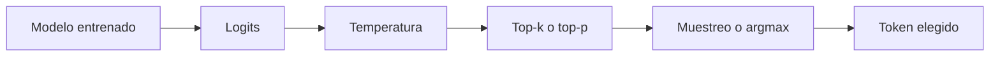

# 23 S04 - Greedy, temperatura, top-k y top-p

[[00 INICIO - Ruta de aprendizaje|Volver al índice]]

## 1. El modelo no elige por sí solo

El transformer produce logits $z_1,\ldots,z_V$ para el vocabulario. Softmax forma una distribución. La **estrategia de decodificación** decide cómo obtener el token siguiente.



Estas operaciones no actualizan $\theta$. Modifican cómo se usa la salida del modelo.

## 2. Greedy

La decodificación greedy toma el token con mayor probabilidad:

$$x_t=\arg\max_i z_i.$$

Ventajas:

- simple;
- una misma distribución produce la misma elección;
- útil cuando se desea poca variación.

Limitaciones:

- una decisión local no maximiza necesariamente la probabilidad de toda la secuencia;
- puede entrar en bucles o repetir patrones;
- pequeñas diferencias previas cambian los pasos siguientes.

«Temperatura 0» suele significar que la implementación toma la rama greedy. No se debe dividir logits entre cero.

## 3. Temperatura

Para $T>0$:

$$P_T(i)=\frac{e^{z_i/T}}{\sum_j e^{z_j/T}}.$$

- $T<1$ amplifica diferencias y concentra masa en los tokens principales.
- $T=1$ deja la distribución sin escalado.
- $T>1$ reduce diferencias y reparte más masa hacia la cola.

La temperatura no crea tokens nuevos ni añade conocimiento. Redistribuye probabilidad entre candidatos que el modelo ya puntuó.


El gráfico usa logits didácticos. En una distribución real, el tamaño del núcleo top-p depende de la forma concreta de la cola.

## 4. Top-k

Top-k conserva los $k$ tokens con mayor score y enmascara los demás antes de renormalizar.

```text
Probabilidades: A .60, B .25, C .10, D .04, E .01
top-k = 3:      A .632, B .263, C .105, D 0, E 0
```

El ranking no cambia al dividir todos los logits por una temperatura positiva. Por eso seleccionar los $k$ mayores antes o después del escalado conserva el mismo conjunto, aunque las probabilidades finales cambien.

Top-k elimina candidatos raros; no garantiza mejorar la opción típica.

## 5. Top-p o nucleus sampling

Top-p:

1. ordena tokens de mayor a menor probabilidad;
2. acumula masa;
3. conserva el prefijo mínimo que alcanza $p$;
4. elimina el resto y renormaliza.

Con $p=0.9$, una distribución muy concentrada puede conservar dos tokens; una distribución plana puede necesitar decenas. Es un corte adaptativo.

## 6. El orden sí importa con top-p

La temperatura cambia las probabilidades acumuladas y, por tanto, cuántos tokens forman el núcleo. Aplicar temperatura antes de top-p puede producir otro conjunto que aplicar top-p antes.

Con top-k el conjunto depende solo del ranking, que una temperatura positiva no altera. Con top-p depende de la masa, que sí cambia.

## 7. Muestreo y reproducibilidad

Usar greedy reduce aleatoriedad en la elección del token, pero no promete reproducibilidad absoluta de un servicio remoto. También pueden influir:

- versión del modelo;
- cambios del proveedor;
- operaciones numéricas no deterministas;
- procesamiento concurrente;
- semilla, si la API la expone.

Para un experimento, registra la configuración y ejecuta varias corridas cuando exista muestreo.

## 8. Guía rápida

| Síntoma | Primera prueba | Riesgo |
| --- | --- | --- |
| Salida errática | bajar T hacia greedy | perder diversidad útil |
| Repetición o bucle | subir T moderadamente | introducir cola absurda |
| Tokens raros con T alta | top-k o top-p | eliminar una alternativa válida |
| Necesitas varias rutas de razonamiento | muestrear y votar respuestas | costo multiplicado por corridas |

## 9. Relación con $P(X)$

El modelo aprendió una distribución. Al aplicar $T\neq1$, top-k o top-p, se muestrea de una distribución transformada. Eso puede ser deliberadamente útil, pero ya no es exactamente la distribución original.

## Fuentes de esta explicación

- [[sesion-04.pdf#page=2|Sesión 04, páginas 2–8: greedy, temperatura, top-k y top-p]]
- [[sesion-04.pdf#page=31|Sesión 04, páginas 31–32: árbol de decisión y relación con P(X)]]

## Preguntas para comprobar que entendiste

> [!question]- ¿Qué hace T alta con el ranking de logits?
> No cambia el ranking si T es positiva; aplana las probabilidades y da más masa relativa a candidatos menos probables.

> [!question]- ¿Cuál es la diferencia esencial entre top-k y top-p?
> Top-k fija una cantidad de tokens; top-p fija una masa acumulada y deja que el tamaño del conjunto se adapte.

> [!question]- ¿Por qué el orden temperatura/top-p importa?
> Porque la temperatura cambia las probabilidades acumuladas que determinan el corte top-p.

> [!question]- ¿Greedy maximiza la probabilidad de la secuencia completa?
> No necesariamente. Maximiza el siguiente paso local.
