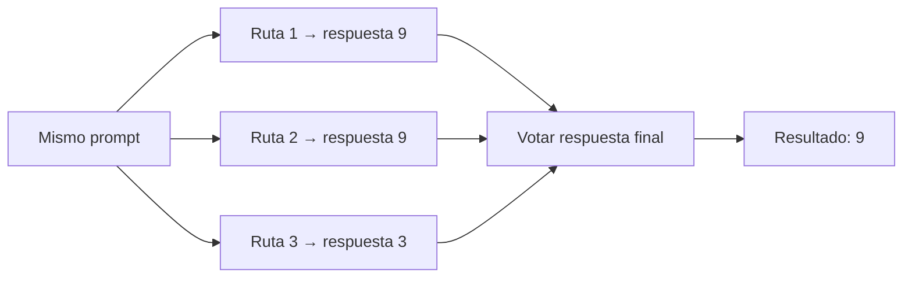
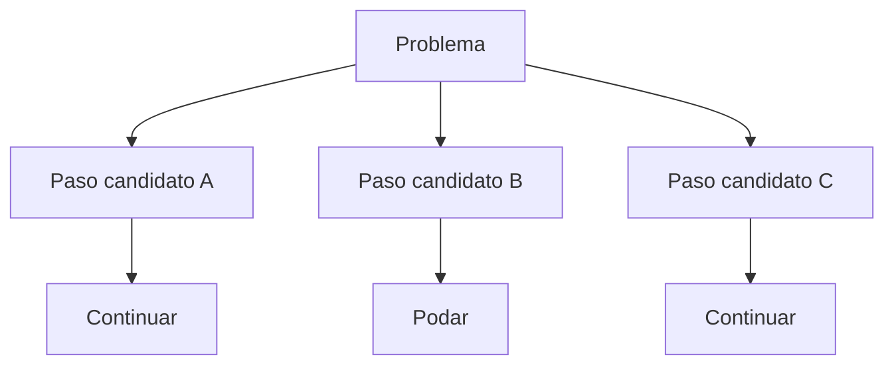
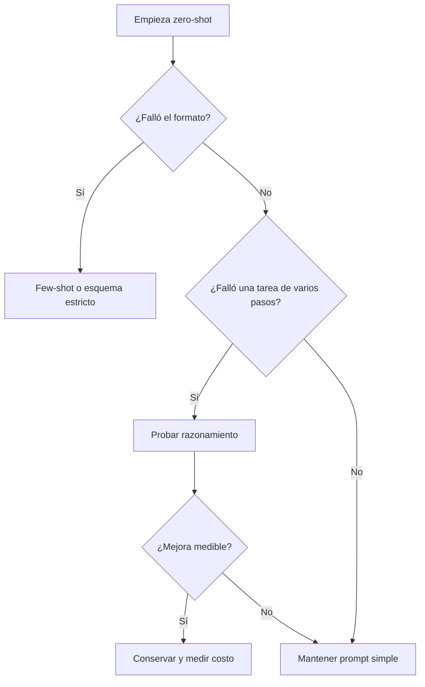

# 24 S04 - Zero-shot, few-shot y técnicas de razonamiento

[[00 INICIO - Ruta de aprendizaje|Volver al índice]]

## 1. Cambiar el prompt no cambia los pesos

El prompt altera el prefijo que condiciona la distribución del siguiente token. Normalmente no ejecuta retropropagación ni actualiza parámetros.

| Método | Contenido del prompt | Actualiza pesos |
| --- | --- | --- |
| Zero-shot | Instrucción sin ejemplo | No |
| One-shot | Instrucción y un ejemplo | No |
| Few-shot | Instrucción y varios ejemplos | No |
| Fine-tuning | Dataset usado en entrenamiento | Sí |

Este aprendizaje aparente dentro del contexto se llama **in-context learning**. El ejemplo influye mientras forme parte del contexto disponible; al salir de la ventana, deja de estar accesible directamente y no queda incorporado a los pesos.

## 2. Qué aporta un ejemplo

Un ejemplo puede comunicar:

- formato de entrada y salida;
- criterio de clasificación;
- nivel de detalle;
- estilo;
- procedimiento intermedio.

No es un contrato: el modelo todavía muestrea desde su distribución y puede ignorar o copiar mal el patrón.

## 3. El orden de los ejemplos es una variable experimental

Los mismos ejemplos en distinto orden pueden cambiar la salida. También importan la selección, similitud con la consulta y balance de etiquetas.

Por eso «few-shot funcionó una vez» no basta. Para comparar variantes:

1. fija el conjunto de ejemplos;
2. prueba varios órdenes o declara uno fijo;
3. repite corridas si hay muestreo;
4. evalúa sobre casos separados de los ejemplos.

## 4. Cadena de razonamiento como demostración

El prompting estándar muestra entrada y salida. Un ejemplo de cadena de razonamiento añade pasos intermedios:

```text
Pregunta: Tengo 5 monedas y recibo 2 bolsas de 3. ¿Cuántas tengo?
Razonamiento: Dos bolsas de 3 son 6. 5 + 6 = 11.
Respuesta: 11.
```

El ejemplo no revela la respuesta de una pregunta nueva. Enseña una forma de descomponerla.

> [!warning] No siempre ayuda
> En tareas de un solo paso, modelos pequeños o problemas con información irrelevante, pedir más razonamiento puede añadir errores, costo y verbosidad.

## 5. Zero-shot reasoning y trazas visibles

Frases como «razona paso a paso» intentan inducir una estructura intermedia sin ejemplos. Una traza fluida no garantiza que sea una explicación fiel del proceso interno ni que la respuesta sea correcta.

Evalúa la respuesta final con un verificador cuando sea posible. Si la traza se usa como evidencia, comprueba su consistencia y qué ocurre al intervenirla.

## 6. Auto-consistencia

La auto-consistencia obtiene varias trayectorias de solución mediante muestreo y elige la respuesta final más frecuente, después de normalizar respuestas equivalentes si hace falta.



Se vota la respuesta, no el texto completo del razonamiento. Con greedy, las corridas tienden a repetir la misma ruta y la votación aporta poco. El costo crece aproximadamente con el número de muestras.

## 7. Árbol de pensamiento

En un árbol de pensamiento se proponen varios pasos, se puntúan, se conservan los prometedores y se podan los demás.



Explorar más rutas puede ayudar en búsqueda y planificación, pero exige más llamadas o más tokens. Debe justificarse con mejora medida.

## 8. Árbol de decisión práctico



Si el problema es «el modelo no conoce mis documentos», la solución no es automáticamente fine-tuning ni razonamiento: normalmente se investiga recuperación aumentada con generación.

## Fuentes de esta explicación

- [[sesion-04.pdf#page=10|Sesión 04, páginas 10–17: zero/one/few-shot, CoT, auto-consistencia y árboles]]
- [[sesion-04.pdf#page=31|Sesión 04, página 31: árbol de decisión de inferencia]]
- [[23 S04 - Greedy temperatura top-k y top-p|Decodificación y muestreo]]

## Preguntas para comprobar que entendiste

> [!question]- ¿Few-shot modifica los parámetros del modelo?
> No. Añade demostraciones al contexto de inferencia.

> [!question]- ¿Qué se vota en auto-consistencia?
> La respuesta final extraída de cada corrida, no la redacción completa de las cadenas.

> [!question]- ¿Una cadena más larga implica una respuesta mejor?
> No. Puede ayudar en problemas de varios pasos, pero también introducir distracciones y errores.

> [!question]- ¿Qué debes probar antes de conservar una técnica costosa?
> Que mejora una métrica relevante sobre casos representativos y que el costo adicional es aceptable.
