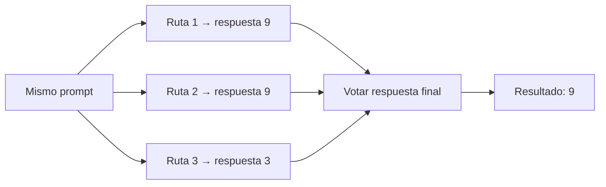
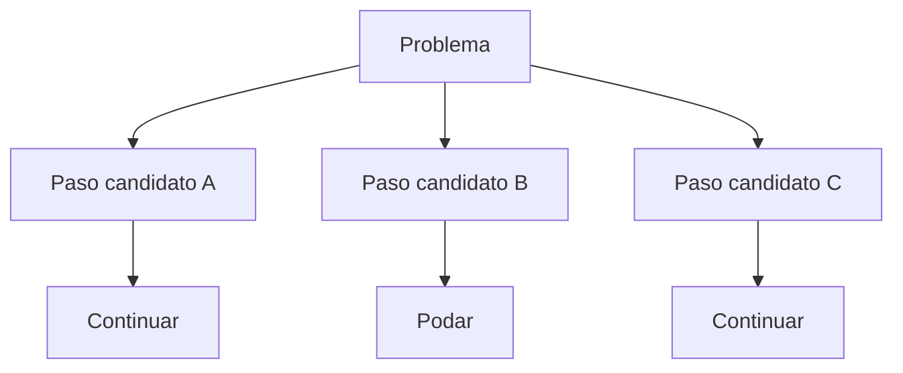
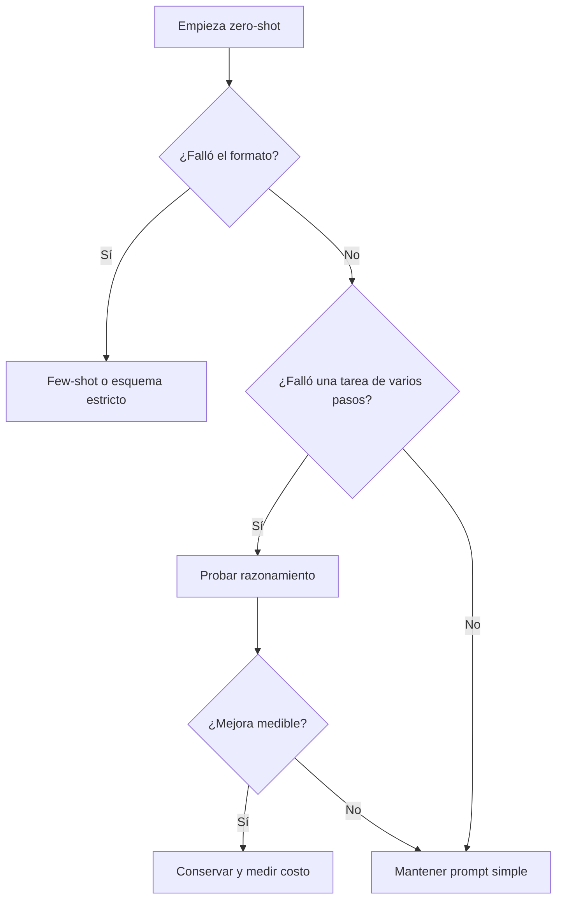

# 24 S04 - Zero-shot, few-shot y técnicas de razonamiento

[[00 INICIO - Ruta de aprendizaje|Volver al índice]]

## 1. Cambiar el prompt no cambia los pesos

El prompt altera el prefijo que condiciona la distribución del siguiente token. Normalmente no ejecuta retropropagación ni actualiza parámetros.

| Método | Contenido del prompt | Actualiza pesos |
| --- | --- | --- |
| Zero-shot | Instrucción sin ejemplo | No |
| One-shot | Instrucción y un ejemplo | No |
| Few-shot | Instrucción y varios ejemplos | No |
| Fine-tuning | Dataset usado en entrenamiento | Sí |

Este aprendizaje aparente dentro del contexto se llama **in-context learning**. El ejemplo influye mientras forme parte del contexto disponible; al salir de la ventana, deja de estar accesible directamente y no queda incorporado a los pesos.

## 2. Qué aporta un ejemplo

Un ejemplo puede comunicar:

- formato de entrada y salida;
- criterio de clasificación;
- nivel de detalle;
- estilo;
- procedimiento intermedio.

No es un contrato: el modelo todavía muestrea desde su distribución y puede ignorar o copiar mal el patrón.

## 3. El orden de los ejemplos es una variable experimental

Los mismos ejemplos en distinto orden pueden cambiar la salida. También importan la selección, similitud con la consulta y balance de etiquetas.

Por eso «few-shot funcionó una vez» no basta. Para comparar variantes:

1. fija el conjunto de ejemplos;
2. prueba varios órdenes o declara uno fijo;
3. repite corridas si hay muestreo;
4. evalúa sobre casos separados de los ejemplos.

## 4. Cadena de razonamiento como demostración

El prompting estándar muestra entrada y salida. Un ejemplo de cadena de razonamiento añade pasos intermedios:

```text
Pregunta: Tengo 5 monedas y recibo 2 bolsas de 3. ¿Cuántas tengo?
Razonamiento: Dos bolsas de 3 son 6. 5 + 6 = 11.
Respuesta: 11.
```

El ejemplo no revela la respuesta de una pregunta nueva. Enseña una forma de descomponerla.

> [!warning] No siempre ayuda
> En tareas de un solo paso, modelos pequeños o problemas con información irrelevante, pedir más razonamiento puede añadir errores, costo y verbosidad.

## 5. Zero-shot reasoning y trazas visibles

Frases como «razona paso a paso» intentan inducir una estructura intermedia sin ejemplos. Una traza fluida no garantiza que sea una explicación fiel del proceso interno ni que la respuesta sea correcta.

Evalúa la respuesta final con un verificador cuando sea posible. Si la traza se usa como evidencia, comprueba su consistencia y qué ocurre al intervenirla.

## 6. Auto-consistencia

La auto-consistencia obtiene varias trayectorias de solución mediante muestreo y elige la respuesta final más frecuente, después de normalizar respuestas equivalentes si hace falta.


```mermaid
flowchart LR
    P["Mismo prompt"] --> R1["Ruta 1 → respuesta 9"]
    P --> R2["Ruta 2 → respuesta 9"]
    P --> R3["Ruta 3 → respuesta 3"]
    R1 --> V["Votar respuesta final"]
    R2 --> V
    R3 --> V
    V --> O["Resultado: 9"]
```

Se vota la respuesta, no el texto completo del razonamiento. Con greedy, las corridas tienden a repetir la misma ruta y la votación aporta poco. El costo crece aproximadamente con el número de muestras.

## 7. Árbol de pensamiento

En un árbol de pensamiento se proponen varios pasos, se puntúan, se conservan los prometedores y se podan los demás.


```mermaid
flowchart TD
    A["Problema"] --> B1["Paso candidato A"]
    A --> B2["Paso candidato B"]
    A --> B3["Paso candidato C"]
    B1 --> C1["Continuar"]
    B2 --> X["Podar"]
    B3 --> C3["Continuar"]
```

Explorar más rutas puede ayudar en búsqueda y planificación, pero exige más llamadas o más tokens. Debe justificarse con mejora medida.

## 8. Árbol de decisión práctico


```mermaid
flowchart TD
    Z["Empieza zero-shot"] --> F{"¿Falló el formato?"}
    F -->|Sí| FS["Few-shot o esquema estricto"]
    F -->|No| R{"¿Falló una tarea de varios pasos?"}
    R -->|Sí| C["Probar razonamiento"]
    R -->|No| E["Mantener prompt simple"]
    C --> M{"¿Mejora medible?"}
    M -->|Sí| K["Conservar y medir costo"]
    M -->|No| E
```

Si el problema es «el modelo no conoce mis documentos», la solución no es automáticamente fine-tuning ni razonamiento: normalmente se investiga recuperación aumentada con generación.

## Qué evidenció el trabajo de cadena de razonamiento

La comparación de Wei et al. usa pocos ejemplos con pasos intermedios dentro del prompt. En su resultado histórico de GSM8K, PaLM 540B pasó aproximadamente de 18 % con prompting estándar a 57 % con cadena de razonamiento, usando **greedy**. Cambió el contenido de las demostraciones; el muestreo no fue la causa de ese salto. El estudio encontró ganancias especialmente en problemas de varios pasos y modelos grandes de las familias evaluadas, y escasas o negativas en algunas tareas de un paso. No establece una ley universal de 100B parámetros aplicable a cualquier modelo posterior. [[wei-2022-chain-of-thought.pdf#page=2|Wei et al., Fig. 2, PDF 2]] y [[wei-2022-chain-of-thought.pdf#page=4|§§3.1–3.2, PDF 4–5]].

Ejemplo propio: «Había 23 fichas; se usaron 20 y se compraron 6». La solución comprobable es $(23-20)+6=9$. Un procedimiento que ignore la resta puede responder 29 aunque imite la forma de una explicación. Evaluar con una calculadora o una función de referencia detecta ese error; premiar que escriba muchos pasos no lo detecta.

## Votar y buscar necesitan una regla de decisión

Si cuatro rutas contestan «9», «9.0», «nueve» y «3», primero hay que convertir las tres primeras a una misma respuesta canónica y después contar votos. En preguntas abiertas esa equivalencia puede ser difícil. Una mayoría también puede repetir el mismo error sistemático: no constituye un verificador independiente. Más muestras aumentan trabajo y costo; ejecutarlas en paralelo puede reducir la latencia de pared, por lo que n muestras no implica siempre n veces más tiempo para el usuario.

En un árbol de búsqueda real, el controlador conserva estados candidatos, expande algunos y utiliza una puntuación o un verificador para decidir qué explorar. Esa puntuación también puede equivocarse y podar una ruta buena. Pedir «simula tres expertos» en una sola respuesta puede dar ideas alternativas, pero no implementa por sí solo ese controlador, sus estados ni su backtracking. El diagrama de la sección 7 muestra la estructura de búsqueda, mientras el de auto-consistencia muestra rutas completas evaluadas al final.

## Fuentes de esta explicación

- [[sesion-04.pdf#page=10|Sesión 04, páginas 10–17: zero/one/few-shot, CoT, auto-consistencia y árboles]]
- [[sesion-04.pdf#page=31|Sesión 04, página 31: árbol de decisión de inferencia]]
- [[23 S04 - Greedy temperatura top-k y top-p|Decodificación y muestreo]]

## Preguntas para comprobar que entendiste

> [!question]- ¿Few-shot modifica los parámetros del modelo?
> No. Añade demostraciones al contexto de inferencia.

> [!question]- ¿Qué se vota en auto-consistencia?
> La respuesta final extraída de cada corrida, no la redacción completa de las cadenas.

> [!question]- ¿Una cadena más larga implica una respuesta mejor?
> No. Puede ayudar en problemas de varios pasos, pero también introducir distracciones y errores.

> [!question]- ¿Qué debes probar antes de conservar una técnica costosa?
> Que mejora una métrica relevante sobre casos representativos y que el costo adicional es aceptable.
